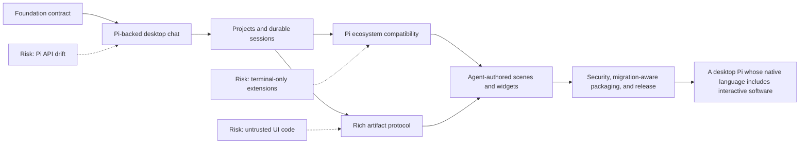
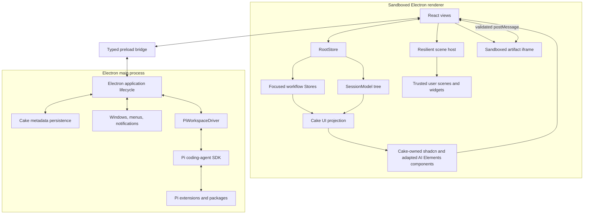

# Cake: Living Product and Implementation Plan

> **Status:** Draft implementation specification
> **Last updated:** 2026-08-11
> **Purpose:** This is the canonical description of Cake. An agent should be able to read this document, understand the product vision and architectural constraints, select the next incomplete milestone, and implement it without reconstructing the original product conversation.

## How to use and maintain this document

This is a living specification, not a historical proposal.

- Treat the vision, product principles, architectural decisions, security boundaries, and source-of-truth rules as authoritative.
- Treat milestones as outcome-based. An implementation may change internal details while preserving the stated outcome and constraints.
- Do not silently reverse a decided item. Record a replacement decision, its reason, and its migration impact in the decision log.
- Do not mark a milestone complete until every acceptance check for that milestone passes.
- Add newly discovered risks and open questions where they affect the route, not only in commit messages.
- Keep Pi-specific code behind the Pi adapter boundary in `src/agent/pi-runtime.ts`. Other Cake modules must use Cake-owned contracts.
- Treat the trusted user scene/widget source layer as ordinary application code, not as untrusted artifact content or a stable third-party plugin SDK. Preserve the explicit trust decision, compiler migration, safe-mode, and rollback rules in Section 9.
- Maintain agent-facing release migration notes for every change that can affect user scenes or widgets; compatibility is a tested migration process rather than a promise to freeze renderer internals.
- Treat `.agents/skills/r-state-tree/SKILL.md` and its bundled references as the authoritative implementation guidance for state placement, Store/Model design, lifecycle, async ownership, persistence, observability, and React integration. Agents changing those concerns must read and apply the skill before editing.
- `pi-gui` is reference material only. Cake must not fork it or copy its implementation wholesale.

## Ten-second brief

Cake is a minimal, extensible desktop coding agent powered by Pi, with the full web platform available for safe, rich, stateful interactions such as sortable tables, diagrams, forms, previews, and React widgets.



## 1. Product vision

Pi proves that a coding agent can remain small because capabilities live in extensions, skills, tools, and packages rather than an ever-growing core. Cake preserves that philosophy and replaces the terminal presentation layer with a desktop application built on the web platform.

The desktop is not merely a prettier terminal transcript. It changes what the agent can communicate. In Cake, an agent can:

- explain normally with Markdown;
- present a sortable and filterable table rather than print an ASCII table;
- draw and update a diagram;
- ask for structured input through a form;
- show file, diff, image, audio, and chart views;
- create a stateful interactive artifact the user can manipulate;
- create or modify trusted, user-owned React widgets and workspace scenes after explicit user authorization;
- run a complete mini-application whose interface explicitly coordinates multiple Pi-backed model calls or agent sessions without forcing their internal work into the primary transcript;
- receive structured interaction results back from the user;
- use Pi extensions, skills, packages, providers, tools, session branching, and compaction wherever their semantics are presentation-independent.

Cake should feel closer to a focused coding workspace such as the Codex desktop app than to an IDE. The conversation is primary. Files, diffs, artifacts, and controls appear when useful and remain subordinate to the agent interaction.

## 2. Why Cake exists

Terminal interfaces are excellent for text and keyboard-driven workflows, but terminal widgets are constrained by cell grids, ANSI rendering, and raw key handling. The browser platform already provides layout, typography, accessibility, graphics, media, input controls, and a mature component ecosystem.

Cake exists to combine:

1. Pi's minimal, provider-neutral, extensible agent runtime;
2. a multi-project and multi-session desktop shell;
3. React for rich presentation;
4. `r-state-tree` for explicit domain, workflow, lifecycle, and view-state ownership;
5. two distinct paths for rich UI: model responses may request temporary interactive views through a validated, sandboxed artifact protocol; separately, with explicit user approval, an agent may edit user-owned React scene and widget source that runs as trusted application code.

The product is successful when rich interactions feel native to the conversation rather than embedded webpages bolted onto a chat client.

## 3. Product principles

### 3.1 Pi is the core, not an inspiration

Cake depends on Pi's published packages and delegates agent behavior to Pi. It must not reimplement Pi's agent loop, model/provider support, core tool execution, session branching, compaction, skills, or extension discovery without a documented and compelling incompatibility.

### 3.2 Minimal core, agent-shaped workspace

Cake's core supplies conversation, artifacts, persistence, a resilient scene host, and enough source structure for an agent to reshape the workspace. The right side of the application is a React scene composed of widgets. A widget is ordinary trusted React source, not a schema-driven mini-application. The user may ask an agent to add one small widget, reorganize the default scene, create an alternate scene, or replace the scene completely.

### 3.3 The conversation remains primary

Cake is not a general-purpose IDE. A file tree, diff, or artifact should appear because it supports the active work. Avoid filling the initial UI with permanent panels.

### 3.4 Distinguish presented content from trusted customization

Content merely returned by a model never executes as privileged application code. Markdown, HTML, and conversational artifacts cross the versioned artifact protocol and remain schema-validated or sandboxed.

A user may separately authorize the agent to create or modify a scene/widget customization. That source is user-owned, reviewable, and trusted with the same renderer authority as any other user-approved application edit. It may import Cake components, call `useStore`, read Models, extend Stores, and compose ordinary React. This explicit installation/editing action—not the fact that an LLM produced the text—moves code into the trusted customization layer.

### 3.5 One authority for every kind of state

Pi owns Pi sessions and transcripts. Cake owns Cake-specific application and artifact metadata. `r-state-tree` Models and Stores must reflect these ownership boundaries rather than create competing persistent copies.

### 3.6 Web-native first, terminal-compatible where practical

Cake does not introduce a separate declarative language for workspace customization: user-owned scenes and widgets are ordinary React and TypeScript, with their conventions documented through Markdown, examples, current source, and types. Presentation-independent Pi extension behavior continues to run through Pi, and supported primitives such as `select`, `confirm`, and `input` are mapped to Cake controls. Custom Pi TUI components depend on a terminal renderer, so they require a deliberate React implementation rather than being translated automatically.

### 3.7 Dependency first, upstream second, fork last

Use published Pi APIs. If a required general-purpose seam is missing, prefer an upstream contribution. Maintain a narrow patch only when blocked. A long-lived Pi fork is a last resort.

### 3.8 Reference without imitation

`pi-gui` validates several architectural patterns and may inform tests and edge cases, but Cake is an independent implementation with its own architecture, state model, widget system, and visual identity.

## 4. Scope

### 4.1 Required product capabilities

- Add, remove, rename, and reopen local projects.
- View sessions across projects and create, resume, rename, archive, fork, and branch sessions.
- Stream assistant text, thinking state, tool calls, tool updates, results, retries, compaction, and errors.
- Compose prompts with file references, pasted or dropped images, steering messages, and follow-ups.
- Select providers, models, and thinking levels using Pi's model and authentication systems.
- Display changed files and diffs in command-opened panes.
- Discover and manage Pi skills, prompts, packages, and extensions.
- Adapt compatible Pi extension UI primitives to desktop UI.
- Present and persist rich Cake artifacts.
- Allow structured interaction with artifacts and return results to the waiting tool or the next agent turn.
- Let a user ask the agent to create, edit, remove, and repair trusted React widgets and complete workspace scenes.
- Let trusted scenes drive Pi-backed mini-app workflows: select models, start auxiliary completions or agent sessions, route explicit context and structured results, stream progress, accept steering/cancellation, and choose what is promoted into the primary transcript.
- Recover cleanly after renderer reloads and reset failed Pi session runtimes.
- Package for macOS first without embedding assumptions that prevent Windows and Linux support.

### 4.2 Explicit non-goals for the initial product

- Building a full source-code editor or language-server-based IDE.
- Replacing Pi's provider, auth, session, compaction, or package systems.
- Automatically translating arbitrary terminal `Component` implementations into React.
- Automatically executing JavaScript merely because it appeared in a model response or artifact.
- Treating trusted user-installed scene/widget source as isolated or permission-restricted application code; it has renderer authority by design, while the renderer itself still has no broad Node or Electron access.
- Making Pi's experimental remote client/server protocol a hard dependency before it is stable.
- Pixel-matching Codex, `pi-gui`, or another existing app.

## 5. Primary user experience

### 5.1 First launch

1. Cake explains that it uses Pi and offers Pi-supported provider authentication.
2. The user adds a project directory.
3. Cake resolves project trust before loading project-local executable resources.
4. The user creates a session and sends a prompt.
5. The transcript streams immediately, including tool activity and recoverable errors.

### 5.2 Everyday session workflow

1. Select a project and session from the sidebar.
2. Inspect the current transcript and any durable artifacts.
3. Send a prompt with optional file or image attachments.
4. While the agent runs, steer the active turn or queue a follow-up.
5. Expand tool calls and results, inspect diffs, or open a terminal when needed.
6. Interact with a form, table, diagram, or other artifact without leaving the conversation.
7. Close and reopen Cake without losing the Pi session or Cake view state.

### 5.3 Rich interaction workflow

There are two interaction shapes:

- **Present:** The agent calls `ui_present`. Cake creates or updates an artifact and immediately acknowledges it. Interaction may later create a user-authored event or prompt.
- **Request:** The agent calls `ui_request`. Cake displays an interactive artifact and resolves the tool only after the user submits or cancels a structured response.

Every interactive artifact must provide a readable fallback for session export, terminal viewing, accessibility, and unsupported clients.

## 6. Decided architecture

### 6.1 Technology choices

| Concern | Decision | Reason |
| --- | --- | --- |
| Desktop shell | Electron | Pi and its extension ecosystem are Node-first; Electron avoids a Node sidecar packaging layer. |
| Renderer | React + TypeScript | Required for the intended component and widget ecosystem. |
| UI component foundation | shadcn/ui + Tailwind CSS 4, with adapted AI Elements components | shadcn/ui supplies Cake's source-owned primitive layer. Selected AI Elements components are copied into the repository, stripped of AI SDK contracts, adapted to Cake-owned UI parts, and maintained as Cake source. Prompt Kit may be used selectively when a specific component is demonstrably preferable. |
| State | `r-state-tree` | Provides explicit Model/Store separation, reactive views, snapshots, lifecycle ownership, and React bindings. |
| Agent runtime | `@earendil-works/pi-coding-agent` | Reuses Pi sessions, resources, tools, providers, auth, compaction, and extension runtime. |
| AI SDK relationship | Do not use as Cake's agent runtime | Pi and `pi-ai` remain authoritative; Cake adapts Pi events to Cake-owned UI models instead of adding a competing model, streaming, transport, and tool abstraction. |
| Pi integration | Cake-owned adapter | Prevents Pi types and API drift from spreading through the app. |
| Session authority | Pi session files and `SessionManager` | Preserves CLI compatibility and avoids divergent transcripts. |
| Rich UI transport | Versioned Cake artifact protocol | Makes interactions serializable, testable, persistable, and secure. |
| Trusted user scenes/widgets | Ordinary React + TypeScript compiled against Cake | User-approved agent edits are application customizations, may access renderer Stores directly, and are migrated by compiler diagnostics rather than insulated behind a frozen SDK. |
| Untrusted rich content | Sandboxed artifact web runtime | Model-presented HTML and any future untrusted package code stay away from renderer, Electron, and Node privileges. |
| `pi-gui` relationship | Reference only | Useful prior art; not a dependency or fork. |

At the 2026-08-06 research snapshot, Pi's published coding-agent package exposes the SDK, session runtime, resource loader, package manager, settings, tools, and `ExtensionUIContext` needed for this design. Pin the exact Pi version selected during the foundation spike; do not use an unbounded range.

### 6.2 Process boundaries



Responsibilities:

- **Renderer:** presentation, DOM interaction, window-local Stores, the resilient scene host, trusted user scene/widget code, artifact host, and no broad Node access. Trusted customizations share renderer authority and may use the same Store providers and preload-backed application intents as Cake's built-in React code.
- **Preload:** a narrow, typed, validated request/event API. It does not expose raw `ipcRenderer`; trusted widgets do not bypass it.
- **Main:** window lifecycle, native dialogs, app metadata persistence, customization compilation/migration orchestration, and direct ownership of workspace-scoped Pi drivers, sessions, tools, providers, packages, and extensions.
- **Artifact frame:** untrusted model-presented or remote web content with no Node integration, no same-origin privilege, no direct Electron IPC, and no network by default. This boundary does not apply to explicitly trusted user scenes/widgets.

Use one `PiWorkspaceDriver` per active workspace. Multiple sessions within a
workspace share that in-process driver while retaining independent runtime and
subscription ownership. Idle drivers are disposed and reopened from Pi's
authoritative session files when needed.

### 6.3 Pi adapter boundary

Only `src/agent/pi-runtime.ts` may import `@earendil-works/pi-coding-agent` in ordinary application code. It exposes Cake-owned DTOs and intent methods such as:

```ts
interface AgentRuntime {
  openWorkspace(input: OpenWorkspaceInput): Promise<WorkspaceSnapshot>;
  listSessions(workspaceId: string): Promise<SessionSummary[]>;
  createSession(input: CreateSessionInput): Promise<SessionSnapshot>;
  openSession(ref: SessionRef): Promise<SessionSnapshot>;
  closeSession(ref: SessionRef): Promise<void>;
  prompt(ref: SessionRef, input: PromptInput): Promise<void>;
  steer(ref: SessionRef, input: PromptInput): Promise<void>;
  followUp(ref: SessionRef, input: PromptInput): Promise<void>;
  abort(ref: SessionRef): Promise<void>;
  compact(ref: SessionRef, instructions?: string): Promise<void>;
  fork(ref: SessionRef, entryId: string): Promise<SessionSnapshot>;
  navigateTree(ref: SessionRef, entryId: string): Promise<SessionSnapshot>;
  respondToUi(ref: SessionRef, response: ExtensionUiResponse): Promise<void>;
  subscribe(ref: SessionRef, listener: (event: SessionEvent) => void): () => void;
}
```

The final interface may differ, but it must preserve these rules:

- Cake modules outside the Pi adapter do not depend on Pi event shapes directly.
- Events have stable IDs and session/workspace identity.
- Initial snapshots are authoritative; deltas update them.
- Resubscription after session replacement is explicit.
- The adapter normalizes extension UI, tool events, errors, and capability differences.
- Adapter contract tests run against the exact pinned Pi version.

### 6.4 Source-owned presentation boundary

Use [shadcn/ui](https://ui.shadcn.com/) conventions and Tailwind CSS 4 as the foundation for Cake's trusted renderer components. Components added through shadcn registries are copied into Cake, reviewed, adapted, themed, tested, and thereafter maintained as Cake source; they are not opaque runtime UI dependencies.

Use [AI Elements](https://elements.ai-sdk.dev/) as the preferred source registry for conversation and coding-agent presentation primitives. Its components follow the shadcn ownership model and provide useful starting points for messages, streaming Markdown, reasoning, tools, approvals, sources, attachments, code, terminal output, file trees, plans, tasks, queues, checkpoints, tests, and artifacts. Cake does not adopt AI Elements as an application data contract or promise drop-in compatibility with its upstream examples.

[Prompt Kit](https://www.prompt-kit.com/) also follows the shadcn source-copy model and may be used as a secondary source when a specific component is smaller, more accessible, more secure, or otherwise better suited to Cake. Do not maintain two interchangeable implementations of the same surface without a concrete reason. Prefer AI Elements by default, compare at component-selection time, and record the chosen source and revision.

Cake must not adopt Vercel AI SDK as a second agent runtime. In particular, the trusted renderer must not depend on `useChat`, `DefaultChatTransport`, `streamText`, AI SDK provider packages, or AI SDK server routes for ordinary Cake conversations. Pi and `pi-ai` remain responsible for providers, inference, streaming, tool execution, session history, auth, and cost/token information.

The data path is:

```text
Pi session snapshots and events
        -> src/agent/pi-runtime normalization
        -> Cake process-safe SessionEvent DTOs
        -> r-state-tree transcript/tool/artifact Stores
        -> Cake-owned UI part models
        -> Cake-owned shadcn and adapted AI Elements React components
```

Define Cake-owned discriminated unions for presentation instead of allowing AI SDK types to become application contracts. The initial vocabulary should cover at least:

- user and assistant text, including incremental streaming;
- reasoning/thinking with explicit visibility and lifecycle state;
- tool invocation input, approval, running, success, error, and denial states;
- sources and citations;
- file and image attachments;
- task/plan/checklist progress;
- artifacts, code, diffs, terminal output, file trees, and previews;
- retry, branch, copy, open, approve, deny, submit, and cancel actions.

Implementation rules:

- Copy only the AI Elements or Prompt Kit components Cake actually uses; do not import either documentation application, example application, or catalog wholesale.
- Treat registry installation as source acquisition, not dependency adoption. The resulting component files belong to Cake and may intentionally diverge from upstream.
- Replace AI Elements imports of `UIMessage`, `ToolUIPart`, `DynamicToolUIPart`, `FileUIPart`, `SourceDocumentUIPart`, `ChatStatus`, and other AI SDK types with Cake-owned presentation types before integrating a component into the product path.
- Do not install the `ai` package merely to satisfy copied component types. Do not inherit AI Elements or Prompt Kit examples' AI SDK hooks, Next.js assumptions, provider setup, transports, or server routes.
- Drive components with intent methods and reactive state from Cake's `r-state-tree` Stores.
- Keep Pi-to-UI translation in a dedicated projection/adapter layer; components must not interpret raw Pi events.
- Preserve useful upstream accessibility, keyboard behavior, streaming Markdown, and composition patterns.
- Treat copied component code as a starting point, not an upstream-compatible API promise. Cake may reshape props and visuals to fit its product language.
- Use React 19, shadcn/ui conventions, CSS-variable theme tokens, and Tailwind CSS 4 with the Electron/Vite toolchain; remove Next.js-only assumptions and adapt registry aliases to Cake's repository layout.
- Audit transitive browser dependencies before accepting a component. Renderer dependencies must not introduce Node access or weaken the content security policy.
- Retain required upstream licensing and attribution: AI Elements is Apache-2.0 and Prompt Kit is MIT. Mark materially modified Apache-derived files as required.
- Record the source project, upstream path, and exact revision for each imported component so security fixes and useful improvements can be reviewed deliberately.
- Do not expose AI SDK-shaped data through IPC or persist it as Cake's durable schema.

The first AI Elements evaluation slice is conversation, message, reasoning, tool, and confirmation. It must render the existing Pi foundation stream and extension confirmation through Cake-owned props without `ai` or `@ai-sdk/react` installed. Later candidates include streaming Markdown, sources, attachments, code blocks, terminal output, file trees, plans, tasks, queues, checkpoints, test results, and artifact chrome. Evaluate the large prompt-input component only after Cake's composer and attachment contracts are defined; prefer composing smaller shadcn primitives if adapting it would retain unnecessary upstream state or behavior. JSX preview and other executable-content components require separate capability and security review before adoption.

This boundary leaves open an optional future use of AI SDK for an isolated feature. Such use must have a concrete need, remain outside the Pi-backed conversation path, and receive an explicit architecture decision; installing it merely to satisfy copied component types is prohibited.

### 6.5 Pi resource and extension compatibility

Use Pi's `DefaultResourceLoader`, project trust behavior, package manager, skills, prompts, context files, settings, and extension runtime where public APIs permit.

| Pi capability | Cake behavior |
| --- | --- |
| Tools, providers, event handlers, compaction hooks | Run unchanged through the Pi SDK in Electron main. |
| Skills, prompt templates, context files | Discover through Pi and expose in Cake UI. |
| Package installation | Delegate to Pi package management with Cake confirmation and diagnostics. |
| Commands | List and invoke through the Pi session. |
| `select`, `confirm`, `input`, `editor` | Render as Cake dialogs and return structured responses. |
| `notify`, `setStatus`, `setTitle`, `setEditorText` | Map to Cake notifications, status, window title, and composer state. |
| String `setWidget` | Render as a legacy terminal-style widget with ANSI sanitization. |
| TUI component factory, custom footer/header/editor, raw terminal input | Report as unsupported or degraded unless a deliberate compatibility implementation exists. |
| Custom message/TUI renderer | Preserve its data and provide a fallback; do not execute TUI render code in React. |

Every compatibility downgrade must be observable in extension diagnostics. Do not fail silently when an extension believes it displayed or requested something important.

### 6.6 Pi-backed mini-application workflows

Cake uses Pi's SDK as the sole model, authentication, agent-loop, tool, and session runtime for custom mini-applications. Cake must not add a second provider abstraction, transcript database, or agent implementation merely to coordinate multiple models.

A single Pi `AgentSession` owns one active model context and one active branch at a time. A workflow that needs independent or concurrent participants uses the narrowest Pi primitive that preserves the required semantics:

- **Auxiliary completion:** call a selected configured model with an explicitly assembled context for bounded work that does not require an agent tool loop or independent transcript.
- **Child agent session:** create an in-memory or durable Pi session when a participant needs its own multi-turn history, tools, streaming lifecycle, compaction, steering, or branching.
- **Worker runtime:** use a separately managed Pi runtime when process isolation, independent failure recovery, or long-lived background execution is required.

Pi remains authoritative for every child session's messages, tool loop, model state, usage, compaction, and session tree. Cake stores only references and application-owned workflow facts; it must not copy a child transcript into a Cake-owned competing history. Cake owns the concerns Pi does not define: workflow topology, role labels, context-routing decisions, mini-app domain data, presentation, user checkpoints, and the explicit policy for promoting selected results into the primary Pi session, an artifact, or neither.

The renderer and trusted scene source do not receive the raw Pi SDK. Workflow Stores call Cake-owned intent-level ports such as `startWorkflow`, `promptParticipant`, `steerParticipant`, `cancelParticipant`, and `promoteResult`. The Pi adapter in Electron main maps those intents to pinned public Pi SDK APIs, validates every cross-process payload, and emits Cake-owned workflow events. This is a process and ownership boundary, not a competing runtime or a generic capability façade around React customization.

Installed Pi council, subagent, and team extensions remain useful compatible backends and reference implementations. Cake must not make a terminal multiplexer, terminal pane, custom TUI renderer, globally installed `pi` executable, or one particular community extension a prerequisite for desktop mini-app workflows. Packaged execution must resolve Pi from Cake's bundled runtime and must be tested by actually running representative auxiliary and child-agent work, not merely by confirming that an extension registered its tools.

## 7. `r-state-tree` state architecture

Cake uses Models for serializable application-owned domain state and Stores for mounted behavior, I/O, routing, and view/session workflows. Components read from Stores and call intent-level methods.

### 7.1 Authority and persistence

| State | Authority | Representation |
| --- | --- | --- |
| Pi transcript, session tree, compaction, model history | Pi | Pi session files; projected into the renderer `SessionModel` tree |
| Auxiliary/child agent transcript, tools, usage, compaction, model history | Pi | Independent in-memory or durable Pi sessions; Cake retains references and projections only |
| Provider credentials | Pi/auth runtime | Never copied into renderer Models |
| Project registry and display metadata | Cake main process | Cake Model snapshot persisted atomically |
| Artifact metadata and content pointers | Cake + Pi custom session entries | Cake artifact store plus session reference |
| Mini-app domain data and workflow topology | Cake | Versioned Cake Models containing application facts and Pi session/result references, never copied Pi transcripts |
| Live multi-model workflow progress, routing, cancellation, and subscriptions | Cake renderer/main coordination over Pi | Workflow Stores and Cake-owned event projections with explicit lifecycle and concurrency policy |
| Navigation, project/session selection, panel state, composer draft, scroll | Cake renderer | Focused behavioral Stores; selected fields snapshotted |
| Live streaming and tool progress | Pi event stream | Ephemeral Stores |
| Extension dialogs and active statuses | Main-process Pi driver/Cake bridge | Ephemeral Stores with cancellation |

### 7.2 Main-process state and services

The Electron main process does not require an `r-state-tree` composition root
for symmetry with the renderer. Keep straightforward window lifecycle, IPC
routing, native operations, and stateless services as ordinary TypeScript.
Introduce a main-process Store only when a concrete subsystem owns observable
application state, derived state, mounted resources, or coordinated async
workflow that benefits from Store semantics. Name that Store for its behavioral
surface—for example, Pi runtime supervision—rather than creating a generic
kernel container in advance. Introduce a main-process composition root only if
multiple real Stores later require shared ownership and coordination.

Likely future Store candidates, subject to that boundary test:

- `ProjectRegistryStore` when project loading, trust, and persistence form a
  reactive workflow visible across windows.
- `PiRuntimeSupervisorStore` when per-workspace start, stop, reset, and retry
  behavior becomes observable application state.
- `ArtifactRepositoryStore` if artifact persistence and synchronization require
  mounted reactive orchestration rather than a repository service.
- `PiWorkflowSupervisorStore` when multiple auxiliary calls or child sessions
  require observable start, route, steer, cancel, retry, recovery, and usage
  coordination. It depends on intent-level Pi adapter ports rather than raw
  transport commands.

Suggested Models:

- `ApplicationModel`: schema version and durable app-owned metadata.
- `ProjectModel`: stable ID, canonical path, display name, trust/display metadata, last-opened time.
- `ArtifactModel`: artifact ID, session reference, kind, version, content digest/location, fallback, creation/update metadata.
- `MiniAppWorkflowModel`: customization/workflow ID, versioned domain data, participant roles and Pi session references, explicit result references, routing history required for recovery, and promotion records. It does not contain copied Pi messages.
- `PreferencesModel`: app-owned appearance and behavior preferences that do not belong to Pi.

### 7.3 Renderer tree

`RootStore` is the composition root for one renderer window. Cake creates one
independent root for each Electron window, provides it to React, and disposes it
when that renderer ends. It owns the Pi event subscription and synchronizes
validated events into a disposable `SessionModel` snapshot while coordinating
the window-scoped tree of focused behavioral Stores.

Pi remains authoritative for session persistence and behavior. `SessionModel`
is the reactive renderer representation of the current Pi session, not a second
session authority. Every transport snapshot field is an `@state` field with the
same name and value shape; the model does not normalize, flatten, or reconstruct
the data. Full snapshots and snapshots assembled from streaming events commit
atomically through r-state-tree's `applySnapshot`. UI-specific interpretations
belong in computed getters and presentation adapters.

Each named product surface owns its cohesive state, lifecycle, async policy,
and behavior in a focused Store. `RootStore` composes shared Stores and routes
cross-cutting events; it does not become a generic owner for all window state.
Nest a Store only when one parent surface truly owns its lifetime. Existing
concentration of unrelated workflows is a refactoring signal, not precedent for
putting the next field or method there.

```text
RootStore
├── SessionCacheStore
│   └── SessionModel[]
├── NavigationStore / SidebarStore
├── ProjectStore
├── MainChatStore / SessionViewStore
├── ChangesStore
├── ReviewsStore
├── BrowseStore
├── ArtifactHostStore
├── ExtensionUiStore
└── SettingsStore
```

Implementation rules:

- Create Stores with `mount(createStore(...))`; never instantiate them with `new`.
- Compose meaningful subsystems with `@child` and stable keys.
- Create Models through their supported factory and mutate collections in place.
- Use Store effects for IPC subscriptions and external resources; clean them up with the Store.
- Use the Store lifetime signal for Store disposal and separate operation controllers or revisions for take-latest, queue, retry, and user cancellation.
- Do not materialize lazy child Stores merely to start background work.
- Do not persist constructor defaults before hydration completes.
- React providers are lookup scopes, not ownership or disposal scopes.
- Keep tiny focus, hover, measurement, and isolated input state in React only when it has no workflow meaning.
- Trusted widgets may use their explicitly provided focused Stores directly. Do not add capability façades merely to imitate a conventional plugin SDK.
- A root or shell Store is a composition and coordination boundary, not a dumping ground for unrelated state. Window scope describes lifetime, not behavioral ownership.
- Models are read directly and normally changed through their owning Model or Store methods to preserve invariants. This is an authoring convention enforced by guidance, review, tests, and agent repair—not a claimed runtime security boundary.
- A widget that introduces coherent workflow state, subscriptions, timers, persistence, or async policy should add or compose the nearest meaningful Store owner rather than hiding application workflow in React effects.
- A multi-model workflow Store owns its Pi event subscriptions, cancellation, retry/queue/take-latest policy, and late-result guards. It calls semantic workflow ports and never constructs raw IPC envelopes or exposes provider credentials to React.

## 8. Rich artifact protocol

### 8.1 Goals

The protocol must be versioned, serializable, streamable, schema-validated, persistable, accessible, secure by default, and independent of a single renderer implementation.

An initial envelope:

```ts
interface CakeArtifactV1 {
  protocol: "cake.artifact/v1";
  id: string;
  sessionId: string;
  kind: "markdown" | "table" | "diagram" | "form" | "html" | "widget" | "media";
  title?: string;
  payload: unknown;
  fallback: {
    markdown: string;
  };
  capabilities?: ArtifactCapability[];
  interaction?: {
    mode: "present" | "request";
    responseSchema?: unknown;
  };
}
```

The exact schema should be implemented with the repository's selected runtime schema library and shared across agent, main, preload, renderer, and sandboxed artifact-renderer boundaries. Unknown versions or kinds must degrade to the Markdown fallback.

### 8.2 Built-in artifact kinds

- **Markdown:** safe Markdown and GFM; raw HTML disabled by default.
- **Table:** typed columns, rows, sorting, filtering, selection, copy, and export.
- **Diagram:** Mermaid source initially; later diagrams may register separately.
- **Form:** schema-defined controls, validation, submit, and cancel.
- **HTML:** rendered only in the artifact sandbox.
- **Artifact widget:** may reference a future registered, sandboxed artifact renderer and validated props. It is distinct from a trusted workspace widget or scene.
- **Media:** image, audio, video, or document reference with safe URL handling.

### 8.3 Agent tools

Cake ships a built-in Pi extension that registers:

- `ui_present`: create or update a non-blocking artifact and return its ID.
- `ui_request`: display a request artifact, wait for submit/cancel, and return schema-validated data.

Tool requirements:

- Inputs are size-limited and schema-validated before display.
- The user can cancel a request.
- Session abort, replacement, Pi driver disposal, or window loss settles pending requests predictably.
- Updates use stable artifact IDs and explicit revisions.
- A request cannot receive more than one terminal response.
- The tool result contains a concise textual outcome for the LLM context.
- Artifact content is stored outside the transcript when large; the Pi session contains a versioned custom entry or pointer plus fallback.

### 8.4 Interaction routing

Sandboxed artifact events never become arbitrary IPC calls. They are validated against the artifact contract and routed as one of:

- local presentation state update;
- artifact persistence update;
- response to a waiting `ui_request`;
- explicit new user message or follow-up, with visible user confirmation where appropriate;
- request for a declared host capability.

## 9. Trusted user scenes, widgets, and automatic migration

### 9.1 Core model

The right-hand workspace is a **scene**: an ordinary React component tree composed of **widgets**. A widget is an ordinary React component. Neither term implies a sandbox, serialized UI schema, capability façade, frozen SDK, or special component base class.

The default transcript and composer are widgets in the default scene. A user may ask the agent to:

- add, remove, or reorganize widgets in the current scene;
- create an addon widget opened, focused, or toggled by a slash command;
- create an alternate scene for a workflow such as code review;
- replace the default scene completely;
- extend application Stores or application behavior needed by that scene.

Trusted customization source may import Cake's source-owned components and styles, use `observer`, call `useStore` for provided Stores, read Models, invoke application methods, and participate in the renderer like built-in code. Cake does not wrap it in a narrower host API merely to create an artificial plugin boundary. The renderer's existing sandbox still prevents both built-in and customized React code from directly acquiring Node or raw Electron IPC.

This trust is explicit. Code shown in a transcript or artifact never installs or executes itself. Before first activation, Cake explains that the customization has renderer authority, shows its source or summary, and obtains user approval. Code copied from another person or registry is trusted only if the user chooses to install it; a future untrusted marketplace runtime is a separate architecture decision.

### 9.2 Markdown is the authoring framework

The primary widget system is an agent-facing Markdown guide plus current application source, TypeScript types, component examples, and verification commands. The guide must define:

- canonical source locations and naming;
- how scenes compose widgets and how the resilient scene host selects a scene;
- how slash commands accept validated arguments, initialize workflow state, perform actions, toggle/focus widgets, or switch scenes;
- how to use `observer`, `StoreProvider`, and `useStore` correctly;
- the current Store/Model map and state-placement rules;
- how to use Cake's intent-level Pi workflow ports for auxiliary completions, child agent sessions, explicit context routing, streaming, steering, cancellation, and result promotion without importing the raw Pi SDK into renderer source;
- the source-owned component catalog, design tokens, accessibility rules, and visual examples;
- lifecycle, async, persistence, and cleanup expectations;
- required typecheck, lint, test, and build commands;
- the trust model and the distinction between trusted customization and sandboxed artifact content.

Keep runtime convention minimal. Prefer ordinary imports and components over a JSON UI DSL, generic widget props protocol, package capability manifest, or inheritance framework. A small generated scene/command registry and migration metadata are acceptable discovery and bookkeeping mechanisms, not an SDK compatibility boundary.

### 9.3 Source shape and invocation

The intended conceptual shape is:

```text
user-customizations/
├── customization.json       # identity and migration bookkeeping
├── scenes/
│   ├── default-scene.tsx
│   └── review-scene.tsx
├── widgets/
│   └── code-review-widget.tsx
└── tests/
```

A customization record needs only information required to locate, compile, recover, and migrate source, for example:

```json
{
  "id": "local-workspace",
  "entry": "scenes/default-scene.tsx",
  "generatedAgainst": "0.8.0"
}
```

Slash-command invocation is ordinary application behavior. Commands may accept validated arguments, execute an action, show/hide/focus a widget, select a scene, or initialize a cancellable workflow. The agent registers commands in the current command table and may change that table when application architecture changes. Commands that send messages or alter application workflows use the same Store methods as built-in UI.

### 9.4 Mini-app and multi-model workflow composition

A trusted scene may be a complete mini-application rather than a passive view. It may coordinate multiple Pi-backed participants through Cake Stores and intent-level workflow methods while Pi remains authoritative for each participant's model calls, agent loop, tools, transcript, and usage.

The customization must be able to define and make inspectable:

- which configured model and Pi execution shape each participant uses;
- the exact context selected for each invocation instead of implicitly sharing the primary transcript;
- sequential, parallel, review, debate, synthesis, and user-checkpoint routing;
- which participant events and intermediate results are visible in the scene;
- cancellation, steering, retry, timeout, concurrency, and budget policy;
- which results remain mini-app data, become durable artifacts, enter a child session, or are explicitly promoted into the primary Pi session;
- versioned persistence and migration for application-owned domain data without copying Pi-owned transcripts;
- remote-content origins and permissions when the scene embeds network media.

For example, `/video-tutor <youtube-url>` may validate the URL, select a Video Tutor scene, display an origin-restricted video frame and synchronized transcript, and start Tutor, Researcher, and Fact-checker participants. The scene may route a selected timestamped transcript window to the Tutor, pass uncertain claims to the other participants, display their progress and disagreement, and promote only the user-selected synthesis into the primary transcript. Transcript acquisition, model execution, and other privileged work occur in Electron main through Pi extensions/tools or Cake's Pi adapter; the scene controls them through Stores and never receives Node, credentials, raw IPC, or the raw Pi SDK.

### 9.5 Compatibility through compiler-driven migration

Cake intentionally does not promise that internal renderer Stores, Models, components, or scene structure remain source-compatible forever. Instead, it promises a safe automated migration workflow. TypeScript is the primary structural compatibility detector.

Every Cake release that can affect customizations must include agent-facing migration notes. Notes describe intent and behavior as well as symbol changes, with concrete before/after guidance where possible:

```md
### Widget and scene migrations

- `WindowStore.parts` was removed. Read `WindowStore.session?.uiParts`.
- `ComposerPanel` was renamed to `ComposerWidget`.
- Scenes must now render beneath `WorkspaceSceneBoundary`.
```

Cake keeps each customization's `generatedAgainst` version so the agent can read all intervening notes. The agent may also inspect the current source, types, git diff, tests, and diagnostics; the changelog accelerates migration but never substitutes for the code.

The staged update sequence is:

1. Stage the new Cake version without replacing the working installation.
2. Compile and typecheck every enabled customization against the staged version.
3. If all checks pass, run focused render/integration tests and prepare activation.
4. If checks fail, retain the exact TypeScript diagnostics and identify affected widgets/scenes.
5. Ask whether the user wants the agent to repair them automatically, inspect changes, disable affected customizations, or postpone the update.
6. Give the repair agent the customization source, diagnostics, all intervening migration notes, current relevant source/types, and verification commands.
7. Repeat typecheck and tests until clean; show or summarize the patch according to user preference.
8. Back up the previous source and compiled output, activate atomically, record the new `generatedAgainst` version, and retain rollback data.
9. If activation or runtime checks fail, return to the previous working app/customization pair or boot with the affected customization disabled.

Compiler success proves structural compatibility, not behavioral correctness. Release notes must call out semantic changes that types cannot detect. Focused widget render tests, runtime error capture, and rollback cover the remaining gap.

### 9.6 Resilient host, errors, and safe mode

Customization failure must not prevent Cake from opening the UI needed to diagnose and repair it. The signed/core shell and default recovery scene must be able to boot without loading user customization code.

Requirements:

- validate and compile customizations before activating an application update;
- keep last-known-good source and compiled output;
- render each optional widget and selected user scene beneath an error boundary;
- attribute compile and runtime failures to the responsible customization;
- offer automatic agent repair using diagnostics and release migration notes;
- allow one widget, one scene, or all customizations to be disabled without deleting source;
- provide a safe/default scene for recovery;
- activate migrations transactionally and support one-step rollback;
- keep repair history reviewable, preferably through a local version-control history.

Runtime error capture must not imply that arbitrary semantic errors are automatically safe. A widget has renderer authority and may invoke real application intents. Trust, source review, tests, and rollback are the controls; sandbox capability claims are not.

### 9.7 Separate artifact security boundary

The artifact protocol remains the boundary for content presented during a conversation without explicit installation as trusted source. Raw HTML and any future untrusted artifact renderer continue to run in an isolated frame with restrictive CSP, validated messages, bounded resources, and no Node, Electron, parent DOM, or default network access.

Do not weaken artifact isolation in order to implement trusted workspace widgets, and do not force trusted workspace scenes through the artifact protocol. They are different products with different trust decisions.

## 10. Data layout and durability

Cake owns a single configurable home at `~/.cake` (`CAKE_HOME` overrides it).
The embedded Pi runtime uses `~/.cake/pi` as its agent directory and
`~/.cake/pi/sessions` as the workspace-session root. Review and global-chat Pi
sessions use dedicated descendants of `~/.cake/pi`; Cake plugins use
`~/.cake/plugins`. Standalone Pi remains isolated at `~/.pi/agent`.

On the first isolated launch, Cake copy-migrates only the legacy
`~/.pi/agent/sessions` tree into `~/.cake/pi/sessions`. The migration never
modifies its source, never overwrites different destination content, records
conflicts in a versioned marker beneath `~/.cake/migrations`, and leaves the
marker absent after failure so the next launch can safely retry. Settings,
credentials, models, packages, extensions, skills, prompts, and themes are not
migrated; users authenticate and configure models independently in Cake.

Electron lifecycle-owned state remains beneath `app.getPath("userData")`:
application/window snapshots, artifact payloads, and review annotations. Tests
may redirect this with `CAKE_ELECTRON_USER_DATA`. These locations depend on
Electron's platform path and `app.setPath()` lifecycle, while all Pi runtime
paths come from Cake's centralized home resolver.

Keep these conceptual areas separate:

```text
cake-data/
├── application.json          # schema-versioned Cake Model snapshot
├── artifacts/                # content-addressed artifact payloads and bundles
├── workflows/                # mini-app domain data, routing history, Pi references, and recovery metadata
├── customizations/           # trusted user scene/widget source, metadata, tests, and history
├── customization-builds/     # staged and last-known-good compiled output
├── cache/                    # disposable derived data
├── logs/                     # redacted diagnostics
```

Pi continues to use its configured agent directory and session files. Cake may read Pi sessions through Pi APIs and must not mutate their JSONL format with ad hoc file editing.

Durability rules:

- Atomic writes for app-owned JSON snapshots.
- Explicit schema version and migrations.
- Content digests for external artifact payloads.
- Garbage collection only after proving no live session/custom entry references an artifact.
- Credentials and provider secrets never enter Cake state snapshots, logs, renderer IPC, or artifacts.
- Cache loss must not destroy sessions, artifacts declared durable, or user customization source.
- Workflow storage may retain application-owned topology, media/transcript indexes, checkpoints, and references to Pi sessions/results, but must not become a duplicate transcript database. Durable child-agent history remains in Pi sessions.
- Customization source and migration history are user-owned durable data. Compiled output is replaceable, but Cake retains a last-known-good build for recovery and rollback.
- App updates are staged until enabled customizations compile against the candidate version or the user explicitly disables/postpones incompatible customizations.

## 11. Repository shape

```text
cake/
├── src/
│   ├── main/                 # Electron lifecycle, Pi drivers, native services, persisted metadata
│   ├── preload/              # narrow contextBridge API; no application workflow
│   ├── renderer/             # React frontend, scene host, built-in widgets, Stores, projections, components
│   ├── agent/                # Cake's thin Pi SDK adapter; executed by Electron main
│   └── ipc/                  # validated main/preload/renderer transport schemas
├── examples/
│   ├── extensions/
│   └── customizations/       # ordinary React scenes/widgets and command examples
├── docs/
│   ├── architecture/
│   ├── extension-compatibility.md
│   ├── customization-guide.md # primary agent-facing scene/widget formula
│   ├── release-migrations.md  # versioned agent-facing customization changes
│   └── security.md
└── PLAN.md
```

Cake is one application package with one build and release lifecycle. Electron process boundaries are enforced by directories, typed IPC contracts, import restrictions, and tests; they do not imply npm-package boundaries. Extract a package only after there is a real independent consumer, publication requirement, or release lifecycle. Do not create packages as technical-category buckets for protocol, state, UI, or adapters.

## 12. Implementation route

Durations and ownership are intentionally unspecified until the project has contributors and measured velocity.

### Stage S0 — Foundation contract

**Status:** Complete (2026-08-07)
**Outcome:** The repository builds a secure Electron shell and proves the selected Pi and `r-state-tree` versions can support the architecture.

Work:

- Create the single-package pnpm project, TypeScript configuration, linting, tests, and Electron/Vite setup.
- Pin exact versions of Pi and `r-state-tree`.
- Configure React 19, Tailwind CSS 4, and shadcn/ui for the Electron/Vite renderer.
- Define process-safe protocol schemas and a typed preload bridge.
- Prove Electron main can import Pi through Cake's adapter, create an in-memory session, stream events, and dispose it.
- Prove `AgentSession.bindExtensions()` accepts a Cake `ExtensionUIContext` implementation.
- Mount the renderer's `RootStore` and verify its owned subscriptions are
  disposed with the renderer lifecycle.
- Adapt one small AI Elements component to Cake-owned props without installing AI SDK runtime or type dependencies, and document the source-revision, modification, and attribution convention.
- Record any Pi API gaps before product UI grows around workarounds.

Acceptance checks:

- A sandboxed renderer displays streamed text from a Pi session running outside the renderer.
- The renderer has no Node globals and cannot access raw Electron IPC.
- Pi runtime reset is detected and the selected session can be reopened.
- A Pi extension `confirm` call appears in React and receives its response.
- Unit, type, and one real Electron smoke test pass.

Current S0 checkpoint (2026-08-07):

- The visible “Test Pi session” flow is a diagnostic architecture probe, not
  provider authentication, connection to an existing session, or normal chat.
- It creates a new in-memory, non-persistent Pi session through the main-process
  driver, invokes the built-in `/cake-foundation` extension command, carries
  that extension's `confirm` request into React, returns the correlated answer,
  and projects the resulting Pi events into the renderer state tree.
- This probe has established the Pi adapter, extension UI, IPC validation,
  preload, renderer Store, and process-lifecycle path. It should be removed once
  the equivalent path is covered by the real S1 session workflow and tests.
- The Tailwind/shadcn foundation and first adapted AI Elements component are in
  place without AI SDK contracts. A Playwright-driven Electron smoke test now
  verifies renderer sandboxing, visible Pi streaming, the extension confirmation
  round trip, Pi runtime disposal, and renderer survival. S0 is complete.

### Stage S1 — Pi-backed desktop chat

**Status:** Implementation complete; live-provider acceptance verification pending (2026-08-07)
**Depends on:** S0
**Outcome:** Cake is usable for a single project and session.

Work:

- Implement the Pi adapter session lifecycle and event normalization.
- Define Cake-owned UI part unions and the Pi-event-to-UI projection layer; no raw Pi or AI SDK message types may reach React components.
- Build transcript rendering for user, assistant, thinking, tools, results, retries, compaction, and errors.
- Adapt selected AI Elements conversation, message, Markdown, reasoning, sources, tool, confirmation, code, and composer primitives to Cake Stores and intents. Use Prompt Kit selectively only where a reviewed component is preferable.
- Build composer submission, abort, steering, follow-up, file mention, and image attachment flows.
- Add model, provider/auth, and thinking-level controls through Pi.
- Add project trust handling before project-local executable resources load.
- Persist and hydrate window-local view state only after initial data loads.

Acceptance checks:

- A user can open a project, authenticate, run a coding task, inspect tool output, steer or abort, close Cake, and resume the same Pi session.
- A terminal Pi client can still open and understand the resulting session.
- No transcript is stored as an independent Cake-owned source of truth.
- The Pi runtime streams through Cake Stores into Cake-owned adapted components without `UIMessage`, `useChat`, AI SDK transports, or an AI SDK server route.

Current S1 checkpoint (2026-08-07):

- All eight implementation work items are present in the real Electron path:
  persistent Pi lifecycle and normalization, Cake UI parts, transcript surfaces,
  adapted source-owned components, full composer delivery controls, provider and
  thinking controls, pre-load project trust, and hydration-gated window state.
- Deterministic contract tests verify Pi JSONL reopen, trust detection, protocol
  validation, Store lifecycle and stale-session filtering, and inert rich-text
  rendering. The Electron smoke verifies sandboxing, durable session open,
  composer/view-state hydration, Pi runtime reset/reopen, and renderer survival.
- Pi remains the only transcript authority. Cake persists only window-local view
  state and projects Pi snapshots/events through Cake-owned DTOs. No AI SDK
  runtime or types are installed.
- S1 is not marked complete yet because the full real-provider workflow—native
  provider login, a paid/credentialed coding turn, steering/abort against that
  live turn, application restart, and independent Pi terminal reopening—must be
  run with explicitly supplied user credentials. Live provider checks remain
  opt-in and may incur cost.

### Stage S2 — Projects and durable sessions

**Status:** Complete (2026-08-07)
**Depends on:** S1
**Outcome:** Cake provides the multi-project, multi-session desktop experience described in the vision.

Work:

- Add project registry, sidebar, session listing, create/resume/rename/archive/fork/tree navigation.
- Add multiple windows without confusing window-local selection with global session state.
- Add changed-file and diff panes opened by slash commands.
- Add Pi driver lifecycle, idle retention, reset/reopen, and stale-event protection.
- Add session search and useful metadata without rewriting Pi sessions.

Acceptance checks:

- Multiple projects and sessions survive restart.
- Two windows can view different sessions without overwriting each other's selection or drafts.
- A disposed or failed Pi runtime can be recreated and its sessions reopened.
- Forking and tree navigation match Pi semantics.

Current S2 checkpoint (2026-08-07):

- Cake now persists schema-versioned application metadata through an
  `ApplicationModel`: named local projects plus Cake-only archived-session
  identifiers. Pi JSONL remains authoritative for session names, transcripts,
  parent/fork relationships, and branch trees. Removing a project from Cake
  does not delete its directory or Pi sessions.
- The desktop main process owns multiple windows and a workspace-keyed
  `PiWorkspaceDriver` pool with idle retention. Each driver owns independent Pi
  runtimes per open session, while each renderer `RootStore` independently owns
  its Pi subscription and current `SessionModel` projection. Focused renderer
  Stores own project/session selection, per-session drafts, search, transient
  command panes, pending operations, and stale-event filtering according to
  their behavioral surfaces.
- The session UI supports create/resume/rename/archive/restore, text search,
  Pi-native fork and in-file tree navigation through `/tree`. The chat header's
  Changes action opens a full-application, Git-backed session change explorer.
  Cake appends durable Git tree checkpoints to the Pi session on first open and
  after settled work. The explorer compares the session's initial checkpoint with
  the latest checkpoint on its active Pi branch, including committed and
  uncommitted changes, deletions, renames, and non-ignored new files. Private Cake
  Git refs keep checkpoint trees reachable across branch deletion and history
  rewrites; forks carry checkpoint entries through Pi's native session branching.
  These panes are transient and are not workspace tabs.
- Pi runtime failure exposes an explicit restart action. A recreated workspace
  driver securely reopens the selected Pi session from its validated session
  file, resubscribes the window, and preserves its draft. Empty Pi sessions are
  covered as well as indexed sessions.
- Deterministic tests cover project metadata, Pi JSONL rename/fork/tree behavior,
  window hydration, per-session drafts, archive/search filtering, S2 intent
  routing, slash-command panes, changes, and stale-session/UI-event isolation. Two
  Playwright Electron smokes verify independent windows with different active
  sessions and drafts, the Tree command dialog, sandboxing, durable reopen,
  Pi runtime reset, reopen, and renderer survival.

### Stage S3 — Pi ecosystem compatibility

**Status:** Complete (2026-08-08)
**Depends on:** S2
**Workstream:** Can proceed in parallel with S4 after S2.
**Outcome:** Existing Pi packages retain useful behavior and their compatibility level is transparent.

Work:

- Surface skills, prompt templates, packages, extensions, load errors, and diagnostics.
- Complete the Cake `ExtensionUIContext` adapter.
- Implement dialogs, notifications, status, title, editor text, and legacy string widgets.
- Define visible degraded behavior for TUI-only calls.
- Add a compatibility fixture suite using representative Pi extensions, including MCP and sub-agent extensions when available.
- Preserve extension session isolation and cleanup.

Acceptance checks:

- Headless Pi extensions, tools, providers, commands, skills, and prompts work without source changes.
- Primitive extension dialogs and widgets work through Cake UI.
- Unsupported TUI functionality produces an actionable diagnostic rather than a false success.
- Reloading or replacing a session does not leak extension state into another session.

Current S3 checkpoint (2026-08-08):

- Cake surfaces Pi-owned skills, prompt templates, packages, extensions,
  registered commands/tools, source scope, load errors, collisions, and
  compatibility diagnostics through a validated resource catalog and the
  `/resources` desktop pane. Pi remains authoritative; renderer child Models
  are projections and no resource catalog is persisted by Cake.
- The extension UI adapter implements select, confirm, input, multiline editor,
  notifications, keyed status, title, editor replacement/insertion, and legacy
  string widgets. Dialog abort, timeout, correlation, operation cleanup, and
  workspace-driver disposal resolve pending requests safely.
- TUI-only component factories, headers, footers, custom editors, autocomplete,
  raw terminal input, terminal themes, and working-indicator customization emit
  visible deduplicated diagnostics rather than false success. The stable
  compatibility and ownership contract is documented in
  `docs/architecture/s3-pi-compatibility.md`.
- Deterministic fixtures load a local Pi package with a skill, prompt, headless
  tool, command, and custom provider, plus Pi's shipped subagent extension
  unchanged. Pi 0.84.0 has no shipped MCP extension fixture, so an MCP-shaped
  headless tool covers that compatibility seam without claiming an unavailable
  concrete package. Store and driver tests prove stale-session rejection,
  replacement cleanup, and pending-dialog disposal. An Electron smoke verifies
  the real resource pane, dialog, notification, status, title, editor-text,
  legacy-widget, and degraded-diagnostic path. S3 is complete.

### Stage S4 — Rich artifact protocol

**Status:** Complete (2026-08-08)
**Depends on:** S2
**Workstream:** Can proceed in parallel with S3.
**Outcome:** The agent can safely present and request interaction through first-class durable artifacts.

Work:

- Finalize and implement `cake.artifact/v1` schemas.
- Add artifact repository, session custom entries, fallbacks, hydration, and revision updates.
- Implement `ui_present` and `ui_request` as a built-in Pi extension.
- Ship built-in Markdown, table, Mermaid diagram, form, media, diff, and HTML-sandbox renderers.
- Implement request cancellation and lifecycle rules.
- Add artifact export and transcript fallback behavior.

Acceptance checks:

- The agent can present a sortable table and update it by stable ID.
- The agent can request a validated form response and receive it as a tool result.
- A diagram and artifact survive application restart.
- Raw HTML cannot access Node, Electron IPC, parent DOM, or network without a grant.
- Unsupported artifact clients can read a useful Markdown fallback.

Current S4 checkpoint (2026-08-08):

- `cake.artifact/v1` is a shared, size-bounded Zod contract across the Pi
  extension, main repository, IPC bridge, renderer Models, and interaction
  responses. Stable IDs use explicit monotonically adjacent revisions.
- Electron main persists atomic per-session metadata plus SHA-256-addressed
  payload blobs under `userData/artifacts`. Pi session custom entries retain
  versioned pointers and Markdown fallbacks; Pi remains the transcript authority.
  Q4 is resolved at a 1 MiB UTF-8 JSON input/response limit.
- The built-in Pi extension implements non-blocking `ui_present` and blocking
  `ui_request`. Request IDs settle once; user cancellation, abort, session
  replacement, window loss, and driver disposal cancel predictably, while late
  responses are ignored.
- Cake renders Markdown, sortable/filterable/selectable/exportable tables,
  Mermaid, schema-defined forms, safe media, diffs, and raw HTML. Model HTML and
  Mermaid SVG use empty-sandbox iframes; HTML receives a deny-by-default CSP and
  has no Node, Electron, parent DOM, navigation, popup, download, or network
  grant. Every artifact retains an exportable Markdown fallback.
- Renderer `ArtifactModel` children are hydrated Cake-owned projections;
  a focused artifact workflow Store owns pending responses. Persisted session references,
  Pi custom-entry pointers, and Cake session aliases restore tables and diagrams
  after application restart without copying the Pi transcript.
- Contract, repository, Store, driver, renderer, and security tests are
  deterministic. The real Electron smoke verifies table sorting, validated form
  submission, explicit revision update, HTML isolation, Mermaid rendering, and
  restart hydration. The stable contract is documented in
  `docs/architecture/s4-artifact-protocol.md`. S4 is complete.

### Stage S5 — Agent-authored scenes and widgets

**Depends on:** S3 and S4
**Outcome:** A user can ask the agent to reshape Cake's right-hand workspace with trusted ordinary React, from a small slash-command widget through a complete Pi-backed multi-model mini-application, and Cake can automatically migrate that source across application updates.

Work:

- Extract the current transcript/composer workbench into a default scene beneath a resilient `SceneHost` while leaving navigation, trust dialogs, recovery, and customization repair available outside user code.
- Publish `docs/customization-guide.md` as the primary agent instruction: source locations, scene/widget formula, slash commands, Store/Model map, component/style catalog, examples, state placement, lifecycle, and verification.
- Implement durable user customization source and minimal metadata, including `generatedAgainst`.
- Let trusted customizations use ordinary React imports, `observer`, provided Stores, Models, source-owned components, and application methods without a capability façade.
- Implement scene selection and a simple command registry supporting actions, widget toggle/focus, and complete scene switching.
- Add validated slash-command arguments and workflow initialization so commands such as `/video-tutor <youtube-url>` can open a scene with explicit inputs and start cancellable work.
- Extend the Cake-owned Pi adapter with intent-level workflow contracts for bounded auxiliary model completions and independent in-memory or durable child agent sessions. Support explicit model/role selection, context routing, event streaming, steering, cancellation, retries, usage, and result promotion while keeping Pi authoritative for every agent transcript and tool loop.
- Add `MiniAppWorkflowModel` persistence for application-owned domain facts, participant/session references, checkpoints, routing and promotion history, plus a lifecycle-owning `MiniAppWorkflowStore`; never persist copied Pi transcripts in either.
- Define a restricted remote-embed path for trusted scenes with explicit origin, navigation, storage, popup, download, autoplay/fullscreen, and network policy rather than broadly weakening the artifact or renderer CSP.
- Prove bundled/package execution for representative Pi council/subagent shapes. Do not count extension discovery as execution compatibility, and do not require a terminal multiplexer, custom Pi TUI, or globally installed `pi` binary.
- Add creation/edit/removal flows with explicit trust confirmation and source/patch review options.
- Implement staged TypeScript compilation against the current or candidate Cake version and preserve exact diagnostics.
- Add agent-facing release migration notes and feed all intervening notes, current source/types, diagnostics, and tests into automatic repair.
- Implement last-known-good builds, per-widget/scene error boundaries, safe mode, disable controls, transactional activation, migration history, and rollback.
- Add focused render/integration test templates and development reload for local customization source.
- Keep conversational HTML and other non-installed generated content in the existing artifact sandbox.

Acceptance checks:

- The agent creates a small React widget that reads live Store/Model state, invokes an existing application intent, uses Cake components, and is opened through a slash command.
- The agent reorganizes the default scene and creates a complete alternate scene without introducing a JSON UI schema or capability wrapper.
- A Video Tutor fixture invokes `/video-tutor <youtube-url>`, opens a complete scene with an origin-restricted embedded player and synchronized transcript, and persists its application-owned state across restart.
- The Video Tutor starts at least two independently configured Pi-backed participants, shows their live state and usage, routes an explicitly selected transcript segment and structured intermediate result between them, supports steering/cancellation, and promotes only a user-selected synthesis into the primary session.
- Direct auxiliary completions, durable child sessions, and the primary session retain distinct context/history semantics; Cake persists references and workflow facts without duplicating any Pi transcript.
- A representative packaged child-agent or council workflow actually completes in Electron without a terminal pane or globally installed Pi executable, and an extension requiring unsupported TUI presentation receives an actionable compatibility diagnostic.
- Cake clearly obtains user trust before first activation and can display the generated source or patch.
- A fixture customization generated against an older Cake version fails staged `tsc`, receives deterministic diagnostics and migration notes, is repaired by the agent, passes typecheck/tests, and activates atomically.
- A TypeScript-broken scene cannot prevent Cake from booting into its recovery UI.
- A runtime-broken optional widget is attributed and disabled without deleting its source; the prior working build can be restored in one step.
- Trusted customization still cannot directly access Node or raw Electron IPC because the containing renderer cannot, while no false claim is made that it is isolated from Cake's renderer Stores or DOM.

### Stage S6 — Security, migration-aware packaging, and release

**Depends on:** S5
**Outcome:** Cake can be distributed with confidence that development behavior, packaged behavior, customization migration/recovery, and actual security boundaries match.

Work:

- Complete the threat model and security review.
- Add dependency and package provenance checks appropriate to executable extensions.
- Verify CSP, navigation, permissions, protocol validation, path handling, and secret redaction.
- Add macOS signing, notarization, staged install/update, customization preflight/migration, rollback, and packaged smoke tests.
- Add Windows and Linux packaging when the macOS release path is stable.
- Add crash reports and diagnostics with opt-in and redaction.
- Document recovery, safe mode, customization trust and migration, data locations, extension permissions, and uninstall behavior.

Acceptance checks:

- A packaged macOS build completes the core real-app workflow.
- Packaged Pi extensions and trusted user customization bundles resolve correctly.
- Security tests prove uninstalled generated content and sandboxed artifacts cannot cross their artifact boundary; tests separately confirm that trusted customization has the documented renderer authority.
- App and renderer crashes, customization compile/runtime failures, failed migrations, and Pi runtime reset have tested recovery behavior.
- A release checklist can be executed without undocumented local knowledge.

## 13. Testing strategy

### 13.1 Unit and contract tests

- Protocol schema validation, rejection, migration, and size limits.
- Pi adapter normalization against the pinned Pi release.
- Model snapshots, migrations, identifiers, and references.
- Store lifecycle, cancellation, operation concurrency, and late-result guards.
- Artifact storage, content addressing, revisions, and garbage-collection reachability.
- Customization metadata, staged TypeScript diagnostics, version-range migration-note selection, transactional activation, and rollback.
- Scene/command registration, safe-mode selection, and error attribution.
- Workflow routing, transcript-authority separation, explicit context selection, promotion policy, cancellation, concurrency, usage aggregation, and late-result rejection.

### 13.2 Integration tests

- Main-process Pi driver command/event ordering and runtime reset.
- Preload request/event contracts with invalid payload rejection.
- Pi extension UI request/response behavior and cancellation.
- Session replacement and resubscription.
- Multiple windows and window-local state isolation.
- Artifact persistence and fallback restoration.
- Trusted customization compilation against current Stores/components and migration from an older fixture version.
- Auxiliary completion and child-session orchestration through Cake-owned intents, including restart recovery without copied Pi history.

### 13.3 Electron end-to-end tests

Use Playwright's Electron support for visible workflows:

- first launch and project add;
- create and resume session;
- streaming transcript and tool expansion;
- steering, follow-up, and abort;
- extension dialog and legacy widget;
- table sorting and form response;
- Pi runtime reset and session reopen;
- renderer reload and app restart;
- slash-command widget invocation and complete scene switching;
- Video Tutor scene initialization with validated URL arguments, synchronized transcript state, multi-model routing, steering/cancellation, and explicit result promotion;
- packaged headless council/child-agent execution without terminal panes or a globally installed Pi CLI;
- staged update with TypeScript-detected customization repair;
- broken-widget recovery, safe mode, and rollback;
- packaged smoke test.

Separate deterministic UI tests, live provider tests, native OS-surface tests, and packaged-release tests. Live credentials must always be opt-in.

### 13.4 Security and trust-boundary tests

- Attempt Node and raw Electron access from the ordinary renderer and trusted customization; both must remain constrained by the renderer/preload boundary.
- Confirm trusted customization can access the documented renderer DOM, provided Stores, Models, components, and application intents; do not mislabel it as sandboxed.
- Attempt parent DOM access, top navigation, popup, download, clipboard, filesystem, and network access from sandboxed Markdown/HTML/artifact contexts.
- Confirm code merely present in a model response cannot install or execute without the explicit trusted-customization flow.
- Confirm custom scenes cannot obtain raw Pi SDK objects, provider credentials, or arbitrary model/IPC access and can only invoke the documented intent-level workflow methods.
- Confirm trusted remote embeds are restricted to approved origins and cannot navigate the parent, open uncontrolled popups/downloads, or weaken sandboxed artifact isolation.
- Fuzz artifact protocol and sandbox bridge messages within bounded test limits.
- Verify path traversal rejection and project-scope enforcement.
- Verify secret fields never appear in renderer state, logs, crash reports, or artifact snapshots.

## 14. Security and threat model

Treat these as separate trust levels:

1. Cake's signed core and recovery shell.
2. Explicitly approved, user-owned scene/widget customization source with trusted renderer authority.
3. Pi and pinned application dependencies.
4. User-approved global Pi extensions/packages with full Electron-main authority.
5. Project-local Pi resources requiring project trust.
6. Sandboxed model-presented HTML and future untrusted artifact renderers.
7. Inert/model-presented Markdown and artifact data.
8. Remote content and network responses.

Trusted customization is intentionally not isolated from Cake's renderer DOM or provided Stores. It still cannot directly access Node or raw Electron IPC because neither can the renderer. This is a trust decision, not a capability grant. The signed recovery shell, staged compiler, and last-known-good build must remain available when customization source is broken.

Key threats and mitigations:

| Threat | Affected stage | Mitigation |
| --- | --- | --- |
| Model HTML compromises desktop privileges | S4-S6 | Separate sandbox, CSP, no Node, validated bridge, deny navigation/network. |
| Pi API changes break sessions or extensions | S0-S6 | Exact pin, adapter contract tests, upgrade ledger, upstream-first fixes. |
| Malicious Pi extension accesses the host or destabilizes Electron main | S1-S6 | Clear trust UI, project trust, exact dependency pins, and a future OS sandbox option; do not claim in-process execution provides isolation. |
| Stale agent event mutates a replacement session | S2-S4 | Session generation/revision IDs and teardown before resubscription. |
| Cake snapshot overwrites Pi or hydrated state | S1-S2 | Separate authorities and persistence readiness gates. |
| Large or noisy sandboxed artifact degrades the app | S4-S6 | Payload, rate, time, frame, and memory limits; artifact-local termination. |
| Trusted customization no longer compiles after update | S5-S6 | Stage updates, run TypeScript against every enabled customization, supply diagnostics and release migration notes to the repair agent, and activate only after checks pass or explicit disablement. |
| Trusted customization compiles but fails semantically at runtime | S5-S6 | Agent-facing behavioral migration notes, focused render/integration tests, per-widget/scene error boundaries, safe mode, last-known-good output, and rollback. |
| Trusted customization invokes destructive application behavior | S5-S6 | Explicit installation trust, source/patch review, application confirmation for inherently destructive intents, tests, history, and rollback; do not claim renderer isolation. |
| Workflow routing leaks unintended transcript or secret context to another model | S5-S6 | Explicit per-participant context assembly, inspectable routing, no ambient transcript sharing, credential exclusion, size limits, and tests proving only selected inputs cross each route. |
| Child agents leak, outlive their scene, or commit late results after replacement | S5-S6 | Lifecycle-owning workflow Stores, Pi abort/dispose propagation, operation revisions, bounded concurrency, recovery metadata, and stale-event rejection. |
| Council/subagent extension loads but cannot execute in packaged Electron | S5-S6 | Run real packaged execution fixtures, resolve workers from Cake's bundled Pi runtime, and diagnose unsupported terminal/TUI dependencies instead of treating registration as compatibility. |
| Artifact data leaks secrets | S4-S6 | Explicit artifact creation, redaction rules, no implicit environment capture, reviewable persistence. |
| Packaging omits dynamic Pi dependencies | S6 | Dependency audit and packaged real-app tests. |

Pi extensions execute with Electron-main/host permissions. The direct SDK
architecture intentionally favors a simpler integration over crash isolation;
Cake must describe this honestly and may add a real OS sandbox later if the
threat model or measured stability requires it.

## 15. Observability and diagnostics

- Use structured logs with subsystem, workspace ID, session ID, artifact ID, and operation ID where relevant.
- Redact prompts, tool payloads, file contents, credentials, tokens, headers, and environment variables by default.
- Show extension/resource loading errors in a diagnostics view.
- Show Pi runtime lifecycle and reset state without exposing internal stack traces as the only user message.
- Record protocol/version mismatch details.
- Make artifact sandbox failures inspectable in development and understandable in production.
- Persist exact customization compiler diagnostics, migration attempts, test results, active/previous build identity, and runtime error attribution without logging user source by default.
- Record workflow/participant IDs, Pi session references, model IDs, lifecycle transitions, routing metadata, usage, cancellation, and result-promotion decisions without logging prompts, transcripts, credentials, or model outputs by default.
- Present agent-facing release migration notes inside the update/repair flow.
- Telemetry and crash submission are opt-in unless a later explicit product decision changes that policy.

## 16. Performance expectations

Do not invent fixed performance targets before measurement, but preserve these qualitative requirements:

- Streaming text should not wait for full assistant messages.
- Tool updates and artifact updates should be coalesced to avoid excessive React renders.
- Opening a session should render useful cached or persisted state before expensive secondary views.
- Long transcripts should use virtualization without breaking search, selection, or streaming scroll behavior.
- Inactive sessions should not retain unnecessary DOM trees or active artifact frames.
- Agent-process and artifact resource consumption must be observable before adding automatic limits.
- Concurrent auxiliary calls and child sessions must expose usage and lifecycle state; each workflow declares bounded concurrency, cancellation, retry, timeout, and late-result policy before automatic fan-out is enabled.

Establish measured baselines during S1, S2, and S4, then replace qualitative expectations with evidence-based budgets.

## 17. Open questions

These are intentionally unresolved. Resolve each before the stage that depends on it and record the answer in the decision log.

| ID | Question | Needed before |
| --- | --- | --- |
| Q5 | Which packaged compilation/module-loading strategy lets trusted user source share Cake's React singleton, component imports, source maps, and types while preserving a core recovery boot path? | S5 implementation |
| Q6 | Which agent execution flow performs pre-activation repairs when the currently installed renderer cannot load code built for the staged update? | S5 implementation |
| Q7 | How should focused generated tests be selected and time-bounded during automatic migration without reducing `tsc` to a false guarantee of semantic correctness? | S5 implementation |
| Q8 | Which OS-level sandbox, if any, should be offered for Pi tools and extensions? | S6 release |
| Q9 | What update mechanism and release channels should Cake use, and how do release rollback and customization rollback remain atomic as one version pair? | S6 implementation |
| Q10 | Which pinned Pi SDK path should Cake use for each workflow participant—direct completion, in-process child `AgentSession`, or separately managed runtime—and what criteria require escalation between them? | S5 implementation |
| Q11 | What durable workflow schema stores mini-app domain data, Pi session/result references, routing checkpoints, and promotion history without duplicating transcripts or coupling to one customization? | S5 implementation |
| Q12 | Which restricted-frame strategy and permission UI support trusted remote media such as YouTube while preserving renderer and artifact CSP boundaries? | S5 implementation |

## 18. Decision log

| Date | Decision | Status | Consequence |
| --- | --- | --- | --- |
| 2026-08-06 | Use Electron rather than Tauri initially. | Decided | Direct Node compatibility with Pi; accept Electron distribution size. |
| 2026-08-06 | Depend on Pi's coding-agent SDK. | Decided | Pi stays authoritative for agent behavior and sessions. |
| 2026-08-06 | Hide Pi behind a Cake-owned adapter. | Decided | Cake types and UI remain insulated from Pi API drift. |
| 2026-08-06 | Use `r-state-tree` for state architecture. | Decided | Models own serializable domain state; Stores own workflow and resources. |
| 2026-08-06 | Keep Pi JSONL sessions authoritative. | Decided | No duplicate Cake transcript database. |
| 2026-08-06 | Run Pi and arbitrary Pi extensions outside the renderer in an Electron utility process. | Superseded 2026-08-08 | The initial fault-isolation layer required a second protocol, process pool, correlation, and restart machinery. |
| 2026-08-08 | Embed Pi's SDK directly in Electron main behind a workspace-scoped Cake driver. | Decided | Renderer sandboxing and one validated preload boundary remain; Cake removes the internal utility-process protocol and accepts that Pi/extensions share main-process fault authority. |
| 2026-08-06 | Use a versioned artifact protocol instead of raw privileged HTML/MDX. | Decided | Rich UI is persistable and secure by construction. |
| 2026-08-06 | Treat `pi-gui` as reference only. | Decided | No fork, dependency, or wholesale copying. |
| 2026-08-06 | Use Zod 4.4.3 for process-safe runtime schemas. | Decided | IPC and later artifact contracts share one exact, runtime-validated schema dependency. |
| 2026-08-06 | Pin `@earendil-works/pi-coding-agent` 0.84.0 and `r-state-tree` 0.10.1 for the foundation spike. | Decided | S0 contract tests target these exact releases; upgrades require deliberate validation. |
| 2026-08-06 | Use selected Prompt Kit components as Cake's source-level UI foundation. | Superseded 2026-08-07 | Prompt Kit remains an optional secondary component source; it is no longer the default foundation. |
| 2026-08-06 | Treat AI Elements and other AI UI libraries as reference only. | Superseded 2026-08-07 | AI Elements is now the preferred source registry, but its AI SDK contracts and runtime remain outside Cake. |
| 2026-08-06 | Do not use Vercel AI SDK in the Pi-backed agent runtime. | Decided | Pi remains the sole model, streaming, tool, auth, and session abstraction; Cake translates Pi events into Cake-owned UI part models. |
| 2026-08-06 | Pin the initial Pi adapter contract to the public APIs documented in `docs/architecture/pi-0.84-contract.md`. | Decided | Q2 is resolved; upgrades must rerun the in-memory session, extension binding, confirmation, event projection, and disposal contract tests. |
| 2026-08-07 | Keep Cake as one application package organized by Electron process boundaries. | Decided | `main`, `preload`, `renderer`, `agent`, and `ipc` are source directories in one build; packages are extracted only for demonstrated independent consumers or release lifecycles. |
| 2026-08-07 | Use shadcn/ui and Tailwind CSS 4 as the renderer foundation, with AI Elements as the preferred source registry. | Decided | Cake copies selected component source, replaces AI SDK types with Cake-owned UI parts, records upstream provenance and modifications, and may select a Prompt Kit component when it is demonstrably preferable. |
| 2026-08-08 | Store S4 artifact payloads under Electron user data as content-addressed blobs with atomic per-session metadata; cap v1 tool input and responses at 1 MiB UTF-8 JSON. | Decided | Resolves Q4; Pi custom entries contain only versioned pointers and Markdown fallbacks, while Cake owns durable artifact content. |
| 2026-08-08 | Restore artifacts from Pi custom-entry pointers plus Cake session aliases, and persist the selected Pi session reference as window view state. | Decided | Artifact hydration survives Pi's transition from an in-memory runtime identifier to its durable session identity without making Cake authoritative for transcript history. |
| 2026-08-11 | Treat user-approved agent-authored scenes and widgets as trusted ordinary React source rather than sandboxed packages behind a stable widget SDK. | Decided | Customizations may use renderer Stores, Models, components, DOM, and intents directly; the renderer/preload boundary still denies direct Node and raw Electron IPC. Artifact content remains sandboxed unless explicitly installed as trusted source. |
| 2026-08-11 | Make Markdown guidance, current source/types, and examples the primary widget authoring framework. | Decided | Cake keeps only minimal scene hosting, command discovery, migration metadata, recovery, and build machinery; it does not introduce a JSON UI DSL, generic capability façade, or frozen widget interface. |
| 2026-08-11 | Preserve customization compatibility through staged TypeScript checks and agent-driven migration instead of indefinitely preserving renderer internals. | Decided | Releases carry agent-facing behavioral migration notes; Cake offers automatic repair, tests the result, activates app/customization pairs atomically, and retains safe mode plus rollback. |
| 2026-08-11 | Use the pinned Pi SDK for every mini-app model call, agent loop, tool execution, and agent transcript while keeping it behind Cake's main-process adapter. | Decided | Custom scenes receive Cake components, Stores, Models, and intent-level workflow methods rather than raw Pi objects; Cake coordinates but does not create a competing model or session runtime. |
| 2026-08-11 | Treat multi-model mini-app coordination as Cake-owned workflow state over Pi-owned participant sessions. | Decided | Cake owns explicit context routing, roles, checkpoints, presentation, and result promotion; Pi remains authoritative for each participant's history, tools, usage, compaction, and session tree. |
| 2026-08-11 | Do not make community council/subagent extensions or terminal process conventions the mini-app architecture boundary. | Decided | Cake remains compatible with useful headless extensions but provides bundled, desktop-native Pi workflow execution and tests real packaged execution rather than tool registration alone. |
| 2026-08-12 | Make Changes a Git-backed comparison of durable tree checkpoints stored on the Pi session branch instead of reconstructing changes from edit-tool results or diffing a fixed commit against the current workspace. | Decided | Checkpoints cover direct edits, shell mutations, commits, deletions, renames, and non-ignored new files without depending on current `HEAD`. Pi branch/fork semantics select the relevant checkpoint history, while private Cake refs keep old checkpoint trees reachable. Tool-result diffs remain transcript history. |
| 2026-08-13 | Keep one persistent application-level global chat backed by a hidden Pi session. | Decided | Users expect follow-up references to include earlier messages. Pi owns the transcript and compaction under Cake app data; the session stays out of project lists, refreshes live app state through curated control tools, and can be explicitly cleared into a new hidden session. |
| 2026-08-14 | Isolate every embedded Pi runtime beneath the centralized Cake home (`~/.cake` or `CAKE_HOME`). | Decided | Cake passes explicit agent/session paths, standalone `~/.pi/agent` resources cannot influence Cake, and a copy-only, marker-backed migration imports existing session history without sharing future writes. |

## 19. Instructions for implementation agents

Before changing code:

1. Read this entire document.
2. Read repository `AGENTS.md` files that apply to the target paths.
3. Identify the active stage, its outcome, dependencies, risks, and acceptance checks.
4. Inspect the exact installed Pi and `r-state-tree` versions and use their public APIs.
5. For any state-related change, read and apply `.agents/skills/r-state-tree/SKILL.md` plus the references it routes to for that work.
6. Classify every new piece of state by authority, persistence, process, and lifecycle owner.
7. State which contract or acceptance check the change advances.

While implementing:

- Keep changes within one coherent milestone slice.
- Prefer vertical slices that reach the real Electron surface.
- Preserve process boundaries and validate every cross-boundary payload.
- Add abort, cleanup, and late-result handling for every async resource.
- Do not introduce a second source of truth for Pi state.
- For multi-model features, classify each participant as an auxiliary completion, child Pi session, or separately managed Pi runtime. Keep every agent transcript, tool loop, model state, compaction, and usage authoritative in Pi; Cake may persist only application-owned workflow facts and references.
- Keep raw Pi SDK objects in `src/agent/pi-runtime.ts`. Renderer workflow Stores call intent-level Cake ports, own subscriptions and operation policy, and never assemble raw IPC envelopes or receive provider credentials.
- Do not claim a council, subagent, or team extension works in Cake merely because its tool registered. Exercise its headless execution path in real or packaged Electron and emit actionable diagnostics for terminal/TUI-only dependencies.
- Do not introduce AI SDK hooks, transports, provider packages, or message types into the Pi-backed conversation path; adapt copied AI Elements or Prompt Kit components to Cake-owned contracts.
- Do not expose raw Electron IPC or Node APIs to the renderer, trusted customizations, or artifact frames. Trusted customizations share renderer authority but do not receive a new process bridge.
- When changing renderer Stores, Models, components, scene conventions, commands, or behavior visible to customizations, add concrete agent-facing release migration notes in the same change.
- Do not add a widget capability façade, serialized UI DSL, or stable SDK merely to hide ordinary renderer internals from trusted user source. Add boundaries only for actual ownership, recovery, or untrusted-content requirements.
- Ensure the signed recovery shell can boot and initiate repair without evaluating user customization code.
- Do not claim compatibility for UI behavior that is actually ignored.
- Add tests at the narrowest useful level and at the real Electron level when behavior crosses processes.
- Update this plan when implementation evidence changes a decision, risk, open question, or acceptance check.

At handoff:

- Report the stage and acceptance checks advanced.
- List tests run and any checks not run.
- Record new open questions or risks.
- Link architecture documentation added for stable public contracts.
- Do not mark a stage complete while required work remains.

## 20. Overall success checks

Cake fulfills the initial vision when all of the following are observable:

- A user can manage projects and Pi sessions in a coherent desktop application.
- Pi remains the actual agent core and its CLI can still use Cake-created sessions.
- Existing headless Pi extensions, skills, packages, and primitive UI interactions work with documented compatibility.
- The agent can present a sortable table, diagram, form, diff, media view, and sandboxed web artifact.
- A user can interact with an artifact and return structured data to the agent.
- A user can ask the agent to add a trusted React widget, reorganize the default workspace, or create a complete slash-command scene replacement using current Cake Stores and components.
- A trusted scene can act as a durable mini-application that coordinates multiple Pi-backed models or agent sessions, explicitly controls context and result routing, streams and steers participants, and decides what—if anything—is promoted into the primary transcript.
- A `/video-tutor <youtube-url>` reference workflow can embed restricted remote media, synchronize transcript/domain state, route selected context through multiple model roles, survive restart, and keep Pi participant histories distinct from Cake workflow data.
- Cake detects structurally incompatible customizations with TypeScript during staged updates, can repair them using diagnostics and release migration notes, and can boot safely or roll back when compilation, tests, or runtime activation fail.
- Trusted customization has the explicitly documented renderer authority but no direct Node or raw Electron IPC; uninstalled generated content and sandboxed artifacts do not gain that trust implicitly.
- `r-state-tree` ownership makes durable domain state, workflow state, resources, and view state explicit.
- Cake-owned shadcn and adapted AI Elements components render Cake-owned UI parts while Pi remains the only agent runtime.
- Restart and crash recovery preserve authoritative sessions and durable artifacts.
- Packaged builds enforce the same privilege boundaries tested in development.
- The product remains recognizably minimal: the conversation leads, and richer surfaces appear because the work calls for them.

## 21. Research references

- Pi repository: <https://github.com/earendil-works/pi>
- Pi coding-agent SDK: <https://github.com/earendil-works/pi/blob/main/packages/coding-agent/docs/sdk.md>
- Pi extension API: <https://github.com/earendil-works/pi/blob/main/packages/coding-agent/docs/extensions.md>
- Pi RPC extension UI behavior: <https://github.com/earendil-works/pi/blob/main/packages/coding-agent/docs/rpc.md>
- Pi package system: <https://github.com/earendil-works/pi/blob/main/packages/coding-agent/docs/packages.md>
- Pi security model: <https://github.com/earendil-works/pi/blob/main/packages/coding-agent/docs/security.md>
- Pi protocol and client experiments: <https://github.com/earendil-works/pi/tree/main/packages/protocol>
- Electron process model: <https://www.electronjs.org/docs/latest/tutorial/process-model>
- Electron security guidance: <https://www.electronjs.org/docs/latest/tutorial/security>
- Tauri sidecar reference: <https://v2.tauri.app/develop/sidecar/>
- `pi-gui` reference implementation: <https://github.com/minghinmatthewlam/pi-gui>
- shadcn/ui documentation and registry model: <https://ui.shadcn.com/docs>
- AI Elements documentation and component registry: <https://elements.ai-sdk.dev/>
- AI Elements source and Apache-2.0 license: <https://github.com/vercel/ai-elements>
- Prompt Kit documentation: <https://www.prompt-kit.com/docs>
- Prompt Kit source and MIT license: <https://github.com/ibelick/prompt-kit>
- Prompt Kit component source: <https://github.com/ibelick/prompt-kit/tree/main/components/prompt-kit>
- Local `r-state-tree` documentation: `/Users/user/dev/r-state-tree/README.md`
