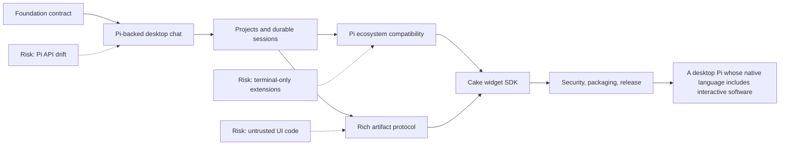
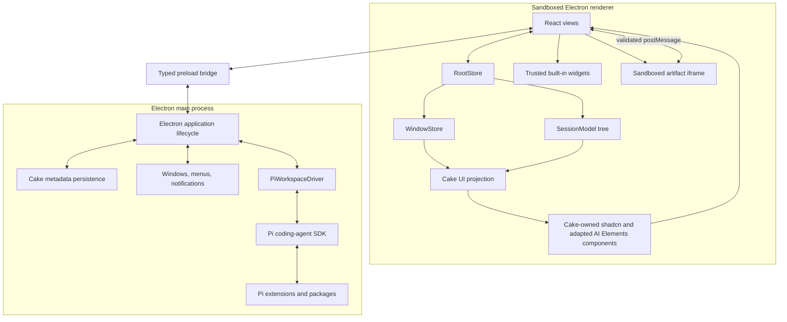

# Cake: Living Product and Implementation Plan

> **Status:** Draft implementation specification
> **Last updated:** 2026-08-07
> **Purpose:** This is the canonical description of Cake. An agent should be able to read this document, understand the product vision and architectural constraints, select the next incomplete milestone, and implement it without reconstructing the original product conversation.

## How to use and maintain this document

This is a living specification, not a historical proposal.

- Treat the vision, product principles, architectural decisions, security boundaries, and source-of-truth rules as authoritative.
- Treat milestones as outcome-based. An implementation may change internal details while preserving the stated outcome and constraints.
- Do not silently reverse a decided item. Record a replacement decision, its reason, and its migration impact in the decision log.
- Do not mark a milestone complete until every acceptance check for that milestone passes.
- Add newly discovered risks and open questions where they affect the route, not only in commit messages.
- Keep Pi-specific code behind the Pi adapter boundary in `src/agent/pi-runtime.ts`. Other Cake modules must use Cake-owned contracts.
- Treat `.agents/skills/r-state-tree/SKILL.md` and its bundled references as the authoritative implementation guidance for state placement, Store/Model design, lifecycle, async ownership, persistence, observability, and React integration. Agents changing those concerns must read and apply the skill before editing.
- `pi-gui` is reference material only. Cake must not fork it or copy its implementation wholesale.

## Ten-second brief

Cake is a minimal, extensible desktop coding agent powered by Pi, with the full web platform available for safe, rich, stateful interactions such as sortable tables, diagrams, forms, previews, and React widgets.



## 1. Product vision

Pi proves that a coding agent can remain small because capabilities live in extensions, skills, tools, and packages rather than an ever-growing core. Cake preserves that philosophy and replaces the terminal presentation layer with a desktop application built on the web platform.

The desktop is not merely a prettier terminal transcript. It changes what the agent can communicate. In Cake, an agent can:

- explain normally with Markdown;
- present a sortable and filterable table rather than print an ASCII table;
- draw and update a diagram;
- ask for structured input through a form;
- show file, diff, image, audio, and chart views;
- create a stateful interactive artifact the user can manipulate;
- install or generate React-based widgets within a constrained runtime;
- receive structured interaction results back from the user;
- use Pi extensions, skills, packages, providers, tools, session branching, and compaction wherever their semantics are presentation-independent.

Cake should feel closer to a focused coding workspace such as the Codex desktop app than to an IDE. The conversation is primary. Files, diffs, artifacts, and controls appear when useful and remain subordinate to the agent interaction.

## 2. Why Cake exists

Terminal interfaces are excellent for text and keyboard-driven workflows, but terminal widgets are constrained by cell grids, ANSI rendering, and raw key handling. The browser platform already provides layout, typography, accessibility, graphics, media, input controls, and a mature component ecosystem.

Cake exists to combine:

1. Pi's minimal, provider-neutral, extensible agent runtime;
2. a multi-project and multi-session desktop shell;
3. React for rich presentation;
4. `r-state-tree` for explicit domain, workflow, lifecycle, and view-state ownership;
5. a secure protocol through which agents and extensions can present interactive artifacts.

The product is successful when rich interactions feel native to the conversation rather than embedded webpages bolted onto a chat client.

## 3. Product principles

### 3.1 Pi is the core, not an inspiration

Cake depends on Pi's published packages and delegates agent behavior to Pi. It must not reimplement Pi's agent loop, model/provider support, core tool execution, session branching, compaction, skills, or extension discovery without a documented and compelling incompatibility.

### 3.2 Minimal core, powerful extensions

Cake's core supplies stable primitives: conversation, artifacts, capabilities, persistence, and extension loading. Features with legitimate workflow variation should remain packages or extensions.

### 3.3 The conversation remains primary

Cake is not a general-purpose IDE. A file tree, diff, or artifact should appear because it supports the active work. Avoid filling the initial UI with permanent panels.

### 3.4 Rich output is structured, not arbitrary privileged code

The model may request HTML, widgets, and interactions, but model-generated content never executes in Cake's privileged renderer or Node process. Rich output crosses a versioned schema and a capability boundary.

### 3.5 One authority for every kind of state

Pi owns Pi sessions and transcripts. Cake owns Cake-specific application and artifact metadata. `r-state-tree` Models and Stores must reflect these ownership boundaries rather than create competing persistent copies.

### 3.6 Web-native first, terminal-compatible where practical

Cake offers a native React/widget API. Existing Pi extensions retain non-visual behavior and primitive UI where possible. Arbitrary Pi TUI components are not promised automatic React conversion.

### 3.7 Dependency first, upstream second, fork last

Use published Pi APIs. If a required general-purpose seam is missing, prefer an upstream contribution. Maintain a narrow patch only when blocked. A long-lived Pi fork is a last resort.

### 3.8 Reference without imitation

`pi-gui` validates several architectural patterns and may inform tests and edge cases, but Cake is an independent implementation with its own architecture, state model, widget system, and visual identity.

## 4. Scope

### 4.1 Required product capabilities

- Add, remove, rename, and reopen local projects.
- View sessions across projects and create, resume, rename, archive, fork, and branch sessions.
- Stream assistant text, thinking state, tool calls, tool updates, results, retries, compaction, and errors.
- Compose prompts with file references, pasted or dropped images, steering messages, and follow-ups.
- Select providers, models, and thinking levels using Pi's model and authentication systems.
- Display changed files and diffs in command-opened panes.
- Discover and manage Pi skills, prompts, packages, and extensions.
- Adapt compatible Pi extension UI primitives to desktop UI.
- Present and persist rich Cake artifacts.
- Allow structured interaction with artifacts and return results to the waiting tool or the next agent turn.
- Load Cake-native widget packages.
- Recover cleanly after renderer reloads and reset failed Pi session runtimes.
- Package for macOS first without embedding assumptions that prevent Windows and Linux support.

### 4.2 Explicit non-goals for the initial product

- Building a full source-code editor or language-server-based IDE.
- Replacing Pi's provider, auth, session, compaction, or package systems.
- Automatically translating arbitrary terminal `Component` implementations into React.
- Running model-generated JavaScript in the main Cake renderer.
- Allowing widgets unrestricted filesystem, process, credential, clipboard, or network access.
- Making Pi's experimental remote client/server protocol a hard dependency before it is stable.
- Pixel-matching Codex, `pi-gui`, or another existing app.

## 5. Primary user experience

### 5.1 First launch

1. Cake explains that it uses Pi and offers Pi-supported provider authentication.
2. The user adds a project directory.
3. Cake resolves project trust before loading project-local executable resources.
4. The user creates a session and sends a prompt.
5. The transcript streams immediately, including tool activity and recoverable errors.

### 5.2 Everyday session workflow

1. Select a project and session from the sidebar.
2. Inspect the current transcript and any durable artifacts.
3. Send a prompt with optional file or image attachments.
4. While the agent runs, steer the active turn or queue a follow-up.
5. Expand tool calls and results, inspect diffs, or open a terminal when needed.
6. Interact with a form, table, diagram, or other artifact without leaving the conversation.
7. Close and reopen Cake without losing the Pi session or Cake view state.

### 5.3 Rich interaction workflow

There are two interaction shapes:

- **Present:** The agent calls `ui_present`. Cake creates or updates an artifact and immediately acknowledges it. Interaction may later create a user-authored event or prompt.
- **Request:** The agent calls `ui_request`. Cake displays an interactive artifact and resolves the tool only after the user submits or cancels a structured response.

Every interactive artifact must provide a readable fallback for session export, terminal viewing, accessibility, and unsupported clients.

## 6. Decided architecture

### 6.1 Technology choices

| Concern | Decision | Reason |
| --- | --- | --- |
| Desktop shell | Electron | Pi and its extension ecosystem are Node-first; Electron avoids a Node sidecar packaging layer. |
| Renderer | React + TypeScript | Required for the intended component and widget ecosystem. |
| UI component foundation | shadcn/ui + Tailwind CSS 4, with adapted AI Elements components | shadcn/ui supplies Cake's source-owned primitive layer. Selected AI Elements components are copied into the repository, stripped of AI SDK contracts, adapted to Cake-owned UI parts, and maintained as Cake source. Prompt Kit may be used selectively when a specific component is demonstrably preferable. |
| State | `r-state-tree` | Provides explicit Model/Store separation, reactive views, snapshots, lifecycle ownership, and React bindings. |
| Agent runtime | `@earendil-works/pi-coding-agent` | Reuses Pi sessions, resources, tools, providers, auth, compaction, and extension runtime. |
| AI SDK relationship | Do not use as Cake's agent runtime | Pi and `pi-ai` remain authoritative; Cake adapts Pi events to Cake-owned UI models instead of adding a competing model, streaming, transport, and tool abstraction. |
| Pi integration | Cake-owned adapter | Prevents Pi types and API drift from spreading through the app. |
| Session authority | Pi session files and `SessionManager` | Preserves CLI compatibility and avoids divergent transcripts. |
| Rich UI transport | Versioned Cake artifact protocol | Makes interactions serializable, testable, persistable, and secure. |
| Third-party widget execution | Sandboxed web runtime | Keeps extension presentation code away from Electron and Node privileges. |
| `pi-gui` relationship | Reference only | Useful prior art; not a dependency or fork. |

At the 2026-08-06 research snapshot, Pi's published coding-agent package exposes the SDK, session runtime, resource loader, package manager, settings, tools, and `ExtensionUIContext` needed for this design. Pin the exact Pi version selected during the foundation spike; do not use an unbounded range.

### 6.2 Process boundaries



Responsibilities:

- **Renderer:** presentation, DOM interaction, window-local Stores, artifact host, and no broad Node access.
- **Preload:** a narrow, typed, validated request/event API. It does not expose raw `ipcRenderer`.
- **Main:** window lifecycle, native dialogs, app metadata persistence, and direct ownership of workspace-scoped Pi drivers, sessions, tools, providers, packages, and extensions.
- **Artifact frame:** generated or third-party web code with no Node integration, no same-origin privilege, no direct Electron IPC, and no network by default.

Use one `PiWorkspaceDriver` per active workspace. Multiple sessions within a
workspace share that in-process driver while retaining independent runtime and
subscription ownership. Idle drivers are disposed and reopened from Pi's
authoritative session files when needed.

### 6.3 Pi adapter boundary

Only `src/agent/pi-runtime.ts` may import `@earendil-works/pi-coding-agent` in ordinary application code. It exposes Cake-owned DTOs and intent methods such as:

```ts
interface AgentRuntime {
  openWorkspace(input: OpenWorkspaceInput): Promise<WorkspaceSnapshot>;
  listSessions(workspaceId: string): Promise<SessionSummary[]>;
  createSession(input: CreateSessionInput): Promise<SessionSnapshot>;
  openSession(ref: SessionRef): Promise<SessionSnapshot>;
  closeSession(ref: SessionRef): Promise<void>;
  prompt(ref: SessionRef, input: PromptInput): Promise<void>;
  steer(ref: SessionRef, input: PromptInput): Promise<void>;
  followUp(ref: SessionRef, input: PromptInput): Promise<void>;
  abort(ref: SessionRef): Promise<void>;
  compact(ref: SessionRef, instructions?: string): Promise<void>;
  fork(ref: SessionRef, entryId: string): Promise<SessionSnapshot>;
  navigateTree(ref: SessionRef, entryId: string): Promise<SessionSnapshot>;
  respondToUi(ref: SessionRef, response: ExtensionUiResponse): Promise<void>;
  subscribe(ref: SessionRef, listener: (event: SessionEvent) => void): () => void;
}
```

The final interface may differ, but it must preserve these rules:

- Cake modules outside the Pi adapter do not depend on Pi event shapes directly.
- Events have stable IDs and session/workspace identity.
- Initial snapshots are authoritative; deltas update them.
- Resubscription after session replacement is explicit.
- The adapter normalizes extension UI, tool events, errors, and capability differences.
- Adapter contract tests run against the exact pinned Pi version.

### 6.4 Source-owned presentation boundary

Use [shadcn/ui](https://ui.shadcn.com/) conventions and Tailwind CSS 4 as the foundation for Cake's trusted renderer components. Components added through shadcn registries are copied into Cake, reviewed, adapted, themed, tested, and thereafter maintained as Cake source; they are not opaque runtime UI dependencies.

Use [AI Elements](https://elements.ai-sdk.dev/) as the preferred source registry for conversation and coding-agent presentation primitives. Its components follow the shadcn ownership model and provide useful starting points for messages, streaming Markdown, reasoning, tools, approvals, sources, attachments, code, terminal output, file trees, plans, tasks, queues, checkpoints, tests, and artifacts. Cake does not adopt AI Elements as an application data contract or promise drop-in compatibility with its upstream examples.

[Prompt Kit](https://www.prompt-kit.com/) also follows the shadcn source-copy model and may be used as a secondary source when a specific component is smaller, more accessible, more secure, or otherwise better suited to Cake. Do not maintain two interchangeable implementations of the same surface without a concrete reason. Prefer AI Elements by default, compare at component-selection time, and record the chosen source and revision.

Cake must not adopt Vercel AI SDK as a second agent runtime. In particular, the trusted renderer must not depend on `useChat`, `DefaultChatTransport`, `streamText`, AI SDK provider packages, or AI SDK server routes for ordinary Cake conversations. Pi and `pi-ai` remain responsible for providers, inference, streaming, tool execution, session history, auth, and cost/token information.

The data path is:

```text
Pi session snapshots and events
        -> src/agent/pi-runtime normalization
        -> Cake process-safe SessionEvent DTOs
        -> r-state-tree transcript/tool/artifact Stores
        -> Cake-owned UI part models
        -> Cake-owned shadcn and adapted AI Elements React components
```

Define Cake-owned discriminated unions for presentation instead of allowing AI SDK types to become application contracts. The initial vocabulary should cover at least:

- user and assistant text, including incremental streaming;
- reasoning/thinking with explicit visibility and lifecycle state;
- tool invocation input, approval, running, success, error, and denial states;
- sources and citations;
- file and image attachments;
- task/plan/checklist progress;
- artifacts, code, diffs, terminal output, file trees, and previews;
- retry, branch, copy, open, approve, deny, submit, and cancel actions.

Implementation rules:

- Copy only the AI Elements or Prompt Kit components Cake actually uses; do not import either documentation application, example application, or catalog wholesale.
- Treat registry installation as source acquisition, not dependency adoption. The resulting component files belong to Cake and may intentionally diverge from upstream.
- Replace AI Elements imports of `UIMessage`, `ToolUIPart`, `DynamicToolUIPart`, `FileUIPart`, `SourceDocumentUIPart`, `ChatStatus`, and other AI SDK types with Cake-owned presentation types before integrating a component into the product path.
- Do not install the `ai` package merely to satisfy copied component types. Do not inherit AI Elements or Prompt Kit examples' AI SDK hooks, Next.js assumptions, provider setup, transports, or server routes.
- Drive components with intent methods and reactive state from Cake's `r-state-tree` Stores.
- Keep Pi-to-UI translation in a dedicated projection/adapter layer; components must not interpret raw Pi events.
- Preserve useful upstream accessibility, keyboard behavior, streaming Markdown, and composition patterns.
- Treat copied component code as a starting point, not an upstream-compatible API promise. Cake may reshape props and visuals to fit its product language.
- Use React 19, shadcn/ui conventions, CSS-variable theme tokens, and Tailwind CSS 4 with the Electron/Vite toolchain; remove Next.js-only assumptions and adapt registry aliases to Cake's repository layout.
- Audit transitive browser dependencies before accepting a component. Renderer dependencies must not introduce Node access or weaken the content security policy.
- Retain required upstream licensing and attribution: AI Elements is Apache-2.0 and Prompt Kit is MIT. Mark materially modified Apache-derived files as required.
- Record the source project, upstream path, and exact revision for each imported component so security fixes and useful improvements can be reviewed deliberately.
- Do not expose AI SDK-shaped data through IPC or persist it as Cake's durable schema.

The first AI Elements evaluation slice is conversation, message, reasoning, tool, and confirmation. It must render the existing Pi foundation stream and extension confirmation through Cake-owned props without `ai` or `@ai-sdk/react` installed. Later candidates include streaming Markdown, sources, attachments, code blocks, terminal output, file trees, plans, tasks, queues, checkpoints, test results, and artifact chrome. Evaluate the large prompt-input component only after Cake's composer and attachment contracts are defined; prefer composing smaller shadcn primitives if adapting it would retain unnecessary upstream state or behavior. JSX preview and other executable-content components require separate capability and security review before adoption.

This boundary leaves open an optional future use of AI SDK for an isolated feature. Such use must have a concrete need, remain outside the Pi-backed conversation path, and receive an explicit architecture decision; installing it merely to satisfy copied component types is prohibited.

### 6.5 Pi resource and extension compatibility

Use Pi's `DefaultResourceLoader`, project trust behavior, package manager, skills, prompts, context files, settings, and extension runtime where public APIs permit.

| Pi capability | Cake behavior |
| --- | --- |
| Tools, providers, event handlers, compaction hooks | Run unchanged through the Pi SDK in Electron main. |
| Skills, prompt templates, context files | Discover through Pi and expose in Cake UI. |
| Package installation | Delegate to Pi package management with Cake confirmation and diagnostics. |
| Commands | List and invoke through the Pi session. |
| `select`, `confirm`, `input`, `editor` | Render as Cake dialogs and return structured responses. |
| `notify`, `setStatus`, `setTitle`, `setEditorText` | Map to Cake notifications, status, window title, and composer state. |
| String `setWidget` | Render as a legacy terminal-style widget with ANSI sanitization. |
| TUI component factory, custom footer/header/editor, raw terminal input | Report as unsupported or degraded unless a deliberate compatibility implementation exists. |
| Custom message/TUI renderer | Preserve its data and provide a fallback; do not execute TUI render code in React. |

Every compatibility downgrade must be observable in extension diagnostics. Do not fail silently when an extension believes it displayed or requested something important.

## 7. `r-state-tree` state architecture

Cake uses Models for serializable application-owned domain state and Stores for mounted behavior, I/O, routing, and view/session workflows. Components read from Stores and call intent-level methods.

### 7.1 Authority and persistence

| State | Authority | Representation |
| --- | --- | --- |
| Pi transcript, session tree, compaction, model history | Pi | Pi session files; projected into the renderer `SessionModel` tree |
| Provider credentials | Pi/auth runtime | Never copied into renderer Models |
| Project registry and display metadata | Cake main process | Cake Model snapshot persisted atomically |
| Artifact metadata and content pointers | Cake + Pi custom session entries | Cake artifact store plus session reference |
| Window selection, panel state, composer draft, scroll | Cake renderer | Window Stores; selected fields snapshotted |
| Live streaming and tool progress | Pi event stream | Ephemeral Stores |
| Extension dialogs and active statuses | Main-process Pi driver/Cake bridge | Ephemeral Stores with cancellation |

### 7.2 Main-process state and services

The Electron main process does not require an `r-state-tree` composition root
for symmetry with the renderer. Keep straightforward window lifecycle, IPC
routing, native operations, and stateless services as ordinary TypeScript.
Introduce a main-process Store only when a concrete subsystem owns observable
application state, derived state, mounted resources, or coordinated async
workflow that benefits from Store semantics. Name that Store for its behavioral
surface—for example, Pi runtime supervision—rather than creating a generic
kernel container in advance. Introduce a main-process composition root only if
multiple real Stores later require shared ownership and coordination.

Likely future Store candidates, subject to that boundary test:

- `ProjectRegistryStore` when project loading, trust, and persistence form a
  reactive workflow visible across windows.
- `PiRuntimeSupervisorStore` when per-workspace start, stop, reset, and retry
  behavior becomes observable application state.
- `ArtifactRepositoryStore` if artifact persistence and synchronization require
  mounted reactive orchestration rather than a repository service.

Suggested Models:

- `ApplicationModel`: schema version and durable app-owned metadata.
- `ProjectModel`: stable ID, canonical path, display name, trust/display metadata, last-opened time.
- `ArtifactModel`: artifact ID, session reference, kind, version, content digest/location, fallback, creation/update metadata.
- `PreferencesModel`: app-owned appearance and behavior preferences that do not belong to Pi.

### 7.3 Renderer tree

`RootStore` is the composition root for one renderer window. Cake creates one
independent root for each Electron window, provides it to React, and disposes it
when that renderer ends. It owns the Pi event subscription and synchronizes
validated events into a disposable `SessionModel` snapshot while coordinating
the window-scoped `WindowStore`.

Pi remains authoritative for session persistence and behavior. `SessionModel`
is the reactive renderer representation of the current Pi session, not a second
session authority. Every transport snapshot field is an `@state` field with the
same name and value shape; the model does not normalize, flatten, or reconstruct
the data. Full snapshots and snapshots assembled from streaming events commit
atomically through r-state-tree's `applySnapshot`. UI-specific interpretations
belong in computed getters and presentation adapters.

`WindowStore` owns window workflows such as selection, drafts, search, command
panes, pending operations, and stale-event filtering. As a UI subsystem gains
coherent state, lifecycle, and behavior, compose it beneath `WindowStore` with
`@child` rather than enlarging either root or the session Models.

```text
RootStore
├── SessionModel
│   ├── TranscriptPartModel[]
│   ├── ModelOptionModel[]
│   ├── SelectedModelModel
│   ├── ThinkingLevelModel[]
│   ├── SessionSummaryModel[]
│   └── SessionTreeNodeModel[]
└── WindowStore
    ├── NavigationStore
    ├── ProjectSidebarStore
    ├── ComposerStore
    ├── ToolExecutionStore
    ├── ArtifactHostStore
    ├── ExtensionUiStore
    ├── DiffStore
    └── SettingsViewStore
```

Implementation rules:

- Create Stores with `mount(createStore(...))`; never instantiate them with `new`.
- Compose meaningful subsystems with `@child` and stable keys.
- Create Models through their supported factory and mutate collections in place.
- Use Store effects for IPC subscriptions and external resources; clean them up with the Store.
- Use the Store lifetime signal for Store disposal and separate operation controllers or revisions for take-latest, queue, retry, and user cancellation.
- Do not materialize lazy child Stores merely to start background work.
- Do not persist constructor defaults before hydration completes.
- React providers are lookup scopes, not ownership or disposal scopes.
- Keep tiny focus, hover, measurement, and isolated input state in React only when it has no workflow meaning.

## 8. Rich artifact protocol

### 8.1 Goals

The protocol must be versioned, serializable, streamable, schema-validated, persistable, accessible, secure by default, and independent of a single renderer implementation.

An initial envelope:

```ts
interface CakeArtifactV1 {
  protocol: "cake.artifact/v1";
  id: string;
  sessionId: string;
  kind: "markdown" | "table" | "diagram" | "form" | "html" | "widget" | "media";
  title?: string;
  payload: unknown;
  fallback: {
    markdown: string;
  };
  capabilities?: WidgetCapability[];
  interaction?: {
    mode: "present" | "request";
    responseSchema?: unknown;
  };
}
```

The exact schema should be implemented with the repository's selected runtime schema library and shared across agent, main, preload, renderer, and widget SDK boundaries. Unknown versions or kinds must degrade to the Markdown fallback.

### 8.2 Built-in artifact kinds

- **Markdown:** safe Markdown and GFM; raw HTML disabled by default.
- **Table:** typed columns, rows, sorting, filtering, selection, copy, and export.
- **Diagram:** Mermaid source initially; later diagrams may register separately.
- **Form:** schema-defined controls, validation, submit, and cancel.
- **HTML:** rendered only in the artifact sandbox.
- **Widget:** references a registered widget type and validated props.
- **Media:** image, audio, video, or document reference with safe URL handling.

### 8.3 Agent tools

Cake ships a built-in Pi extension that registers:

- `ui_present`: create or update a non-blocking artifact and return its ID.
- `ui_request`: display a request artifact, wait for submit/cancel, and return schema-validated data.

Tool requirements:

- Inputs are size-limited and schema-validated before display.
- The user can cancel a request.
- Session abort, replacement, Pi driver disposal, or window loss settles pending requests predictably.
- Updates use stable artifact IDs and explicit revisions.
- A request cannot receive more than one terminal response.
- The tool result contains a concise textual outcome for the LLM context.
- Artifact content is stored outside the transcript when large; the Pi session contains a versioned custom entry or pointer plus fallback.

### 8.4 Interaction routing

Widget events never become arbitrary IPC calls. They are validated against the widget manifest and routed as one of:

- local presentation state update;
- artifact persistence update;
- response to a waiting `ui_request`;
- explicit new user message or follow-up, with visible user confirmation where appropriate;
- request for a declared host capability.

## 9. Widget SDK and runtime

### 9.1 Widget classes

1. **Built-in widgets:** shipped with Cake and allowed to render directly in the trusted React renderer.
2. **Installed Cake widgets:** packaged React/web bundles loaded in an artifact sandbox.
3. **Generated widgets:** agent-authored HTML or bundled React loaded in the same or stricter sandbox.
4. **Legacy Pi widgets:** terminal text lines rendered as inert text.

### 9.2 Package manifest

A Pi package may optionally add a Cake section without losing its Pi resources:

```json
{
  "pi": {
    "extensions": ["./extensions"],
    "skills": ["./skills"]
  },
  "cake": {
    "widgets": ["./dist/widgets.manifest.json"]
  }
}
```

The final manifest must declare widget type IDs, bundle entry, protocol version, props schema, response schema, capabilities, and fallback behavior.

### 9.3 Capability model

Capabilities are deny-by-default and narrowly named. Initial candidates:

- `clipboard.write`
- `file.openDialog`
- `file.readSelected`
- `artifact.persist`
- `session.submitResponse`
- `session.sendFollowUp`
- `network.fetch` with explicit origin scopes

There is no generic `electron`, `node`, `filesystem`, `shell`, or `ipc` capability.

Grants are scoped by widget package, project, capability, and when relevant origin/path. Sensitive grants require an explicit user decision and must be reviewable and revocable.

### 9.4 Sandbox requirements

- Use an iframe or equivalent isolated web contents without Node integration.
- Do not grant same-origin access to the parent application.
- Apply a restrictive CSP; scripts and styles come from controlled artifact resources.
- Disable network by default and block top-level navigation, downloads, popups, and permission requests.
- Communicate only through a versioned, validated `postMessage` bridge.
- Bound payload size, message rate, render time, and retained memory.
- Destroy the frame and revoke resources on artifact disposal.
- Treat widget errors as artifact-local; they must not crash the conversation.
- Never use `dangerouslySetInnerHTML` for model HTML in the trusted renderer.

### 9.5 React and MDX

Cake-native widgets may use React internally. Generated React is compiled outside the trusted renderer and executed only in the sandbox.

MDX support, if added, is a restricted authoring format:

- known registered components only;
- no arbitrary imports;
- no Node or Electron access;
- no unbounded expressions in the trusted renderer;
- deterministic Markdown fallback.

## 10. Data layout and durability

Use a dedicated Cake application directory for app-owned data. The exact OS-resolved base path is an implementation detail, but keep these conceptual areas separate:

```text
cake-data/
├── application.json          # schema-versioned Cake Model snapshot
├── artifacts/                # content-addressed artifact payloads and bundles
├── cache/                    # disposable derived data
├── logs/                     # redacted diagnostics
```

Pi continues to use its configured agent directory and session files. Cake may read Pi sessions through Pi APIs and must not mutate their JSONL format with ad hoc file editing.

Durability rules:

- Atomic writes for app-owned JSON snapshots.
- Explicit schema version and migrations.
- Content digests for external artifact payloads.
- Garbage collection only after proving no live session/custom entry references an artifact.
- Credentials and provider secrets never enter Cake state snapshots, logs, renderer IPC, or artifacts.
- Cache loss must not destroy sessions or artifacts declared durable.

## 11. Repository shape

```text
cake/
├── src/
│   ├── main/                 # Electron lifecycle, Pi drivers, native services, persisted metadata
│   ├── preload/              # narrow contextBridge API; no application workflow
│   ├── renderer/             # React frontend, window Stores, UI projections and components
│   ├── agent/                # Cake's thin Pi SDK adapter; executed by Electron main
│   └── ipc/                  # validated main/preload/renderer transport schemas
├── examples/
│   ├── extensions/
│   └── widgets/
├── docs/
│   ├── architecture/
│   ├── extension-compatibility.md
│   ├── security.md
│   └── widget-sdk.md
└── PLAN.md
```

Cake is one application package with one build and release lifecycle. Electron process boundaries are enforced by directories, typed IPC contracts, import restrictions, and tests; they do not imply npm-package boundaries. Extract a package only after there is a real independent consumer, publication requirement, or release lifecycle. Do not create packages as technical-category buckets for protocol, state, UI, or adapters.

## 12. Implementation route

Durations and ownership are intentionally unspecified until the project has contributors and measured velocity.

### Stage S0 — Foundation contract

**Status:** Complete (2026-08-07)
**Outcome:** The repository builds a secure Electron shell and proves the selected Pi and `r-state-tree` versions can support the architecture.

Work:

- Create the single-package pnpm project, TypeScript configuration, linting, tests, and Electron/Vite setup.
- Pin exact versions of Pi and `r-state-tree`.
- Configure React 19, Tailwind CSS 4, and shadcn/ui for the Electron/Vite renderer.
- Define process-safe protocol schemas and a typed preload bridge.
- Prove Electron main can import Pi through Cake's adapter, create an in-memory session, stream events, and dispose it.
- Prove `AgentSession.bindExtensions()` accepts a Cake `ExtensionUIContext` implementation.
- Mount the renderer's `RootStore` and verify its owned subscriptions are
  disposed with the renderer lifecycle.
- Adapt one small AI Elements component to Cake-owned props without installing AI SDK runtime or type dependencies, and document the source-revision, modification, and attribution convention.
- Record any Pi API gaps before product UI grows around workarounds.

Acceptance checks:

- A sandboxed renderer displays streamed text from a Pi session running outside the renderer.
- The renderer has no Node globals and cannot access raw Electron IPC.
- Pi runtime reset is detected and the selected session can be reopened.
- A Pi extension `confirm` call appears in React and receives its response.
- Unit, type, and one real Electron smoke test pass.

Current S0 checkpoint (2026-08-07):

- The visible “Test Pi session” flow is a diagnostic architecture probe, not
  provider authentication, connection to an existing session, or normal chat.
- It creates a new in-memory, non-persistent Pi session through the main-process
  driver, invokes the built-in `/cake-foundation` extension command, carries
  that extension's `confirm` request into React, returns the correlated answer,
  and projects the resulting Pi events into the renderer state tree.
- This probe has established the Pi adapter, extension UI, IPC validation,
  preload, renderer Store, and process-lifecycle path. It should be removed once
  the equivalent path is covered by the real S1 session workflow and tests.
- The Tailwind/shadcn foundation and first adapted AI Elements component are in
  place without AI SDK contracts. A Playwright-driven Electron smoke test now
  verifies renderer sandboxing, visible Pi streaming, the extension confirmation
  round trip, Pi runtime disposal, and renderer survival. S0 is complete.

### Stage S1 — Pi-backed desktop chat

**Status:** Implementation complete; live-provider acceptance verification pending (2026-08-07)
**Depends on:** S0
**Outcome:** Cake is usable for a single project and session.

Work:

- Implement the Pi adapter session lifecycle and event normalization.
- Define Cake-owned UI part unions and the Pi-event-to-UI projection layer; no raw Pi or AI SDK message types may reach React components.
- Build transcript rendering for user, assistant, thinking, tools, results, retries, compaction, and errors.
- Adapt selected AI Elements conversation, message, Markdown, reasoning, sources, tool, confirmation, code, and composer primitives to Cake Stores and intents. Use Prompt Kit selectively only where a reviewed component is preferable.
- Build composer submission, abort, steering, follow-up, file mention, and image attachment flows.
- Add model, provider/auth, and thinking-level controls through Pi.
- Add project trust handling before project-local executable resources load.
- Persist and hydrate window-local view state only after initial data loads.

Acceptance checks:

- A user can open a project, authenticate, run a coding task, inspect tool output, steer or abort, close Cake, and resume the same Pi session.
- A terminal Pi client can still open and understand the resulting session.
- No transcript is stored as an independent Cake-owned source of truth.
- The Pi runtime streams through Cake Stores into Cake-owned adapted components without `UIMessage`, `useChat`, AI SDK transports, or an AI SDK server route.

Current S1 checkpoint (2026-08-07):

- All eight implementation work items are present in the real Electron path:
  persistent Pi lifecycle and normalization, Cake UI parts, transcript surfaces,
  adapted source-owned components, full composer delivery controls, provider and
  thinking controls, pre-load project trust, and hydration-gated window state.
- Deterministic contract tests verify Pi JSONL reopen, trust detection, protocol
  validation, Store lifecycle and stale-session filtering, and inert rich-text
  rendering. The Electron smoke verifies sandboxing, durable session open,
  composer/view-state hydration, Pi runtime reset/reopen, and renderer survival.
- Pi remains the only transcript authority. Cake persists only window-local view
  state and projects Pi snapshots/events through Cake-owned DTOs. No AI SDK
  runtime or types are installed.
- S1 is not marked complete yet because the full real-provider workflow—native
  provider login, a paid/credentialed coding turn, steering/abort against that
  live turn, application restart, and independent Pi terminal reopening—must be
  run with explicitly supplied user credentials. Live provider checks remain
  opt-in and may incur cost.

### Stage S2 — Projects and durable sessions

**Status:** Complete (2026-08-07)
**Depends on:** S1
**Outcome:** Cake provides the multi-project, multi-session desktop experience described in the vision.

Work:

- Add project registry, sidebar, session listing, create/resume/rename/archive/fork/tree navigation.
- Add multiple windows without confusing window-local selection with global session state.
- Add changed-file and diff panes opened by slash commands.
- Add Pi driver lifecycle, idle retention, reset/reopen, and stale-event protection.
- Add session search and useful metadata without rewriting Pi sessions.

Acceptance checks:

- Multiple projects and sessions survive restart.
- Two windows can view different sessions without overwriting each other's selection or drafts.
- A disposed or failed Pi runtime can be recreated and its sessions reopened.
- Forking and tree navigation match Pi semantics.

Current S2 checkpoint (2026-08-07):

- Cake now persists schema-versioned application metadata through an
  `ApplicationModel`: named local projects plus Cake-only archived-session
  identifiers. Pi JSONL remains authoritative for session names, transcripts,
  parent/fork relationships, and branch trees. Removing a project from Cake
  does not delete its directory or Pi sessions.
- The desktop main process owns multiple windows and a workspace-keyed
  `PiWorkspaceDriver` pool with idle retention. Each driver owns independent Pi
  runtimes per open session, while each renderer `RootStore` independently owns
  its Pi subscription and current `SessionModel` projection. Its `WindowStore`
  owns selected project/session workflow, per-session drafts, search, transient
  command pane, pending operations, and stale-event filtering.
- The session UI supports create/resume/rename/archive/restore, text search,
  Pi-native fork and in-file tree navigation through `/tree`. Changed-file
  summaries and diffs come from Git through the workspace driver and open
  through `/changes`. These panes are transient and are not workspace tabs.
- Pi runtime failure exposes an explicit restart action. A recreated workspace
  driver securely reopens the selected Pi session from its validated session
  file, resubscribes the window, and preserves its draft. Empty Pi sessions are
  covered as well as indexed sessions.
- Deterministic tests cover project metadata, Pi JSONL rename/fork/tree behavior,
  window hydration, per-session drafts, archive/search filtering, S2 intent
  routing, slash-command panes, changes, and stale-session/UI-event isolation. Two
  Playwright Electron smokes verify independent windows with different active
  sessions and drafts, the Tree command dialog, sandboxing, durable reopen,
  Pi runtime reset, reopen, and renderer survival.

### Stage S3 — Pi ecosystem compatibility

**Depends on:** S2
**Workstream:** Can proceed in parallel with S4 after S2.
**Outcome:** Existing Pi packages retain useful behavior and their compatibility level is transparent.

Work:

- Surface skills, prompt templates, packages, extensions, load errors, and diagnostics.
- Complete the Cake `ExtensionUIContext` adapter.
- Implement dialogs, notifications, status, title, editor text, and legacy string widgets.
- Define visible degraded behavior for TUI-only calls.
- Add a compatibility fixture suite using representative Pi extensions, including MCP and sub-agent extensions when available.
- Preserve extension session isolation and cleanup.

Acceptance checks:

- Headless Pi extensions, tools, providers, commands, skills, and prompts work without source changes.
- Primitive extension dialogs and widgets work through Cake UI.
- Unsupported TUI functionality produces an actionable diagnostic rather than a false success.
- Reloading or replacing a session does not leak extension state into another session.

### Stage S4 — Rich artifact protocol

**Depends on:** S2
**Workstream:** Can proceed in parallel with S3.
**Outcome:** The agent can safely present and request interaction through first-class durable artifacts.

Work:

- Finalize and implement `cake.artifact/v1` schemas.
- Add artifact repository, session custom entries, fallbacks, hydration, and revision updates.
- Implement `ui_present` and `ui_request` as a built-in Pi extension.
- Ship built-in Markdown, table, Mermaid diagram, form, media, diff, and HTML-sandbox renderers.
- Implement request cancellation and lifecycle rules.
- Add artifact export and transcript fallback behavior.

Acceptance checks:

- The agent can present a sortable table and update it by stable ID.
- The agent can request a validated form response and receive it as a tool result.
- A diagram and artifact survive application restart.
- Raw HTML cannot access Node, Electron IPC, parent DOM, or network without a grant.
- Unsupported artifact clients can read a useful Markdown fallback.

### Stage S5 — Cake widget SDK

**Depends on:** S3 and S4
**Outcome:** Developers and agents can extend Cake with React-powered widgets without entering the privileged application runtime.

Work:

- Publish the widget manifest, runtime API, test harness, and example package.
- Implement bundle loading, schema validation, widget registry, and version negotiation.
- Implement capability requests, grants, revocation, and audit display.
- Implement sandbox lifecycle, crash/error UI, resource limits, and message-rate limits.
- Add development hot reload for local widget packages.
- Document React and restricted-MDX authoring.

Acceptance checks:

- A local package registers a React widget, receives validated props, maintains local state, and submits a validated response.
- The same package cannot access filesystem, shell, credentials, Electron, or network without a declared and granted capability.
- Removing or disabling the package leaves a readable fallback in prior sessions.
- A broken widget affects only its artifact surface.

### Stage S6 — Security, packaging, release

**Depends on:** S5
**Outcome:** Cake can be distributed with confidence that development behavior, packaged behavior, and security boundaries match.

Work:

- Complete the threat model and security review.
- Add dependency and package provenance checks appropriate to executable extensions.
- Verify CSP, navigation, permissions, protocol validation, path handling, and secret redaction.
- Add macOS signing, notarization, install, update, and packaged smoke tests.
- Add Windows and Linux packaging when the macOS release path is stable.
- Add crash reports and diagnostics with opt-in and redaction.
- Document recovery, data locations, trust, extension permissions, and uninstall behavior.

Acceptance checks:

- A packaged macOS build completes the core real-app workflow.
- Packaged Pi extensions and widget bundles resolve correctly.
- Security tests prove generated content cannot cross its capability boundary.
- App and renderer crashes plus Pi runtime reset have tested recovery behavior.
- A release checklist can be executed without undocumented local knowledge.

## 13. Testing strategy

### 13.1 Unit and contract tests

- Protocol schema validation, rejection, migration, and size limits.
- Pi adapter normalization against the pinned Pi release.
- Model snapshots, migrations, identifiers, and references.
- Store lifecycle, cancellation, operation concurrency, and late-result guards.
- Artifact storage, content addressing, revisions, and garbage-collection reachability.
- Widget capability resolution and message validation.

### 13.2 Integration tests

- Main-process Pi driver command/event ordering and runtime reset.
- Preload request/event contracts with invalid payload rejection.
- Pi extension UI request/response behavior and cancellation.
- Session replacement and resubscription.
- Multiple windows and window-local state isolation.
- Artifact persistence and fallback restoration.

### 13.3 Electron end-to-end tests

Use Playwright's Electron support for visible workflows:

- first launch and project add;
- create and resume session;
- streaming transcript and tool expansion;
- steering, follow-up, and abort;
- extension dialog and legacy widget;
- table sorting and form response;
- Pi runtime reset and session reopen;
- renderer reload and app restart;
- packaged smoke test.

Separate deterministic UI tests, live provider tests, native OS-surface tests, and packaged-release tests. Live credentials must always be opt-in.

### 13.4 Security tests

- Attempt Node and Electron access from Markdown, HTML, installed widget, and generated widget contexts.
- Attempt parent DOM access, top navigation, popup, download, clipboard, filesystem, and network access.
- Fuzz protocol and widget messages within bounded test limits.
- Verify path traversal rejection and project-scope enforcement.
- Verify secret fields never appear in renderer state, logs, crash reports, or artifact snapshots.

## 14. Security and threat model

Treat these as separate trust levels:

1. Cake's signed application code.
2. Pi and pinned application dependencies.
3. User-approved global Pi extensions/packages with full Electron-main authority.
4. Project-local Pi resources requiring project trust.
5. Installed Cake widget presentation bundles running in a sandbox.
6. Model-generated HTML, React, Markdown, and artifact data.
7. Remote content and network responses.

Key threats and mitigations:

| Threat | Affected stage | Mitigation |
| --- | --- | --- |
| Model HTML compromises desktop privileges | S4-S6 | Separate sandbox, CSP, no Node, validated bridge, deny navigation/network. |
| Pi API changes break sessions or extensions | S0-S6 | Exact pin, adapter contract tests, upgrade ledger, upstream-first fixes. |
| Malicious Pi extension accesses the host or destabilizes Electron main | S1-S6 | Clear trust UI, project trust, exact dependency pins, and a future OS sandbox option; do not claim in-process execution provides isolation. |
| Stale agent event mutates a replacement session | S2-S4 | Session generation/revision IDs and teardown before resubscription. |
| Cake snapshot overwrites Pi or hydrated state | S1-S2 | Separate authorities and persistence readiness gates. |
| Large or noisy widget degrades the app | S4-S6 | Payload, rate, time, frame, and memory limits; artifact-local termination. |
| Artifact data leaks secrets | S4-S6 | Explicit artifact creation, redaction rules, no implicit environment capture, reviewable persistence. |
| Packaging omits dynamic Pi dependencies | S6 | Dependency audit and packaged real-app tests. |

Pi extensions execute with Electron-main/host permissions. The direct SDK
architecture intentionally favors a simpler integration over crash isolation;
Cake must describe this honestly and may add a real OS sandbox later if the
threat model or measured stability requires it.

## 15. Observability and diagnostics

- Use structured logs with subsystem, workspace ID, session ID, artifact ID, and operation ID where relevant.
- Redact prompts, tool payloads, file contents, credentials, tokens, headers, and environment variables by default.
- Show extension/resource loading errors in a diagnostics view.
- Show Pi runtime lifecycle and reset state without exposing internal stack traces as the only user message.
- Record protocol/version mismatch details.
- Make artifact sandbox failures inspectable in development and understandable in production.
- Telemetry and crash submission are opt-in unless a later explicit product decision changes that policy.

## 16. Performance expectations

Do not invent fixed performance targets before measurement, but preserve these qualitative requirements:

- Streaming text should not wait for full assistant messages.
- Tool updates and artifact updates should be coalesced to avoid excessive React renders.
- Opening a session should render useful cached or persisted state before expensive secondary views.
- Long transcripts should use virtualization without breaking search, selection, or streaming scroll behavior.
- Inactive sessions should not retain unnecessary DOM trees or active artifact frames.
- Agent-process and artifact resource consumption must be observable before adding automatic limits.

Establish measured baselines during S1, S2, and S4, then replace qualitative expectations with evidence-based budgets.

## 17. Open questions

These are intentionally unresolved. Resolve each before the stage that depends on it and record the answer in the decision log.

| ID | Question | Needed before |
| --- | --- | --- |
| Q4 | What is the durable artifact storage location and maximum inline payload size? | S4 implementation |
| Q5 | Will generated React be supported in the first widget SDK release or follow installed widgets? | S5 planning |
| Q6 | Which widget capabilities are safe and necessary for v1? | S5 implementation |
| Q7 | What subset of restricted MDX provides enough value beyond widget manifests? | S5 implementation |
| Q8 | Which OS-level sandbox, if any, should be offered for Pi tools and extensions? | S6 release |
| Q9 | What update mechanism and release channels should Cake use? | S6 implementation |

## 18. Decision log

| Date | Decision | Status | Consequence |
| --- | --- | --- | --- |
| 2026-08-06 | Use Electron rather than Tauri initially. | Decided | Direct Node compatibility with Pi; accept Electron distribution size. |
| 2026-08-06 | Depend on Pi's coding-agent SDK. | Decided | Pi stays authoritative for agent behavior and sessions. |
| 2026-08-06 | Hide Pi behind a Cake-owned adapter. | Decided | Cake types and UI remain insulated from Pi API drift. |
| 2026-08-06 | Use `r-state-tree` for state architecture. | Decided | Models own serializable domain state; Stores own workflow and resources. |
| 2026-08-06 | Keep Pi JSONL sessions authoritative. | Decided | No duplicate Cake transcript database. |
| 2026-08-06 | Run Pi and arbitrary Pi extensions outside the renderer in an Electron utility process. | Superseded 2026-08-08 | The initial fault-isolation layer required a second protocol, process pool, correlation, and restart machinery. |
| 2026-08-08 | Embed Pi's SDK directly in Electron main behind a workspace-scoped Cake driver. | Decided | Renderer sandboxing and one validated preload boundary remain; Cake removes the internal utility-process protocol and accepts that Pi/extensions share main-process fault authority. |
| 2026-08-06 | Use a versioned artifact protocol instead of raw privileged HTML/MDX. | Decided | Rich UI is persistable and secure by construction. |
| 2026-08-06 | Treat `pi-gui` as reference only. | Decided | No fork, dependency, or wholesale copying. |
| 2026-08-06 | Use Zod 4.4.3 for process-safe runtime schemas. | Decided | IPC and later artifact contracts share one exact, runtime-validated schema dependency. |
| 2026-08-06 | Pin `@earendil-works/pi-coding-agent` 0.84.0 and `r-state-tree` 0.10.1 for the foundation spike. | Decided | S0 contract tests target these exact releases; upgrades require deliberate validation. |
| 2026-08-06 | Use selected Prompt Kit components as Cake's source-level UI foundation. | Superseded 2026-08-07 | Prompt Kit remains an optional secondary component source; it is no longer the default foundation. |
| 2026-08-06 | Treat AI Elements and other AI UI libraries as reference only. | Superseded 2026-08-07 | AI Elements is now the preferred source registry, but its AI SDK contracts and runtime remain outside Cake. |
| 2026-08-06 | Do not use Vercel AI SDK in the Pi-backed agent runtime. | Decided | Pi remains the sole model, streaming, tool, auth, and session abstraction; Cake translates Pi events into Cake-owned UI part models. |
| 2026-08-06 | Pin the initial Pi adapter contract to the public APIs documented in `docs/architecture/pi-0.84-contract.md`. | Decided | Q2 is resolved; upgrades must rerun the in-memory session, extension binding, confirmation, event projection, and disposal contract tests. |
| 2026-08-07 | Keep Cake as one application package organized by Electron process boundaries. | Decided | `main`, `preload`, `renderer`, `agent`, and `ipc` are source directories in one build; packages are extracted only for demonstrated independent consumers or release lifecycles. |
| 2026-08-07 | Use shadcn/ui and Tailwind CSS 4 as the renderer foundation, with AI Elements as the preferred source registry. | Decided | Cake copies selected component source, replaces AI SDK types with Cake-owned UI parts, records upstream provenance and modifications, and may select a Prompt Kit component when it is demonstrably preferable. |

## 19. Instructions for implementation agents

Before changing code:

1. Read this entire document.
2. Read repository `AGENTS.md` files that apply to the target paths.
3. Identify the active stage, its outcome, dependencies, risks, and acceptance checks.
4. Inspect the exact installed Pi and `r-state-tree` versions and use their public APIs.
5. For any state-related change, read and apply `.agents/skills/r-state-tree/SKILL.md` plus the references it routes to for that work.
6. Classify every new piece of state by authority, persistence, process, and lifecycle owner.
7. State which contract or acceptance check the change advances.

While implementing:

- Keep changes within one coherent milestone slice.
- Prefer vertical slices that reach the real Electron surface.
- Preserve process boundaries and validate every cross-boundary payload.
- Add abort, cleanup, and late-result handling for every async resource.
- Do not introduce a second source of truth for Pi state.
- Do not introduce AI SDK hooks, transports, provider packages, or message types into the Pi-backed conversation path; adapt copied AI Elements or Prompt Kit components to Cake-owned contracts.
- Do not expose raw Electron IPC or Node APIs to the renderer or widget frames.
- Do not claim compatibility for UI behavior that is actually ignored.
- Add tests at the narrowest useful level and at the real Electron level when behavior crosses processes.
- Update this plan when implementation evidence changes a decision, risk, open question, or acceptance check.

At handoff:

- Report the stage and acceptance checks advanced.
- List tests run and any checks not run.
- Record new open questions or risks.
- Link architecture documentation added for stable public contracts.
- Do not mark a stage complete while required work remains.

## 20. Overall success checks

Cake fulfills the initial vision when all of the following are observable:

- A user can manage projects and Pi sessions in a coherent desktop application.
- Pi remains the actual agent core and its CLI can still use Cake-created sessions.
- Existing headless Pi extensions, skills, packages, and primitive UI interactions work with documented compatibility.
- The agent can present a sortable table, diagram, form, diff, media view, and sandboxed web artifact.
- A user can interact with an artifact and return structured data to the agent.
- A third-party React widget can be installed without gaining implicit desktop privileges.
- `r-state-tree` ownership makes durable domain state, workflow state, resources, and view state explicit.
- Cake-owned shadcn and adapted AI Elements components render Cake-owned UI parts while Pi remains the only agent runtime.
- Restart and crash recovery preserve authoritative sessions and durable artifacts.
- Packaged builds enforce the same privilege boundaries tested in development.
- The product remains recognizably minimal: the conversation leads, and richer surfaces appear because the work calls for them.

## 21. Research references

- Pi repository: <https://github.com/earendil-works/pi>
- Pi coding-agent SDK: <https://github.com/earendil-works/pi/blob/main/packages/coding-agent/docs/sdk.md>
- Pi extension API: <https://github.com/earendil-works/pi/blob/main/packages/coding-agent/docs/extensions.md>
- Pi RPC extension UI behavior: <https://github.com/earendil-works/pi/blob/main/packages/coding-agent/docs/rpc.md>
- Pi package system: <https://github.com/earendil-works/pi/blob/main/packages/coding-agent/docs/packages.md>
- Pi security model: <https://github.com/earendil-works/pi/blob/main/packages/coding-agent/docs/security.md>
- Pi protocol and client experiments: <https://github.com/earendil-works/pi/tree/main/packages/protocol>
- Electron process model: <https://www.electronjs.org/docs/latest/tutorial/process-model>
- Electron security guidance: <https://www.electronjs.org/docs/latest/tutorial/security>
- Tauri sidecar reference: <https://v2.tauri.app/develop/sidecar/>
- `pi-gui` reference implementation: <https://github.com/minghinmatthewlam/pi-gui>
- shadcn/ui documentation and registry model: <https://ui.shadcn.com/docs>
- AI Elements documentation and component registry: <https://elements.ai-sdk.dev/>
- AI Elements source and Apache-2.0 license: <https://github.com/vercel/ai-elements>
- Prompt Kit documentation: <https://www.prompt-kit.com/docs>
- Prompt Kit source and MIT license: <https://github.com/ibelick/prompt-kit>
- Prompt Kit component source: <https://github.com/ibelick/prompt-kit/tree/main/components/prompt-kit>
- Local `r-state-tree` documentation: `/Users/user/dev/r-state-tree/README.md`
