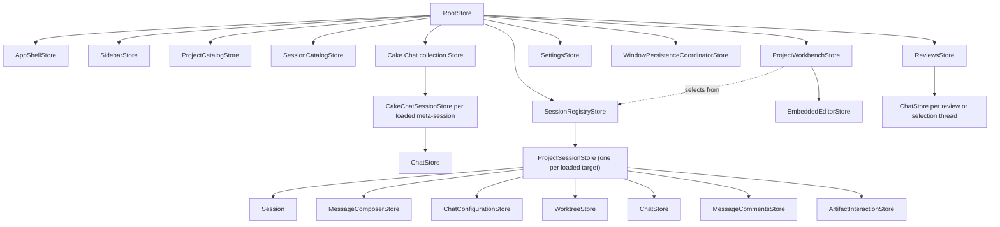

# Cake architecture and product model

This document describes the durable product and architecture of Cake. It is not
a roadmap. Current source and focused contract documents provide implementation
detail; this document explains how the pieces are meant to fit together. The
canonical language is defined in [`cake-vocabulary.md`](./cake-vocabulary.md),
and the normative runtime design is defined in
[`effect-architecture.md`](./effect-architecture.md).

## Product identity

Cake is Pi in a desktop GUI.

Pi already provides the coding-agent runtime: models and providers, the agent
loop, tools, extensions, skills, session branching, compaction, and durable
session history. Cake preserves that engine and gives it a web-native desktop
surface. Cake may wrap Pi's public provider stream at the adapter boundary for
an explicitly Cake-owned transport policy, but must not patch Pi internals or
replace its agent loop. The GUI is valuable not merely because it renders
terminal output more attractively, but because it can provide interactions such
as navigable session
collections, rich tool activity, diffs, tables, diagrams, forms, media,
sandboxed artifacts, and trusted user-authored React interfaces.

Cake operates at two related levels:

1. A Project Session is Cake's view and controller for one project-associated
   Pi Session.
2. The Cake application is a view and controller for the user's collection of
   Projects and Cake Sessions.

The second level is functionality that a single Pi terminal session does not
provide. Cake can navigate across sessions, expose relationships and activity,
and host application-level Cake Chat sessions. Cake Chat is Pi-backed, but its
conversations are meta-sessions: they can reason about and navigate the application
through curated Cake controls without absorbing the histories of Project Sessions.

The conversation remains the center of the product. Files, reviews, artifacts,
and plugin scenes support the work rather than turning Cake into a general-purpose
IDE. Embedded VS Code owns source browsing, editing, Git changes, and native diffs.

## Sources of truth

Every durable concept has one authority.

| Concern                                                           | Authority                                                                 | Cake's role                                                                               |
| ----------------------------------------------------------------- | ------------------------------------------------------------------------- | ----------------------------------------------------------------------------------------- |
| Project Session transcripts, tool history, branching, compaction  | Pi Session files and `SessionManager`                                     | Render validated snapshots and events in the GUI                                          |
| Models, providers, authentication, Pi settings and resources      | Pi                                                                        | Offer Cake controls through the Pi adapter                                                |
| Utility-model selection                                           | Cake application preferences, referencing a Pi provider/model             | Run only explicitly configured, bounded background completions through Pi's model runtime |
| Application-level Cake Chat transcripts                           | Their dedicated Pi Sessions                                               | Present them as Cake-wide meta-sessions and route curated controls                        |
| Projects, window selection and view state                         | Cake                                                                      | Persist application and window metadata without copying Pi history                        |
| Resolved-session status                                           | Cake-managed active/archive transcript location                           | Keep resolved transcripts read-only and restore them before Pi opens them                 |
| Reviews and inline discussions                                    | Cake workflow services, with Pi sidecar-session references where relevant | Persist anchors and workflow metadata without copying Pi transcripts                      |
| Rich artifacts                                                    | Cake artifact repository plus Pi transcript pointers/fallbacks            | Persist and render bounded, versioned artifact data                                       |
| Blocking structured requests                                      | `cake.request/v1` plus the active Pi tool call                            | Render trusted forms or sandboxed custom request widgets and return one validated value   |
| Trusted plugin source, builds, diagnostics and plugin persistence | Cake plugin machinery                                                     | Compile, activate, recover, repair and roll back user-owned source                        |

Do not introduce a second transcript database, reconstruct Pi state into a
competing domain model, or mutate Pi JSONL with ad hoc file operations. A session
cannot be archived while its Pi turn is active. When the calling agent requests
its own resolution during that turn, the runtime records the intent and applies
it at the settled-turn boundary, after the final transcript snapshot is emitted.

Cake's visible transcript projects the complete active branch returned by Pi's
`SessionManager.getBranch()`. The compacted entries returned by
`buildContextEntries()` are model input, not display history, and must never
replace the complete transcript projection. Compaction entries remain visible
as durable timeline events. Steering and follow-up queues are transient Pi
runtime state: Cake overlays `queue_update` projections while messages wait and
removes them when Pi consumes the corresponding user message into the branch.

All inline threads—code reviews and assistant-message discussions—run as
independent lightweight Pi Sessions using the same runtime pipeline. Their
anchors belong to Cake; their replies remain authoritative in the referenced Pi
sidecar session. Before each reply, Cake regenerates a read-only Markdown
projection of the parent session's current active branch. The sidecar receives
only its anchor, nearby context, its own short history, and read-only file tools.
Both assistant-message and code-anchored chats are read-only; the code anchor
changes the source material, not the sidecar's authority. Neither kind forks or
records work in the parent transcript. A single derived Markdown
thread index is also available to the parent agent through its ordinary project
tools.

## Process boundaries

Cake is one logical application split by Electron privilege boundaries. Main
and each renderer window have separate process-local Effect runtimes joined by
Effect RPC over a narrow Electron transport.

### Electron main

Main owns native windows, filesystem and application persistence, Pi Session
Runtime lifecycle, privileged Services, Cake domain operations, and the Effect
RPC server. Pi is embedded behind the focused `PiSessions`, `PiModels`, and
`PiAgentResources` Services. Pi Extensions share main-process authority and
must not be described as sandboxed.

### Preload

Preload exposes only the frozen transport needed by Effect RPC. It validates
transport messages and does not expose `ipcRenderer`, Node, or general Electron
capabilities. It contains no Cake business logic.

### Renderer

The renderer is sandboxed and has no Node integration. It owns React views, one
window-local r-state-tree, reactive projections, and renderer application state
and logic. Renderer infrastructure owns one Effect runtime and generated
`CakeIpcClient`, then exposes a typed Promise-based `RendererClient` for commands
and focused projection synchronizers for Streams. Ordinary Stores and Models do
not import Effect, construct transport envelopes, or import privileged
implementations.

Every cross-process request, success, typed failure, and stream element is
parsed by shared Effect Schemas at the receiving boundary. Raw Pi event and
object shapes stop in `src/services/pi`.

## Utility model

Cake may run bounded, non-authoritative background transformations through one
user-configured **utility model**. The preference stores the exact Pi provider,
model identifier, and reasoning level selected by the user. Cake never chooses,
recommends, or silently substitutes a utility model, and it never falls back to
the active conversation model. With no configured utility model, optional
utility work does not run.

Utility work uses Pi's `ModelRuntime` as an auxiliary completion rather than
creating a second provider abstraction, agent runtime, or durable transcript.
Each feature supplies explicit bounded input, output, timeout, cancellation,
and validation policy. Utility results remain advisory metadata until the owning
feature validates and commits them.

Trusted plugins may explicitly request the utility profile through the bounded
completion or agent host. Those public requests use observable preflight
fallback (utility → Pi default → calling-session current) when a profile is not
configured, unknown, or unauthenticated. The resolved profile and fallback
reasons are returned; a provider failure after execution begins never triggers
fallback. Opportunistic internal utility work still skips when no utility model
is configured.

Cake applies one such adapter policy to empty, pre-output rate-limit responses
and protocol-valid successful responses with no content. It retries the exact
same model request with a bounded exponential-backoff schedule over 24 hours,
projects each wait into the conversation, and propagates the active turn's abort
signal so the normal Stop action cancels both requests and waits. It never
replays a response after text, reasoning, or tool-call output begins, and it
does not persist failed attempts or hidden continuation messages. The policy is
in-memory: quitting Cake ends it. Pi's native retry behavior remains
authoritative for other transient errors.

Pi agents receive one Cake-owned `cake` gateway. Its progressively disclosed
`subagents.*` operations are backed by the same coordinator. Project agents use these tools only when
the user explicitly requests subagents, delegation, or parallel agent work;
tool availability alone is not authorization. Subagent Sessions are hidden,
parent-owned Cake Sessions, never Project Sessions: the tool contract cannot
attach, fork, select visibility, or expose the backing Pi Session identity. Handles are
parent-scoped and use isolated context. Every task chooses a capability profile:
`scout`, `planner`, and `reviewer` receive only read/search tools, while `worker`
receives the parent's non-delegation tools. Recursive delegation defaults to
depth zero and is capped at one explicitly requested descendant level. Parallel
delegation accepts at most eight tasks and runs at most four at once per
Working Directory. A task acquires an active slot before Cake constructs its private Pi
runtime. Cake resolves and validates every requested model against the parent
session before constructing any child; parallel batches preflight atomically.
A task may request Fast mode only for a model advertised by Cake as supporting
it. That setting is scoped to the private runtime and is not persisted as a
project-session preference. Foreground delegation keeps one streaming tool call
open until the child returns, matching Pi's reference subagent behavior.
Background execution is explicit: completion is persisted as a hidden custom Pi
message and triggers or steers the parent unless an active wait already claimed
the handle. Private runtimes omit project-session catalogs, model menus, command
menus, session trees, artifact indexes, and automatic naming. Live activity is
coalesced from child part events rather than rebuilding full session snapshots.
Cancellation reaches active child work. While a child turn is active, Cake may
open its projected parts through the shared `Chat` component and route explicit
user steer or abort intents through the parent-scoped handle; the renderer never
receives or attaches to the private Pi Session identity. One-shot handles release
their private runtime automatically after capturing the result, at which point
the same popup becomes a read-only projection reconstructed from the parent
transcript. Multi-turn continuation requires `retain: true`. Closing a private
parent also releases its private descendants. Cake projects live child tool
activity, usage, cost, and the final answer through the parent tool call rather
than exposing a second transcript.

Embedded VS Code's Source Control view is the Working Directory change authority and
renders native Git diffs. Cake projects review annotations into VS Code without
maintaining a second working-tree snapshot or diff browser. Historical per-turn
diffs remain in Pi's authoritative conversation work logs.

Automatic project-session naming is the first utility workflow. After the
initial user message is accepted, an unnamed session may send that original
user message, with bounded length, to the configured utility model without
waiting for the assistant turn to finish. A successful short title is appended
through Pi's normal session-name API. A Cake-owned draft session attempts the
same bounded naming work when its staged initial message is saved; the title
remains pending metadata until activation. If that attempt fails, normal
first-message naming retries after activation. With no configured utility
model, draft naming is skipped without a fallback. The completion is discarded
if the session is manually named while it is running. Failures are silent and
leave Pi's first-message session-list title as the display fallback for active
sessions. Configuring a utility model later makes an unnamed active session
eligible after its next interaction; already named sessions are never
regenerated automatically.

When the first prompt will create a managed worktree, Cake also attempts a
bounded utility completion before creating the checkout or Pi Session. The
validated result is an exact three-part, lowercase, hyphenated branch slug and
the first prompt remains optimistically visible while this preparation runs.
Missing configuration, timeout, provider failure, or invalid output silently
falls back to the worktree service's existing random naming scheme.

## Renderer state

`RootStore` is the renderer composition root and event-routing boundary. It is
not the owner of every workflow merely because its lifetime matches the window.
Named product surfaces receive named Stores with cohesive behavior, lifecycle,
async policy, and persistence responsibility.

Models are validated reactive projections of entities. Focused projection
synchronizers own authoritative RPC Stream subscriptions, reconnect and
revision policy, and atomic reduction into stable Models. Stores own
window-local application/UI state and logic: workflow timers, cancellation,
concurrency, snapshot coordination, and application intents. They invoke
semantic Promise operations on `RendererClient`; Cake business logic lives in
main-process domain Effect modules. React keeps only truly local DOM, focus,
measurement, hover, or isolated input state.

Parent Stores coordinate cross-Store behavior without copying child state or
publishing one-for-one forwarding facades. Store providers are lookup scopes,
not ownership scopes. Stores and their external resources must be disposed with
their actual owner.

The window Store hierarchy mirrors the product surfaces:

- `RootStore` composes the window, translates application intents, and routes
  desktop events to their authoritative Store.
- `AppShellStore` owns the window's one mutually exclusive application
  selection: a Project Session, a Cake Chat Session, settings, or an empty
  workbench. The visible surface and every active navigation treatment derive
  from that selection. `SidebarStore` owns navigation presentation and
  filtering; neither Store opens sessions directly.
- `ProjectCatalogStore` owns registered project records and their window-local
  ordering. `SessionCatalogStore` owns one flat, activity-sorted session
  projection plus cached ID and project-group indexes. Session IDs are the
  canonical identity; duplicate IDs are rejected. Resolved status derives from
  Cake's active or archived transcript namespace and is projected into those summaries.
- `WindowPersistenceCoordinatorStore` hydrates and saves view state that spans the
  shell, sidebar, workbench, settings, and loaded sessions. It coordinates
  those owners without absorbing their state.
- `ProjectWorkbenchStore` coordinates project activation and its focused
  workflow children: `CommandPaneStore`, `SessionManagementStore`,
  `SessionContinuationStore`, `WorktreeCreationStore`, and `EmbeddedEditorStore`.
  `WorktreeCreationStore` owns both draft-composer worktree
  selection and Cake Chat's coordinated create-worktree-then-create-named-session workflow.
  `EmbeddedEditorStore` owns IDE mode and Source Control navigation,
  where the native VS Code
  view occupies the source pane and Cake's shared chat occupies the right drawer.
  Each child owns its own operation
  state and lifetime; the workbench does not re-export one-for-one child APIs.
- The root-scoped `SessionRegistryStore` preserves one keyed
  `ProjectSessionStore` for every loaded project-session ID so background
  project events and navigation share session identity. The window has exactly one
  unsent, unsaved project chat. It is staged renderer state, not a session: it does
  not enter the session catalog or navigation history, and repeatedly choosing New
  Chat reopens the same staged composer with its text, attachments, configuration,
  and Working Directory intact. Cake persists that staged input continuously in window state.
  The first submitted prompt promotes it to an ordinary Pi Session. An explicitly
  saved draft is different: it becomes a cataloged pseudo-session, stages its initial
  message and attachments in Cake window state, projects them through the shared
  `Chat`, and carries draft and resolved presentation metadata until activation.
  Saving the staged chat as a draft also frees New Chat to create one new staged
  composer. Activation clears the draft state and uses the ordinary first-prompt
  path; Pi remains the transcript authority once the session starts. The Working
  Directory remains routing/storage context for the Pi runtime, not part of
  session identity. Cake Chat never enters this registry.
- Each `ProjectSessionStore` owns that session's activity, `Session`,
  message composer, chat configuration, managed-worktree status and actions,
  artifacts, and message comments. Its
  `ChatStore` is the common conversation-facing state boundary: it presents the
  draft, transcript parts, streaming state, configuration, and composer actions
  consumed by the authoritative `Chat` component.
- Project sessions, Cake Chat sessions, selection chats, and review threads all
  render the same `Chat` component and supply a `ChatStore`. `Chat` owns the
  authoritative virtualized transcript, message rendering, loading behavior,
  scrolling, and composer. A surface may add contextual framing or capabilities
  through the shared component's explicit extension points, but it must not
  substitute a parallel transcript, message, input, or composer implementation.
  React mounts the Project Session as the nearest provider around the active
  session surface.
- The Cake Chat collection owns one keyed `CakeChatSessionStore` per loaded
  meta-session. Each session retains its own draft, attachments, configuration,
  transcript projection, and streaming state while another Cake Chat session is
  selected. Like a new project chat, a new Cake Chat begins as one renderer-owned
  pending session and creates its Pi runtime on the first prompt; its identity and
  draft may be restored from window state without implying that a transcript file
  exists. Persisted Cake Chat sessions keep live runtimes as they are opened. A
  `CakeChatSessionStore` directly owns its Pi `Session`; its snapshots and deltas
  route through the Cake Chat collection, independently of project-session
  registry and workbench lifetimes. Cross-process operations use explicit project
  or Cake Chat intents and never infer session ownership from transcript-file
  existence.

UI and application controls invoke semantic `RootStore` intents such as
`openSession`, `createSession`, or `showGlobalChat`. The root performs any
required shell transition and delegates the workflow to its cohesive owner, so
callers do not assemble cross-Store navigation recipes.

## Rich UI has two trust paths

Model-presented content does not become executable application code with Cake
privileges.

- Artifacts cross a versioned, bounded protocol. Markdown and structured kinds
  are validated; raw HTML runs in an isolated frame with restrictive policy.
- Delegated inline widgets begin as compact `cake widgets.present` presentation briefs.
  Generation and repair run in separate tool-less Pi Sessions; generated source
  stays in Cake's artifact repository rather than the project-session context.
  Electron main compiles that source and runs it in a script-enabled,
  opaque-origin frame whose CSP blocks network and application access.
- Plugins are trusted user-owned software with an optional React renderer and
  optional unrestricted Node backend. Renderer source becomes trusted UI code
  only through an explicit install or edit action. Its module graph is limited
  to its own files, React, and the version-matched `cake` module.

Renderer code cannot acquire Node, Electron, raw IPC, raw Pi objects, or
compiler/recovery internals. A plugin backend runs in a dedicated Electron
utility process with normal Node authority, including filesystem, subprocess,
Git, credential, and network access. The renderer reaches it only through a
validated, bounded call/event protocol. This separation preserves renderer and
main-process reliability; it is not a permissions sandbox. Do not weaken the
artifact sandbox to implement plugins, and do not force trusted plugins through
the artifact protocol.

Enabled plugin renderers load automatically and contribute to canonical,
semantic slots. A plugin may optionally provide the one selected application
scene: it may render the stock `DefaultScene`, mount the canonical slots in a
different layout, or provide an entirely custom React tree. With no selected
plugin scene, Cake uses its core default directly; there is no standalone
user-owned global scene file. Slot identity stays stable across scenes so
plugins written for the stock scene remain composable. Candidate edits use
optimistic revision checks, non-activating validation, and health-gated explicit
activation.
The factory-default recovery scene remains immutable core and never imports
user code or starts plugin backends.

## Plugin failure and self-healing

User-authored code can fail to compile, throw while rendering, crash its backend,
or become incompatible with a newer Cake build. Plugin failure must never
prevent access to the agent needed to fix it.

The immutable core shell must be able to start without importing user plugins.
On a plugin activation or runtime failure, Cake opens a vanilla recovery surface
with Cake Chat, the ordinary transcript and composer, model controls, tool
activity, exact diagnostics, the failed plugin identity and revision, and safe
disable-or-repair actions for an enabled failed plugin. Intentionally disabled
plugins do not enter recovery. A new Cake Chat session receives the recovery context so the user
and agent can inspect the plugin, edit it with explicit authority, run its
checks, activate a candidate transactionally, and reload the repaired scene.

Cake retains broken source, diagnostics, persisted data, and the last-known-good
build. It does not erase evidence merely to boot. A candidate becomes healthy
only after successful import and render; an incomplete activation selects
recovery on the next boot.

## Development philosophy

- Prefer Pi APIs and contribute useful missing seams upstream. Fork Pi only as
  a last resort.
- Keep Cake's Pi adapter narrow and keep renderer contracts Cake-owned.
- Build vertical behavior through the real Electron boundary, not only isolated
  abstractions.
- Give every state value an authority, owner, lifetime, persistence boundary,
  and concurrency policy before adding it.
- Validate boundary data, propagate cancellation, clean up subscriptions, and
  reject late async results after replacement.
- Keep Cake greenfield. Replace obsolete APIs outright and update all callers,
  tests, and documents in the same change.
- Add general workflow machinery only when concrete product or plugin behavior
  demonstrates the need. Do not prebuild a second generic agent runtime.
- Preserve unrelated worktree changes and verify focused tests plus the relevant
  typecheck or build.

## Focused references

- `docs/architecture/cake-vocabulary.md`: canonical domain and architecture
  language.
- `docs/architecture/effect-architecture.md`: Effect Services, domain, RPC,
  Streams, Scopes, storage, renderer state, and source boundaries.
- `docs/architecture/cake-custom-renderer.md`: future, unimplemented design for
  user-owned renderer overlays; explicitly outside the Effect migration.
- `docs/development/effect-migration.md`: temporary ordered implementation
  handoff from the legacy architecture.
- `docs/architecture/cake-plugins.md`: executable plugin, scene, build,
  activation, persistence, command, and recovery contract.
- `docs/architecture/cake-storage.md`: persistent storage ownership.
- `docs/architecture/pi-0.84-contract.md`: pinned Pi adapter assumptions.
- `docs/architecture/s1-session-contract.md`: project-session lifecycle and
  renderer projection contract.
- `docs/architecture/s3-pi-compatibility.md`: Pi resource and extension UI
  compatibility.
- `docs/architecture/s4-artifact-protocol.md`: durable artifact and sandbox
  contract.
- `.agents/skills/cake-plugin-authoring/SKILL.md`: authoritative plugin authoring,
  activation, persistence, and repair workflow.
