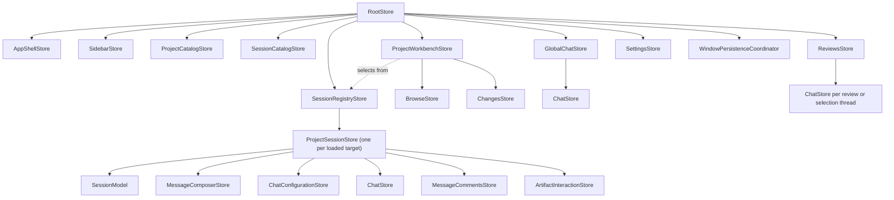

# Cake architecture and product model

This document describes the durable product and architecture of Cake. It is not
a roadmap. Current source and focused contract documents provide implementation
detail; this document explains how the pieces are meant to fit together.

## Product identity

Cake is Pi in a desktop GUI.

Pi already provides the coding-agent runtime: models and providers, the agent
loop, tools, extensions, skills, session branching, compaction, and durable
session history. Cake preserves that engine and gives it a web-native desktop
surface. The GUI is valuable not merely because it renders terminal output more
attractively, but because it can provide interactions such as navigable session
collections, rich tool activity, diffs, tables, diagrams, forms, media,
sandboxed artifacts, and trusted user-authored React interfaces.

Cake operates at two related levels:

1. A project conversation is a view and controller for one Pi session.
2. The Cake application is a view and controller for the user's collection of
   projects and Pi sessions.

The second level is functionality that a single Pi terminal session does not
provide. Cake can navigate across sessions, expose relationships and activity,
and host an application-level global chat. Global chat is itself Pi-backed, but
acts as a meta-session: it can reason about and navigate the application through
curated Cake controls without absorbing the histories of project sessions.

The conversation remains the center of the product. Files, changes, reviews,
artifacts, and plugin scenes support the work rather than turning Cake into a
general-purpose IDE.

## Sources of truth

Every durable concept has one authority.

| Concern | Authority | Cake's role |
| --- | --- | --- |
| Project-session transcripts, tool history, branching, compaction | Pi session files and `SessionManager` | Render validated snapshots and events in the GUI |
| Models, providers, authentication, Pi settings and resources | Pi | Offer Cake controls through the Pi adapter |
| Application-level global-chat transcript | Its dedicated hidden Pi session | Present it as a Cake-wide meta-session and route curated controls |
| Projects, archived-session flags, window selection and view state | Cake | Persist application and window metadata without copying Pi history |
| Changes, reviews, and inline discussions | Cake workflow services, with Pi sidecar-session references where relevant | Persist anchors and workflow metadata without copying Pi transcripts |
| Rich artifacts | Cake artifact repository plus Pi transcript pointers/fallbacks | Persist and render bounded, versioned artifact data |
| Blocking structured requests | `cake.request/v1` plus the active Pi tool call | Render trusted forms or sandboxed custom request widgets and return one validated value |
| Trusted plugin source, builds, diagnostics and plugin persistence | Cake plugin machinery | Compile, activate, recover, repair and roll back user-owned source |

Do not introduce a second transcript database, reconstruct Pi state into a
competing domain model, or mutate Pi JSONL with ad hoc file operations.

All inline threads—code reviews and assistant-message discussions—run as
independent lightweight Pi sessions using the same runtime pipeline. Their
anchors belong to Cake; their replies remain authoritative in the referenced Pi
sidecar session. Before each reply, Cake regenerates a read-only Markdown
projection of the parent session's current active branch. The sidecar receives
only its anchor, nearby context, its own short history, and ordinary file tools;
assistant-message threads are read-only while code-review threads may edit the
workspace. Neither kind forks the parent transcript. A single derived Markdown
thread index is also available to the parent agent through its ordinary project
tools.

## Process boundaries

Cake is one application package split by Electron privilege boundaries.

### Electron main

Main owns native windows, filesystem and application persistence, Pi runtime
lifecycle, privileged adapters, and validated request handling. Pi is embedded
here behind Cake's adapter; Pi extensions share main-process authority and must
not be described as sandboxed.

### Preload

Preload exposes one narrow, typed `window.cake` bridge. It validates messages
and does not expose `ipcRenderer` or general Electron capabilities.

### Renderer

The renderer is sandboxed and has no Node integration. It owns React views,
window-local `r-state-tree` Stores, projections of authoritative data, and
interaction state. Renderer workflows call intent-level Cake clients rather
than constructing transport envelopes or importing privileged implementations.

Every cross-process payload is parsed by shared Zod contracts at the receiving
boundary. Raw Pi event and object shapes stop in the focused `src/agent` adapter modules.

## Renderer state

`RootStore` is the renderer composition root and event-routing boundary. It is
not the owner of every workflow merely because its lifetime matches the window.
Named product surfaces receive named Stores with cohesive behavior, lifecycle,
async policy, and persistence responsibility.

Models represent serializable domain projections. Stores own behavior and
resources: subscriptions, timers, cancellation, concurrency, persistence
coordination, and application intents. React keeps only truly local DOM, focus,
measurement, hover, or isolated input state.

Parent Stores coordinate cross-Store behavior without copying child state or
publishing one-for-one forwarding facades. Store providers are lookup scopes,
not ownership scopes. Stores and their external resources must be disposed with
their actual owner.

The window Store hierarchy mirrors the product surfaces:

- `RootStore` composes the window, translates application intents, and routes
  desktop events to their authoritative Store.
- `AppShellStore` owns which top-level surface is visible. `SidebarStore` owns
  navigation presentation and filtering; neither opens sessions directly.
- `ProjectCatalogStore` owns registered project records and their window-local
  ordering. `SessionCatalogStore` owns lightweight session summaries.
- `WindowPersistenceCoordinator` hydrates and saves view state that spans the
  shell, sidebar, workbench, settings, and loaded sessions. It coordinates
  those owners without absorbing their state.
- `ProjectWorkbenchStore` owns project inspection, active-session selection,
  command panes, and its `BrowseStore` and `ChangesStore` children. It
  coordinates project-level workflows without re-exporting session behavior.
- The root-scoped `SessionRegistryStore` preserves one keyed
  `ProjectSessionStore` for every loaded `(workspacePath, sessionId)` target so
  background events, global chat, and navigation share session identity.
- Each `ProjectSessionStore` owns that session's activity, `SessionModel`,
  message composer, chat configuration, artifacts, and message comments. Its
  `ChatStore` is the common conversation-facing state boundary: it presents the
  draft, transcript parts, streaming state, configuration, and composer actions
  consumed by the authoritative `Chat` component.
- Project sessions, global chat, selection chats, and review threads all render
  the same `Chat` component and supply a `ChatStore`. A surface may provide a
  richer transcript projection, but it must compose the shared message,
  loading, and composer primitives instead of creating chat-specific controls.
  React mounts the project session as the nearest provider around the active
  session surface.

UI and application controls invoke semantic `RootStore` intents such as
`openSession`, `createSession`, or `showGlobalChat`. The root performs any
required shell transition and delegates the workflow to its cohesive owner, so
callers do not assemble cross-Store navigation recipes.

## Rich UI has two trust paths

Model-presented content does not become executable application code with Cake
privileges.

- Artifacts cross a versioned, bounded protocol. Markdown and structured kinds
  are validated; raw HTML runs in an isolated frame with restrictive policy.
- Delegated inline widgets begin as compact `ui_widget` presentation briefs.
  Generation and repair run in separate tool-less Pi sessions; generated source
  stays in Cake's artifact repository rather than the project-session context.
  Electron main compiles that source and runs it in a script-enabled,
  opaque-origin frame whose CSP blocks network and application access.
- Plugins are ordinary user-owned React source. They become trusted renderer
  code only through an explicit install or edit action. Their module graph is
  constrained to their own files, ordinary React, and the version-matched
  `cake` module, as defined by the `cake-plugin-authoring` skill.

Trusted does not mean privileged beyond the renderer: plugins may use approved
Cake Stores, components, DOM, and intents, but they may not acquire Node,
Electron, credentials, raw IPC, raw Pi objects, or compiler/recovery internals.
Do not weaken the artifact sandbox to implement plugins, and do not force
trusted plugins through the artifact protocol.

Plugins contribute named React components and related capabilities; they do not
own fixed application slots or the global layout. A separate user-owned,
revisioned global scene composes contributions from any number of plugins. Its
candidate edits use optimistic revision checks and health-gated activation.
The factory-default recovery scene remains immutable core and never imports
user code.

## Plugin failure and self-healing

User-authored code can fail to compile, throw while rendering, or become
incompatible with a newer Cake build. Plugin failure must never prevent access
to the agent needed to fix it.

The immutable core shell must be able to start without importing user plugins.
On a plugin activation or runtime failure, Cake opens a vanilla recovery surface
with global chat, the ordinary transcript and composer, model controls, tool
activity, exact diagnostics, the failed plugin identity and revision, and safe
disable/rollback actions. Global chat receives the recovery context so the user
and agent can inspect the plugin, edit it with explicit authority, run its
checks, activate a candidate transactionally, and reload the repaired scene.

Cake retains broken source, diagnostics, persisted data, and the last-known-good
build. It does not erase evidence merely to boot. A candidate becomes healthy
only after successful import and render; an incomplete activation selects
recovery on the next boot.

## Development philosophy

- Prefer Pi APIs and contribute useful missing seams upstream. Fork Pi only as
  a last resort.
- Keep Cake's Pi adapter narrow and keep renderer contracts Cake-owned.
- Build vertical behavior through the real Electron boundary, not only isolated
  abstractions.
- Give every state value an authority, owner, lifetime, persistence boundary,
  and concurrency policy before adding it.
- Validate boundary data, propagate cancellation, clean up subscriptions, and
  reject late async results after replacement.
- Keep Cake greenfield. Replace obsolete APIs outright and update all callers,
  tests, and documents in the same change.
- Add general workflow machinery only when concrete product or plugin behavior
  demonstrates the need. Do not prebuild a second generic agent runtime.
- Preserve unrelated worktree changes and verify focused tests plus the relevant
  typecheck or build.

## Focused references

- `docs/architecture/cake-plugins.md`: executable plugin, global-scene, build,
  activation, persistence, command, and recovery contract.
- `docs/architecture/cake-storage.md`: persistent storage ownership.
- `docs/architecture/pi-0.84-contract.md`: pinned Pi adapter assumptions.
- `docs/architecture/s1-session-contract.md`: project-session lifecycle and
  renderer projection contract.
- `docs/architecture/s3-pi-compatibility.md`: Pi resource and extension UI
  compatibility.
- `docs/architecture/s4-artifact-protocol.md`: durable artifact and sandbox
  contract.
- `.agents/skills/cake-plugin-authoring/SKILL.md`: authoritative plugin authoring,
  activation, persistence, and repair workflow.
