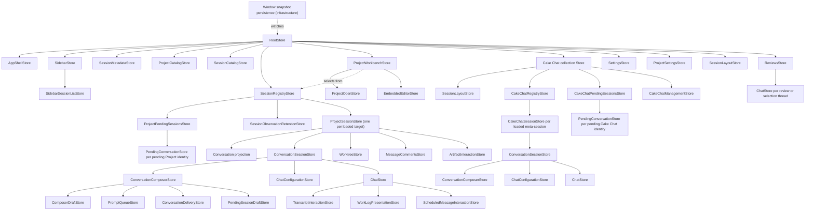

# Cake architecture and product model

This document describes the durable product and architecture of Cake. It is not
a roadmap. Current source and focused contract documents provide implementation
detail; this document explains how the pieces are meant to fit together. The
canonical language is defined in [`cake-vocabulary.md`](./cake-vocabulary.md),
and the normative runtime design is defined in
[`effect-architecture.md`](./effect-architecture.md).

## Product identity

Cake is Pi in a desktop GUI.

Pi already provides the coding-agent runtime: models and providers, the agent
loop, tools, extensions, skills, session branching, compaction, and durable
session history. Cake preserves that engine and gives it a web-native desktop
surface. Cake may wrap Pi's public provider stream at the adapter boundary for
an explicitly Cake-owned transport policy, but must not patch Pi internals or
replace its agent loop. The GUI is valuable not merely because it renders
terminal output more attractively, but because it can provide interactions such
as navigable session
collections, rich tool activity, diffs, tables, diagrams, forms, media,
sandboxed artifacts, and trusted user-authored React interfaces.

Cake operates at two related levels:

1. A Project Session is Cake's top-level project-associated aggregate root. It
   has one primary Conversation backed by one Pi Session and coordinates bounded
   references to its separate related authorities.
2. The Cake application is a view and controller for the user's collection of
   Projects and Cake Sessions.

The second level is functionality that a single Pi terminal session does not
provide. Cake can navigate across sessions, expose relationships and activity,
and host application-level Cake Chat sessions. Cake Chat is Pi-backed, but its
conversations are meta-sessions: they can reason about and navigate the application
through curated Cake controls without absorbing the histories of Project Sessions.

The conversation remains the center of the product. Files, reviews, and artifacts
support the work rather than turning Cake into a general-purpose IDE. Embedded VS Code owns source browsing, editing, Git changes, and native diffs.

## Sources of truth

Every durable concept has one authority.

| Concern                                                                       | Authority                                                                              | Cake's role                                                                                                                    |
| ----------------------------------------------------------------------------- | -------------------------------------------------------------------------------------- | ------------------------------------------------------------------------------------------------------------------------------ |
| Conversation transcripts, tool history, branching, compaction                 | Pi Session files and `SessionManager`                                                  | Render validated `ConversationSnapshot` and `ConversationEvent` values in the GUI                                              |
| Models, providers, authentication, Pi settings and resources                  | Pi                                                                                     | Offer Cake controls through the Pi adapter                                                                                     |
| Utility-model selection                                                       | Cake application preferences, referencing a Pi provider/model                          | Run only explicitly configured, bounded background completions through Pi's model runtime                                      |
| Application-level Cake Chat transcripts                                       | Their dedicated Pi Sessions                                                            | Present them as Cake-wide meta-sessions and route curated controls                                                             |
| Projects, global and per-Project workflow statuses, and worktree settings     | Cake                                                                                   | Persist application metadata without copying or redefining Pi Session lifecycle                                                |
| Window selection and view state                                               | Cake                                                                                   | Persist renderer presentation independently from Project workflow facts                                                        |
| Draw boards and their saved canvas documents                                  | Cake main-owned board storage, scoped to a Project Session                             | Persist Excalidraw document snapshots independently of Pi transcripts and artifact publication                                 |
| Scheduled Project Session messages                                            | Cake                                                                                   | Persist delivery intent until it becomes an ordinary Pi user message                                                           |
| Session Family tree, per-member Working Directory bindings, and sibling order | Cake                                                                                   | Group recursively delegated Project Sessions without copying their transcripts                                                 |
| Cross-session coordination threads and delivery correlation                   | Cake                                                                                   | Bind participants, limits, closure, and acknowledgements without copying transcript text                                       |
| Resolved-session status                                                       | Cake-managed active/archive transcript location of a standalone session or family root | Children inherit resolution; keep resolved conversations read-only                                                             |
| Reviews and inline discussions                                                | Cake workflow services, with Pi sidecar-session references where relevant              | Persist anchors and workflow metadata without copying Pi transcripts                                                           |
| Substantial, reusable artifacts                                               | Cake global artifact-lineage repository plus explicit session/family links             | Persist immutable revisions; project linked lineages into session accessory panels                                             |
| Blocking structured requests                                                  | `cake.request/v1` plus the active Pi tool call                                         | Render one inline interaction and return one validated value                                                                   |
| Session Plugins                                                               | Cake application metadata, keyed by Cake Session and plugin ID                         | Persist validated presets or generated source, JSON state, and user-owned visibility; mount controls in semantic session slots |

Do not introduce a second transcript database, reconstruct Pi state into a
competing domain model, or mutate Pi JSONL with ad hoc file operations. Main
keeps Project, Working Directory, lifecycle, Conversation, Discussion,
Subagent, review, artifact, and Session Family facts in their focused
authorities. The renderer joins only the projections needed by the active
surface instead of assembling a shadow Project Session payload. A session
cannot be archived while its Pi turn is active. When the calling agent requests
its own resolution during that turn, the runtime records the intent and applies
it at the settled-turn boundary, after the final transcript snapshot is emitted.

Cake's visible transcript projects the complete active branch returned by Pi's
`SessionManager.getBranch()`. The compacted entries returned by
`buildContextEntries()` are model input, not display history, and must never
replace the complete transcript projection. Compaction entries remain visible
as durable timeline events. When Pi's ordinary fork extraction can no longer
carry an inactive branch referenced by tool-compaction provenance, the Pi
adapter appends the reconstructed compacted work logs as a schema-validated,
hidden Pi custom entry in the fork. The display projection consumes that entry;
Pi's model context does not. Steering and follow-up queues are transient Pi
runtime state: Cake overlays `queue_update` projections while messages wait and
removes them when Pi consumes the corresponding user message into the branch.
Pi only exposes whole-queue clearing, so removing or promoting one held message
clears the queue and re-enqueues the remainder in its original order and
delivery kind. Scheduled messages are different: Cake owns each durable,
cancellable delivery intent until its deadline. The destination session
projects that pending intent beside its composer. At the deadline Cake restores
the Project Session when necessary and submits an ordinary prompt, or a
follow-up when its runtime is busy; after acceptance, Pi again becomes the sole
message authority. Like cross-session sender identity, the schedule's origin
(when it was created and when it fired) travels inside that ordinary Pi user
message as schema-validated metadata, so the transcript, the queue overlay, and
the model all see the same provenance without a second Cake-owned record.

Cross-session coordination is a lightweight Cake-owned workflow over ordinary
Pi messages. A window-scoped `SessionCoordinationStore` binds two participants,
correlates message and thread IDs, tracks an optional message limit, and closes
an exchange. Sender identity and correlation metadata travel with the ordinary
Pi user message and are schema-validated when projected; Cake does not persist
or replay a second copy of its text. `accepted` means Cake/Pi accepted the turn,
`queued` means it is waiting as Pi follow-up input, `processing` means Pi has
consumed it into an active turn, and `answered` means that turn settled with a
projected response. Closing prevents further coordinated replies. It does not
silently abort unrelated destination work; an already consumed or otherwise
uncancellable late arrival remains visibly attributed to the closed exchange
and never causes autonomous continuation.

All Discussion Sessions—shown as “side chats” in UI copy—including session-level
discussions, the composer-avatar session assistant, code reviews, and
assistant-message discussions, run as independent lightweight Pi Sessions. Their parent scope and optional anchors belong to Cake; their replies
remain authoritative in the referenced Pi sidecar session. Before each reply,
Cake regenerates a read-only Markdown projection of the parent session's current
active branch. Ordinary discussions receive only their scope or anchor, nearby
context, their own transcript, and read-only file tools. Each Project Session has
at most one avatar assistant Discussion Session. Its quick bubble and full chat
are two presentations of that same durable transcript; it uses the configured
utility model and adds only the validated Cake application-control gateway.
Assistant, assistant-message, and code-anchored chats cannot modify project
files. The code anchor changes the source material, not the sidecar's authority.
In the renderer each sidecar has its own Conversation projection driven by the
shared conversation reducer and wrapped by the shared conversation Store; the
parent's Discussion catalog carries only thread metadata and a persisted
preview, so a catalog refresh can never disturb a live side chat.
Neither kind forks or records work in the parent transcript. A single derived
Markdown thread index is also available to the parent agent through its ordinary
project tools.

## Process boundaries

Cake is one logical application split by Electron privilege boundaries. Main
and each renderer window have separate process-local Effect runtimes joined by
Effect RPC over a narrow Electron transport.

### Electron main

Main owns native windows, filesystem and application persistence, Pi Session
Runtime lifecycle, privileged Services, Cake domain operations, and the Effect
RPC server. Pi is embedded behind the focused `CakeSessionRuntimes`, `PiModels`, and
`PiAgentResources` Services. `CakeSessionRuntimes` acquires one Cake Session
Runtime adapter around exactly one Pi Session Runtime and returns a scoped
Cake Session Handle; genuine Pi discovery values remain explicitly Pi-named. Pi Extensions share main-process authority and
must not be described as sandboxed.

### Preload

Preload exposes only the frozen transport needed by Effect RPC. It validates
transport messages and does not expose `ipcRenderer`, Node, or general Electron
capabilities. It contains no Cake business logic.

### Renderer

The renderer is sandboxed and has no Node integration. It owns React views, one
window-local r-state-tree, reactive Models, and renderer application state and
logic. Renderer infrastructure owns one Effect runtime and generated
`CakeIpcClient`, then exposes a typed Promise-based `Client` for commands
and one common Stream observation primitive. Focused window-owned observers
apply validated updates to their Model or Store owners and retain their own
cancellation handles. Ordinary
Stores and Models do not import Effect, construct transport envelopes, or import
privileged implementations.

Every cross-process request, success, typed failure, and stream element is
parsed by shared Effect Schemas at the receiving boundary. Raw Pi event and
object shapes stop in `src/services/pi`. When a Project Session agent needs a
renderer-owned application mutation, main sends one validated control request
only to the renderer connection associated with the calling Project Session;
the renderer executes the shared application intent, completes persistence,
and acknowledges the result through Effect RPC before the tool call returns.
One process-scoped renderer-request coordinator owns transient reverse-request
correlation, Project Session and Cake Chat renderer targeting, completion,
cancellation, and connection/session cleanup. It publishes through the existing
native-event Streams and accepts responses through the existing Effect RPCs; it
is main-local coordination, not another transport or durable authority.

## Utility model

Cake may run bounded, non-authoritative background transformations through one
user-configured **utility model**. The preference stores the exact Pi provider,
model identifier, and reasoning level selected by the user. Cake never chooses,
recommends, or silently substitutes a utility model, and it never falls back to
the active conversation model. With no configured utility model, optional
utility work does not run.

Utility work uses Pi's `ModelRuntime` as an auxiliary completion rather than
creating a second provider abstraction. Each feature supplies explicit bounded
input, output, timeout, cancellation, and validation policy. Utility results
remain advisory metadata until the owning feature validates and commits them.
The composer-avatar session assistant is the interactive exception to plain
completion: it is a durable Discussion Session on the configured utility model.
It receives the same regenerated parent projection as other side chats, never
parent tool calls, and exposes read-only file access plus a parent-scoped,
validated Cake application-control gateway—including embedded VS Code entry and
source navigation—but no shell or direct file mutation tools. Because Cake
operation is this assistant's primary role, its system prompt eagerly embeds the
complete protocol generated from its actual operation registry instead of making
the utility model discover topics first. Its Pi transcript owns its conversation
history across turns and application restarts. A non-empty parent-composer
selection is snapshotted when the avatar opens and supplied eagerly as contextual
data for assistant turns; it is not a discoverable tool result.
`SessionAssistantStore` owns only the window-local draft, selection snapshot,
quick processing and response presentation, cancellation, and single-turn-at-a-time
policy. A primary avatar click presents a focused
one-shot composer, replaces it immediately with an animated processing state,
and then shows only the assistant's compact response bubble, which closes
automatically; a secondary
click presents the full persisted chat. Both presentations compose the shared
`Chat` and `ChatStore`. Pi remains the authority for both the parent and assistant
transcripts; assistant messages are never copied into the parent transcript.

Cake applies one such adapter policy to empty, pre-output rate-limit responses
and protocol-valid successful responses with no content. It retries the exact
same model request with a bounded exponential-backoff schedule over 24 hours,
projects each wait into the conversation, and propagates the active turn's abort
signal so the normal Stop action cancels both requests and waits. It never
replays a response after text, reasoning, or tool-call output begins, and it
does not persist failed attempts or hidden continuation messages. The policy is
in-memory: quitting Cake ends it. Pi's native retry behavior remains
authoritative for other transient errors.

Pi agents receive one Cake-owned `cake` gateway. Its progressively disclosed
`subagents.*` operations are backed by the same coordinator. Project agents use these tools only when
the user explicitly requests subagents, delegation, or parallel agent work;
tool availability alone is not authorization. Subagent Sessions are hidden,
parent-owned Cake Sessions, never Project Sessions: the tool contract cannot
attach, fork, select visibility, or expose the backing Pi Session identity. Handles are
parent-scoped and use isolated context. Cake exposes one general-purpose subagent
rather than role profiles. It receives `read`, `bash`, `edit`, `write`, and one
bounded `message_parent` tool for substantive progress, blockers, or questions.
That tool can queue an attributed message only to the owning parent; it cannot
address another session or expose Cake controls. Subagents receive no recursive
delegation, project context files, skills, extensions, prompt templates, or themes. Parallel delegation accepts at most eight tasks and runs at
most four at once per Working Directory. A task acquires an active slot before Cake constructs its private Pi
runtime. Cake resolves and validates every requested model against the parent
session before constructing any child; parallel batches preflight atomically.
A task may request Fast mode only for a model advertised by Cake as supporting
it. That setting is scoped to the private runtime and is not persisted as a
project-session preference. Delegation starts in the background by default so child execution never keeps the
parent turn open. Foreground run, parallel, and wait operations are explicit
synchronization barriers only. Completion is persisted as a hidden custom Pi
message containing the durable full result for work-log reconstruction, while
only the compact final assistant report enters parent model context. Delivery
uses normal follow-up queuing and never steers or interrupts active parent work. Private runtimes omit project-session catalogs, model menus, command
menus, session trees, artifact indexes, and automatic naming. Live activity is
coalesced from child part events rather than rebuilding full session snapshots.
Child cancellation reaches only the explicitly targeted child work. It marks the
handle aborted but retains the private transcript, partial projected output, and
follow-up capability until explicit close or parent release. Stopping or
redirecting the parent does not cancel its subagents. Cake opens projected
subagent parts through the shared `Chat` component and routes user prompts,
steering, and abort intents through the parent-scoped handle; the renderer never
receives or attaches to the private Pi Session identity. A completed handle remains available for follow-up
until it is explicitly closed or its parent runtime is released. After release, the
side chat remains a read-only projection reconstructed from the parent transcript.
Closing a private parent also releases its private descendants. Cake projects live
child tool activity, usage, cost, and the final answer through the parent tool call
rather than exposing a second transcript.

Full Project Session families use a different coordination contract. Messages
between family sessions, including deterministic missing-response, failure, or
abort notices, are ordinary Pi user messages. Each message carries an explicit
response expectation: initial assignments and ordinary sends default to expecting
a response, while replies, result reports, informational messages, and generated
notices do not. Only a correlated reply satisfies a request. Generated notices
never create another response obligation. By default messages start a normal
turn when the recipient is idle or enter Pi's follow-up queue behind active work.
An explicit steer interrupts and redirects an active family member. Pending family
input is projected beside the composer with source-session attribution rather
than as transcript history.
Creating a child accepts its initial turn in the background and does not keep
the parent's turn waiting for that child. Every member may recursively create
children. A child either shares its immediate parent's Working Directory or uses
a Cake-managed worktree branched from that parent's current checkout; it never
selects an unrelated repository base. Each family member remains independently
selectable, messageable, and stoppable. Only the family root owns resolution;
children recursively inherit their parent's state, and a lifecycle request on any
member targets the root. A parent may abort a child's
active turn without resolving or deleting the child. Project agents may invoke
the same queued Managed Worktree merge and discard actions as the UI for their
own isolated checkout or an immediate child's; Git landing and session
resolution remain separate operations.

Embedded VS Code's Source Control view is the Working Directory change authority and
renders native Git diffs. Cake projects review annotations into VS Code without
maintaining a second working-tree snapshot or diff browser. Historical per-turn
diffs remain in Pi's authoritative conversation work logs.

Automatic project-session naming is the first utility workflow. After the
initial user message is accepted, an unnamed session may send that original
user message, with bounded length, to the configured utility model without
waiting for the assistant turn to finish. A successful short title is appended
through Pi's normal session-name API. A Cake-owned draft session attempts the
same bounded naming work when its staged initial message is saved; the title
remains pending metadata until activation. If that attempt fails, normal
first-message naming retries after activation. With no configured utility
model, draft naming is skipped without a fallback. The completion is discarded
if the session is manually named while it is running. Failures are silent and
leave Pi's first-message session-list title as the display fallback for active
sessions. Configuring a utility model later makes an unnamed active session
eligible after its next interaction; already named sessions are never
regenerated automatically. Tool compaction keeps the existing Pi Session identity and title. A fork inherits the
source session's current title through Pi's session-name metadata, so continuation never triggers a new title
generation pass.

When the first prompt will create a managed worktree, Cake also attempts a
bounded utility completion before creating the checkout or Pi Session. The
validated result is an exact three-part, lowercase, hyphenated branch slug and
the first prompt remains optimistically visible while this preparation runs.
Cake projects the pending session into navigation before checkout preparation,
so a long-running Project-specific setup script does not leave the work invisible.
Each Project may replace Cake's default worktree creation command and provide a
post-creation shell script. Cake substitutes documented, shell-quoted Project,
worktree, branch, and base-revision variables; runs creation from the repository
root; then runs setup from the new Working Directory before starting Pi. A
failure aborts session startup and removes the incomplete checkout. Missing
utility-model configuration, timeout, provider failure, or invalid naming output
silently falls back to the worktree service's existing random naming scheme.

## Renderer state

`RootStore` is the renderer composition and application-intent boundary. It is
not the owner of every workflow merely because its lifetime matches the window.
Named product surfaces receive named Stores with cohesive behavior, lifecycle,
async policy, and persistence responsibility.

Models are validated reactive projections of entities. One window-owned Model
synchronizer owns authoritative Model observation demand and each observation's
cancellation handle. The renderer runtime's narrow Stream helper provides
Effect-scheduled retries. The observer trusts the sources' current-first, ordered
update contract, applies authoritative snapshots with `applySnapshot`, and reduces
ordered events transactionally, using direct, batched Model mutations for
incremental entity changes so identity is preserved.
Window bootstrap attaches it to the mounted Root Store so it can discover the
current loaded Models reactively; feature Stores and Models never access
synchronization machinery. Stores own window-local application/UI
state and logic: workflow timers, cancellation,
concurrency, snapshot coordination, and application intents. They invoke
semantic Promise operations on `Client`; Cake business logic lives in
main-process domain Effect modules. React keeps only truly local DOM, focus,
measurement, hover, or isolated input state.

Parent Stores coordinate cross-Store behavior without copying child state or
publishing one-for-one forwarding facades. Store providers are lookup scopes,
not ownership scopes. Stores and their external resources must be disposed with
their actual owner.

The window Store hierarchy mirrors the product surfaces:

- `RootStore` composes the window and translates application intents. Window-owned
  renderer infrastructure routes non-authoritative native lifecycle events to
  their focused owners outside the Store tree. `NotificationStore` owns transient
  agent-notification delivery: it applies one three-second trailing debounce per
  calling Cake Session, keeps only the latest item in each burst, and assigns a
  stable native group and notification identity per Session. Agent-selected levels
  do not bypass this policy. On delivery, Cake presents the result in its in-window
  toast stack and Electron also sends it to the operating system notification center.
  `ApplicationControlStore` owns Project Session and Cake Chat application-control request
  acceptance, deduplication, invocation, response delivery, and lifetime cancellation. The typed
  application-control host adapter composes narrow capabilities from their focused owners; Root
  retains genuine cross-Store navigation and Session Family presentation coordination rather than
  interpreting the protocol itself. Plugin command interpretation likewise stays at the plugin
  boundary. Neither adapter duplicates workflows or exposes the transport bridge to other Stores.
- `AppShellStore` owns the window's one mutually exclusive application
  selection: a Project Session, a Cake Chat Session, settings, or an empty
  workbench. A Project Session selection stores only its globally unique Session
  ID; its Working Directory is routing context derived from the session catalog
  or registry, never part of selection identity. The visible surface and every
  active navigation treatment derive from that selection. `SidebarStore` owns
  navigation mode, Project focus, visibility, width, and temporary embedded-IDE
  visibility overrides. Its `SidebarSessionListStore` child owns the coupled list
  policy: Project sorting, Session Family expansion and flattening, root-based
  pagination, selected-row pinning, active-turn lane stability, group expansion,
  and catalog demand. `SessionMetadataStore` is a window-shared join for Project
  Session labels and activity, so the sidebar, composer, and application controls
  consume the same semantics without making those facts sidebar-owned. Neither
  navigation Store opens sessions directly.
- `ArtifactLibraryStore` owns artifact catalog search, filters, paging, and the
  active-session scope of the library surface. Its `ArtifactDetailStore` child owns
  the selected lineage and revision, paginated history, comparisons, and restore
  coordination. The window-lifetime `ArtifactReferencePreviewStore` owns bounded
  reference metadata previews and artifact link/materialization actions shared by
  Markdown previews and the library detail surface. All three read and mutate the
  shared `ArtifactCatalog` projection rather than copying artifact entities.
- `ProjectCatalogStore` owns registered Project records and their window-local
  ordering. Cake application state owns a global status catalog available to every Project; each
  Project may also carry additional statuses and its per-session assignments. Global and local
  names remain unique across the combined catalog. `Draft`, active-session custom statuses, and
  `Resolved` remain separate from transcript lifecycle. Main-process Project Session domain
  operations authoritatively normalize status names and enforce lifecycle, custom-status, and
  Session Family transition policy. `GlobalStatusSettingsStore` owns global-status configuration,
  `ProjectSettingsStore` owns Project-specific status configuration, and
  `SessionManagementStore` serializes status and lifecycle transitions. A pending Session's avatar sits beside the composer and opens the compact transient session
  assistant to its left, keeping the main conversation visible; it remains after the Session
  activates. Session labels remain available through the sidebar avatar picker. Only this composer avatar follows the pointer and plays
  occasional blinks, hops, wobbles, and stretches. These disposable DOM effects belong to the
  shared Avatar primitive, pause in hidden documents, and respect reduced motion.
  Sidebar Session avatars opt into row-local interaction feedback instead: hover glances right,
  leaving returns to center, and selecting the row gives a brief blink and bob. They have no
  idle timers or pointer tracking, and animate transforms without React frame updates. This
  ephemeral presentation state is owned by Avatar for its mounted DOM lifetime, is never
  persisted, and cancels/replaces overlapping animations on the same shape.
  Assistant-message gutter avatars remain
  non-interactive identity markers. Sidebar context menus retain equivalent transitions.
  Draft is never a return destination after activation. `SessionCatalogStore` owns the currently demanded, activity-sorted
  session metadata projection plus cached ID and project-group indexes. A separate
  window-lifetime `WorktreeCatalog` Model owns the authoritative Managed Worktree
  projection keyed by Working Directory. Session summaries retain only their stable
  Working Directory and historical display name; every active lifecycle treatment joins
  through that shared catalog, so sessions sharing a checkout observe one entity and expose the
  same Working Directory controls; those controls are not owned by a family parent or any other
  individual session. A renderer-pending creation record bridges only command acceptance to the first projected
  record and never overrides the catalog. Active
  project streams remain demanded while their groups are visually collapsed, so
  expanding a group never restarts discovery or clears its projection. Its
  active discovery reads only the Project root and active or landed Managed
  Worktrees; finished, discarded, and missing worktrees never participate in
  startup. Project-root and active or landed Managed Worktree metadata scans run
  concurrently and join the same bounded initial projection, so worktree sessions
  do not appear as a delayed second catalog. The complete active catalog arrives as
  one coherent initial snapshot. The resolved lane and every resolved Project group
  start visually collapsed, but their archive catalogs remain demanded for the window lifetime.
  Each registered Project therefore has its complete resolved projection before its resolved
  navigation group opens. Catalog discovery reads Cake's routing index and each Pi
  transcript's title without inspecting Git, discovering Managed Worktrees, or acquiring Pi
  runtimes. After the initial scan, session mutations publish scoped catalog events that refresh
  only the affected summary and never restart catalogs from application-state revisions. Resolved groups display ten
  loaded sessions at first and reveal ten more when the user chooses Show more.
  Titles are derived from Pi's authoritative session-name entries, falling back to the first user
  message. Catalog discovery reads each transcript while building its bounded summary projection;
  subsequent runtime name changes publish scoped catalog events. Session IDs are the canonical
  identity; duplicate IDs are rejected. Resolved status derives from the active or archived
  filesystem namespace of the standalone session or family root, never from a persisted ID
  list. Children have no independent resolution state: their transcript placement is only a
  storage detail. Family catalogs include all descendants from durable membership, even when
  their checkouts are retired or their transcripts remain in active storage. Root changes
  refresh every descendant's derived projection; no lifecycle synchronization journal is used. A Project Session's resolved navigation
  record stores only Cake-owned routing metadata: its Project, original Working Directory, and
  historical worktree name. Resolved browsing combines those records with titles derived from Pi
  transcripts without Git or Managed Worktree discovery. Existing archives are indexed once when
  their registered Project catalog first initializes; that migration reads routing metadata and
  derives titles from the archived transcripts. Resolving moves only the standalone or root Pi
  transcript between namespaces; child transcripts remain in place. After the final effectively active Project Session in a landed
  Managed Worktree is resolved, Cake closes that Working Directory's terminals and
  removes the checkout and merged branch while retaining its Managed Worktree record.
  Restoring recreates the required checkouts before restoring the authority's
  transcript. Family cleanup failures do not change descendants' inherited resolution. Resolving one of several active sessions never retires their shared
  Working Directory. The title remains stable because it travels with Pi's transcript across both
  namespaces.
- Window-owned persistence infrastructure loads one versioned Store snapshot before
  mounting the Root Store, then watches the mounted Store tree and saves later
  snapshots through `Client`. Persistence is not a Store and never
  synchronizes storage back into an already-mounted Store tree.
- `ProjectWorkbenchStore` coordinates accepted Project-open results with Project Session
  selection and its focused workflow children. `ProjectOpenStore` owns Project picker and
  inspection state, trust decisions, active Working Directory persistence, and latest-result
  concurrency. `SessionPresentationStore` composes the embedded editor and browser and owns
  Agent/VS Code/browser/Draw transitions, suspend/restore policy, Draw flushing, and native
  presentation-event coordination. `ProjectSessionCreationStore` composes
  `WorktreeCreationStore` and owns background draft/prompted creation, the required
  Managed-Worktree-before-session sequence, plus first-send activation; stable pending identities
  remain in `ProjectPendingSessionsStore`. `ProjectSessionPlacementStore` owns renderer registration,
  runtime-open-before-command sequencing, failed-open cleanup, and optional pane placement for
  agent-created forks and Session Family children. `SessionRetirementStore` owns renderer history,
  layout, registry, and fallback-navigation cleanup after authoritative resolve/delete operations,
  while the focused management Stores retain transition serialization. `ProjectRemovalStore` owns
  equivalent window cleanup after main accepts Project deregistration and optional session deletion.
  Window-level
  `DrawControlStore` registers controls for loaded sessions and dispatches to background Draw
  sessions without changing shell selection. The remaining workbench children include
  `CommandPaneStore`, `SessionManagementStore`, and `SessionContinuationStore`.
  `SessionLayoutStore` owns a persisted binary split tree, divider ratios, focused pane,
  and per-pane session navigation. Root owns the Project Session layout, while the Cake Chat
  collection owns an independent instance for its meta-sessions. Splitting is relative to the
  focused pane and prepares an unsent conversation: a Project Session in the same Working
  Directory or a Cake Chat Session with Cake-wide controls. The single sidebar targets the
  focused pane; selecting a session already visible in another pane focuses that pane rather than
  duplicating it. Every primary conversation pane owns one transient side-chat slot. Selection
  chats and Subagent Sessions replace the current contents of that slot rather than entering the
  persisted split tree. Wide panes present the slot as a resizable right-hand side chat; narrow
  panes let it replace only its parent conversation until the user closes it. Side-chat selection
  and width live with the primary session's renderer Store and are not persisted. Every visible
  pane pins its conversation for observation. Command-pane, extension UI, and embedded-editor
  operations target the focused pane where those capabilities
  apply. The window-level terminal dock spans the workbench and follows the focused Project
  Session pane's Working Directory. Its tab collections are keyed by canonical Working Directory,
  so sessions in one checkout share terminals while different Managed Worktrees remain isolated.
  `WorkingDirectoryRetirementStore` owns the window-local, non-persisted retirement preflight and
  confirmation workflow shared by resolve, discard, and bulk cleanup. Main remains authoritative
  for all-window terminal inspection and closure; `TerminalStore` only blocks and releases its local
  tab projections while retirement is active. Resolving one session preserves those terminals;
  retiring or discarding the Working Directory closes the complete collection. Embedded VS Code
  temporarily replaces the Project Session split presentation without destroying its layout.
  `WorktreeCreationStore` owns staged-session disposition and worktree selection plus the
  coordinated create-worktree-then-create-named-session workflow used by Cake Chat and a Project
  Session agent's singular `session.create` control. That local control creates an independent
  Project Session at the Project root when `worktreeName` is omitted; when supplied, Cake creates
  and registers the Managed Worktree before starting Pi in its path.
  Forks are continuation workflows rather than permanent Working Directory bindings. They create
  a detached Pi Session and can target a child Managed Worktree based on the current worktree, the
  Project root with no Managed Worktree, or a new Managed Worktree based on the Project's default
  branch. Resolution remains a separate lifecycle action; an already resolved source remains
  resolved. Tool compaction is not a continuation workflow: `/toolcompact` always targets the
  latest completed assistant response, appends a root branch that replays visible user and
  assistant text without tool activity, keeps the Pi Session ID and Working Directory, and leaves
  the complete original branch reachable through the session tree. It has no per-message action or
  destination dialog.
  `EmbeddedEditorStore` realizes the selected Project Session's VS Code presentation preference and
  owns native-editor lifecycle, bounds, and Source Control navigation. VS Code and Draw use the
  shared workspace/chat layout: the editor or canvas occupies the left workspace, the ordinary
  Cake sidebar may sit beside it, and Cake's authoritative `Chat` occupies the right drawer.
  Draw embeds Excalidraw as an editor, not as another agent runtime or conversation. Explicit
  `cake draw` operations use the existing renderer-request coordinator to inspect or edit the
  invoking session's board. Draw discovery is a compact index; `<command>.help` discloses one
  exact schema on demand. `draw.flow` and `draw.frame` are compact structural authoring commands,
  translated into the existing validated Apply invocation, not a second mutation transport.
  The renderer adapter measures and places only new flow nodes, adds native bound arrows, and
  optionally contains them in a native editable Excalidraw frame. Relative placement uses live
  node/frame bounds and slides new content outward past collisions; it never relayouts existing
  content. Frame membership is native `frameId` data, not a Cake-owned graph. Frames fit once;
  they are not persistent layout constraints, cannot nest, and do not take ownership of future
  nearby shapes. Each structural operation is one visible playback stage with the existing
  serialized mutation, checkpoint, and durable-flush lifecycle. Flows plan once and reveal
  measured nodes followed by connections within the shared bounded playback duration. There is no new renderer Store
  state, timer, or durable layout specification. `draw.mermaid` remains the complete structured-diagram boundary for
  architecture, flow, sequence, class, state, and entity-relationship diagrams. A named conversion
  atomically creates or replaces one stable region while preserving unrelated artwork and persists
  editable native Excalidraw elements. The Excalidraw document remains the only diagram authority:
  Cake tags converted elements with diagram and semantic identities rather than persisting a second
  graph or maintaining another diagram language. Every public shape identity has canonical
  `shape:<id>` form and conversion returns stable semantic mappings. Mermaid skeletons become native
  Excalidraw elements without Cake text fitting, sibling reflow, subgraph resizing, connector-label
  positioning, or parallel-edge spreading. Cake validates native editability, remaps identities,
  translates the entire diagram as a unit away from existing artwork, and fits the camera. The
  converter retains authority over Mermaid geometry and text; lossy image diagram kinds are rejected.
  Independently authored `draw.flow` and `draw.apply` shapes retain their measured layout behavior. Manual agent edit batches are validated before mutation, presented on the
  visible canvas operation by operation with active-shape focus and cumulative composition
  framing, then persisted once after playback. Automatic framing fits the batch's live changed
  elements, bound labels, and connector endpoints at no more than 100% zoom, not the last operation
  or unrelated page content. Explicit `zoom-to` takes precedence; style-only batches preserve the
  camera. Camera changes commit before the completion receipt and saved snapshot. Apply receipts include
  resulting composition bounds and compact per-shape layout, including connector endpoints,
  without echoing a full scene or requiring another read. Opening or reading a board returns viewport,
  selection, shape bounds, and compact style summaries; later shapes can use relative placement
  against stable shape IDs so Pi can reason about layout without raw Excalidraw elements. Explicit
  semantic operations preserve existing IDs while changing geometry, text, colors, fill, strokes,
  typography/alignment, arrowheads, locking, selection, position, alignment, distribution, layer
  order, explicit connector ports, straight or orthogonal routing, and validated Cake source links.
  Bound connectors reroute after node geometry changes. Viewport reads use the Draw pane's window
  offsets; viewport renders clip to that same scene rectangle at the current zoom and theme,
  including blank space. Page/selection renders remain content-fitted exports, not viewport proof.
  Rendering automatically downscales to a validated maximum size, camera fitting includes labels
  and viewport padding, and the persisted
  board snapshot restores the last actual canvas scroll and zoom on re-entry. Each successful
  agent mutation records one bounded renderer-owned pre-mutation checkpoint; `draw.undo` restores it
  atomically during the mounted board lifetime. Checkpoints deliberately do not persist across board
  reloads and are not a competing durable history: the saved board snapshot remains main-owned and
  Excalidraw's ordinary user history remains editor-owned. A source link stores only a Working Directory-relative
  path and optional range behind Cake's reserved Draw URL; activation is intercepted in the
  renderer and uses the existing embedded-editor reveal workflow. Ordinary Excalidraw links retain
  their normal safe handling. Raw Excalidraw elements, arbitrary patches, arbitrary hyperlinks,
  freehand point arrays, and unbounded batches never cross the control boundary. Drawing gestures
  trigger persistence, never autonomous Pi turns. Cake keeps Excalidraw's generic main menu hidden and owns a compact toolbar
  export surface for whole-board PNG, SVG, and native editable `.excalidraw` documents. Interactive
  exports use the owning Electron window's native save dialog and main-process filesystem access;
  `draw.export` writes the same three formats to an explicit workspace-relative path. Exporting
  serializes a copy and never changes the active board or its Cake persistence binding.
  Each child owns its own operation
  state and lifetime; the workbench does not re-export one-for-one child APIs.
- The root-scoped `SessionRegistryStore` preserves one keyed
  `ProjectSessionStore` for every loaded project-session ID so background
  project events and navigation share session identity. It owns target identity,
  keyed creation and lookup, and Session-ID/Working-Directory collision protection.
  Its `SessionObservationRetentionStore` child owns the process-local materialized
  set, selected/running/visible pins, and four-session idle LRU. Persisted loaded-session
  identity does not create transcript observation demand after restart. Selecting,
  opening, or starting a session refreshes that retention, and eviction stops its live
  observation and clears its transcript projection while preserving stable Store and Model
  identity for later hydration. Its
  `ProjectPendingSessionsStore` child owns staged and temporary membership,
  pending catalog summaries, Project materialization transitions, and relocation while a
  Working Directory is chosen. It composes one keyed `PendingConversationStore` per pending
  identity for the window-persisted name, configuration, saved prompt and attachments,
  pending workflow status, resolution metadata, and timestamps shared with Cake Chat. Each visible split pane may contain an unsent, unsaved
  project chat. It is staged renderer state, not a session: it does not enter Pi's
  session catalog, and choosing
  New Chat while that pane is focused reopens its composer with its text, attachments,
  configuration, and Working Directory intact. Cake persists staged pane input
  continuously in window state.
  The first submitted prompt promotes the existing renderer Store identity to an ordinary
  Pi Session only after main accepts the start command. Promotion keeps the optimistic
  message visible, immediately clears the staged slot so New Chat can create another
  composer, and retains a renderer-local pending catalog summary until the authoritative
  Pi-backed catalog projection catches up. It must not wait for catalog discovery or replace
  the visible Store with a newly synchronized instance. An explicitly
  saved draft is different: choosing Draft beside the staged chat's checkout choices
  and submitting creates a cataloged pseudo-session, stages its initial message and
  attachments in Cake window state, projects them through the shared `Chat`, and
  carries draft and resolved presentation metadata until activation. Saving the
  staged chat as a draft also frees New Chat to create one new staged composer. A
  saved draft has no message input; its composer surface contains only checkout and
  model selection plus the activation action. Its composer avatar remains available for the transient session assistant without activating the
  draft. Activation clears the draft state and keeps the assistant avatar beside the composer;
  Pi remains the transcript authority once the session starts. The Working
  Directory remains routing/storage context for the Pi runtime, not part of
  session identity. Cake Chat never enters this registry.
- Each `ProjectSessionStore` coordinates independently owned Conversation,
  Discussion/review, subagent, scheduled-message, and artifact projections needed
  by the current surface. It owns none of those child payloads and does not
  re-export their APIs. An already-known Project Session target starts
  `conversations.observe` directly; focused relationship authorities update
  only their own Models. Conversation updates never rebuild a Project Session
  payload or replace transcript identity. The Store
  owns that session's activity,
  remembered `normal`/`vscode`/`draw`
  presentation preference and shared workspace chat-drawer geometry, managed-worktree status and
  action presentation, artifact accessory-panel workflow, and message comments. Its focused
  `DrawStore` child owns board navigation, the remembered active board, editor readiness, agent
  playback state, and serialized autosave. During agent playback it suppresses intermediate
  autosaves and user pointer edits, then flushes the final scene before reporting success.
  Excalidraw owns the editable shape graph; Cake does not duplicate it in renderer Models. Main owns
  saved board documents and session association. Boards autosave independently
  of artifact publication, and switching presentation does not create another conversation. Session
  Plugins are a separate durable session-bound UI concept: generated React runs in the opaque-origin
  widget sandbox, mounts in the existing `composer.above` semantic slot, and stacks with installed
  extension companions. `SessionPluginStore` projects their Cake-owned application metadata.
  `plugins.patch` shallow-merges object state inside the main-owned ApplicationState transaction,
  validates the complete resulting preset, and preserves omitted actions and user-owned visibility.
  Concurrent disjoint patches compose; conflicting fields use transaction order. Nested values
  replace as units, null remains a value, and missing plugins or invalid states fail atomically.
  Plugin-private and named session-shared JSON state survive remounts and restarts, while ordinary
  React state remains mount-local. The sandbox's token-bound Plugin SDK routes `useCake()` calls
  through the owning Project Session's actual Cake operation registry and exposes focused
  `usePluginState()` and `useSharedState(key)` hooks; it does not expose Node, Electron, parent DOM,
  credentials, or direct network access. Full artifacts are explicit substantial or reusable deliverables, not a presentation selected from syntax: ordinary Markdown, including
  Mermaid and small tables, stays inline. Artifact identity is a global Cake-owned lineage, while sessions and Session Families receive
  explicit follow-latest or exact-revision links. Links do not copy payloads, confer ownership, or add Pi transcript entries. A session
  effectively linked through either scope may publish the next immutable full snapshot with latest-revision compare-and-swap. Architecture diagrams default to native editable Draw boards through
  named `draw.mermaid`; the unified delegated React widget path is reserved for custom interactive or
  explorable visualizations that Draw cannot express. A restricted widget specialist can compose
  SVG/D3 diagrams, explanations, and controls inside the widget sandbox. Generated candidates are compile-checked
  and reviewed from actual widget-only screenshots captured in a serialized, main-owned hidden offscreen Electron host before publication,
  with at most two replacements. Original historical graph blobs
  and Pi pointers remain immutable; storage projects their readable Markdown fallbacks instead of maintaining a second graph renderer.
  The session header opens the panel, and creating an artifact opens and selects it automatically. Creation from a family session links the
  lineage to that family by default. Session-tree branch changes and tool compaction neither move nor duplicate artifacts. Stable refs use
  `cake://artifact/<lineage-id>` and exact refs append `@rN`. Project agents discover linked artifacts explicitly through Cake's artifact
  operations. The system prompt contains trusted static discovery guidance and, only when effective links exist, one metadata-free capability hint;
  artifact payloads and metadata are never automatically injected. Agents inspect content with ordinary file tools through disposable, read-only, digest-verified
  exact-revision projections under Cake's cache root; those projections are not persistence authority and widget generated source is
  excluded. Permanent session/family deletion triggers conservative best-effort lineage collection after its authority mutation commits; startup runs the same maintenance pass. Surviving direct/family links and durable exact Pi transcript pointers retain the complete lineage history, while unverifiable reachability retains rather than deletes. Projection caches are disposable and cleaned independently. Blocking requests remain inline interactions and never enter the reusable catalog, even when they share rendering infrastructure. Project Sessions and Cake Chat
  Sessions each compose one `ConversationSessionStore`, the window-local active-conversation aggregate whose lifetime matches its owning
  primary session. It owns the stable `ChatStore`, `ConversationComposerStore`, and `ChatConfigurationStore` children plus their common
  delivery, queuing, configuration, transcript-interaction, draft, and operation wiring. Every materialized primary chat uses the single
  `sessionChats` domain/RPC/client operation path, addressed only by its globally unique Pi Session ID. Project Session and Cake Chat
  identity is relevant when the owning collection assembles or restores the runtime profile—not while ordinary conversation commands
  execute. Pi remains transcript and runtime authority; persisted renderer draft state remains in the aggregate's focused child Stores;
  and operation concurrency remains with the delivery, configuration, and shared operation-coordinator owners. Kind-specific parents
  supply only cohesive creation, restoration, catalog, Project, or Cake-control context rather than forwarding conversation APIs.
  `CakeChatSessionStore` separately composes its Cake Chat identity/lifecycle,
  focused Cake-control request projection, and shared Conversation Store; it has
  no Project, Working Directory, review, subagent, artifact, family, or schedule
  projection. Secondary chats continue to compose `ChatStore` directly.
  `ConversationComposerStore` coordinates focused children: `ComposerDraftStore` owns the persisted coherent unsent draft and focus requests,
  `PromptQueueStore` owns transient editable follow-ups and settled-turn draining, `ConversationDeliveryStore` owns optimistic
  projection and operation-correlated delivery recovery, and `PendingSessionDraftStore` owns only the transient saved-draft editing,
  projection, and activation UI workflow over the owning `PendingConversationStore` data.
  Managed Worktree landing sequencing and recovery remain authoritative main-process domain behavior; the renderer only starts, retries,
  dismisses, and projects those operations. Primary-chat queue editing and Pi delivery use the shared session-chat operation boundary;
  renderer-local editable follow-ups use the one `PromptQueueStore` drain policy for both runtime profiles. Managed Worktree records are main-persisted authority and
  stream current-first into `WorktreeCatalog`; `WorktreeStore` owns only window-local command,
  confirmation, error, and retirement presentation. Merge-and-resolve persists its accepted
  completion intent in the Managed Worktree record until main resolves the Working Directory;
  terminal-operation acknowledgement is independent cleanup and cannot gate that resolution.
  Its `ChatStore` remains the common
  conversation-facing state boundary supplied to the authoritative `Chat`
  component. Internally, `TranscriptInteractionStore` owns window-local
  transcript restoration, message navigation, changed-files disclosure, loading
  duration, and user-message presentation mutations; `WorkLogPresentationStore`
  owns work-log disclosure preferences, elapsed-time tracking, and its per-chat
  interval; and `ScheduledMessageInteractionStore` owns scheduled-message
  countdown and cancellation presentation plus its per-chat interval. These
  children share the owning `ChatStore` lifetime and persist nothing. Pi remains
  transcript authority, while Cake's scheduled-message projection remains
  authoritative for pending delivery intents. Composer draft submission remains
  serialized at the shared `ChatStore` boundary.
- Project sessions, Cake Chat sessions, selection chats, and review threads all
  render the same `Chat` component and supply a `ChatStore`. `Chat` owns the
  authoritative virtualized transcript, message rendering, loading behavior,
  scrolling, and composer. A surface may add contextual framing or capabilities
  through the shared component's explicit extension points, but it must not
  substitute a parallel transcript, message, input, or composer implementation.
  React mounts the Project Session as the nearest provider around the active
  session surface.
- **Scrolling favors a good everyday experience using an off-the-shelf
  implementation.** `use-stick-to-bottom` owns bottom-following in `Chat` and
  independently in each expanded work log. Sending a message explicitly scrolls
  the chat to the bottom; new and streaming content follows while the reader is
  at or near the bottom. Scrolling up lets the reader browse earlier content,
  and returning near the bottom resumes following using the library's normal
  threshold. Message navigation stops following before moving to its target.
  Virtuoso owns virtualization and initial position restoration, not a competing
  follow loop. Scroll state stays local to the rendered container, never in a
  Store or Model. Window, pane, and composer resizing are best-effort layout
  behavior, not reasons to add custom scrolling machinery. These rules apply
  identically to every surface using `Chat`.
- `CakeChatCollectionStore` is the collection-level coordinator for catalog initialization and
  genuine cross-child navigation. Its `CakeChatRegistryStore` owns persisted loaded target
  identities, keyed `CakeChatSessionStore` creation and lookup, and reconciliation with the
  authoritative Cake Chat catalog. `CakeChatPendingSessionsStore` owns pending membership,
  pending summaries, and the Cake Chat pending-to-materialized lifecycle. Like the Project owner,
  it composes keyed `PendingConversationStore` children for shared window-persisted
  per-conversation data and behavior; each session composer continues to compose
  `PendingSessionDraftStore` for its transient UI workflow.
  `CakeChatManagementStore` owns rename, tool compaction, resolve, restore, and delete operations.
  Tool compaction has the same in-place session-tree semantics as it does for Project Sessions.
  Resolve/restore commands serialize in invocation order and delete waits for earlier resolution
  work; rename and tool compaction remain independent commands, with Store-lifetime cancellation
  and late result rejection. The collection also composes its independent `SessionLayoutStore`, whose
  focused session is the Cake Chat collection selection. This avoids a second persisted selection
  ID while `AppShellStore` remains the authority for the window's mutually exclusive application
  surface. The layout, registry identities, pending records, and session composer drafts persist in
  the window snapshot; management operations and catalog hydration remain process-lifetime state.
  Main/Pi remain authoritative for materialized Cake Chat metadata and transcripts.

  Each keyed session retains one stable `ConversationSessionStore` aggregate with its own draft, attachments, configuration,
  transcript projection, and streaming state while another Cake Chat session is selected. Like a new project chat, a new Cake
  Chat begins as one renderer-owned pending session and creates its Pi runtime on the first prompt;
  its identity and draft may be restored from window state without implying that a transcript file
  exists. Each visible Cake Chat pane may hold its own pending conversation and retains an
  independent composer. Persisted Cake Chat sessions keep live runtimes as they are opened. The
  window's renderer Model owner retains each projected `Conversation` independently of Store or React
  lifetimes and disposes Models only after Model synchronization has stopped. Project and Cake Chat
  session Stores receive those Models rather than creating or disposing them. Cake Chat snapshots
  and deltas route through the registry, independently of project-session registry and workbench
  lifetimes. Cross-process operations use explicit project or Cake Chat intents and never infer
  session ownership from transcript-file existence.

UI and application controls invoke semantic `RootStore` intents such as
`openSession`, `createSession`, or `showCakeChat`. The root performs any
required shell transition and delegates the workflow to its cohesive owner, so
callers do not assemble cross-Store navigation recipes.

## Rich UI trust paths

Model-presented content does not become executable application code with Cake
privileges.

- Artifacts cross a versioned, bounded protocol. Their explicit deliverable status,
  not their Markdown or structured format, places them in the owning session's
  accessory panel. Validated ordinary Markdown remains inline; raw artifact HTML
  runs in an isolated frame with restrictive policy.
- Delegated inline widgets begin as compact `cake widgets.present` presentation briefs.
  Generation and repair run in separate tool-less Pi Sessions; generated source
  stays in Cake's artifact repository rather than the project-session context.
  Electron main compiles that source and runs it in a script-enabled,
  opaque-origin frame whose CSP blocks network and application access.
- Explicitly installed Pi extension packages may declare trusted React
  companions for named Project Session slots. Main bundles the browser entry, and the
  sandboxed renderer executes it with Cake's shared React instance, no Node or
  Electron globals, an error boundary, and a schema-validated state/action
  bridge over Pi's event bus. This is trusted renderer code, not a sandbox for
  model-generated content; it can inspect and interfere with Cake's DOM.

## Development philosophy

- Prefer Pi APIs and contribute useful missing seams upstream. Fork Pi only as
  a last resort.
- Keep Cake's Pi adapter narrow and keep renderer contracts Cake-owned.
- Build vertical behavior through the real Electron boundary, not only isolated
  abstractions.
- Give every state value an authority, owner, lifetime, persistence boundary,
  and concurrency policy before adding it.
- Validate boundary data, propagate cancellation, clean up subscriptions, and
  reject late async results after replacement.
- Keep Cake greenfield. Replace obsolete APIs outright and update all callers,
  tests, and documents in the same change.
- Add general workflow machinery only when concrete product behavior demonstrates
  the need. Do not prebuild a second generic agent runtime.
- Preserve unrelated worktree changes and verify focused tests plus the relevant
  typecheck or build.

## Focused references

- `docs/architecture/cake-vocabulary.md`: canonical domain and architecture
  language.
- `docs/architecture/effect-architecture.md`: Effect Services, domain, RPC,
  Streams, Scopes, storage, renderer state, and source boundaries.
- `docs/architecture/cake-storage.md`: persistent storage ownership.
- `docs/architecture/pi-0.85-contract.md`: pinned Pi adapter assumptions.
- `docs/architecture/s1-session-contract.md`: project-session lifecycle and
  renderer projection contract.
- `docs/architecture/s3-pi-compatibility.md`: Pi resource and extension UI
  compatibility.
- `docs/architecture/s4-artifact-protocol.md`: durable artifact and sandbox
  contract.
- `docs/architecture/session-family-contract.md`: Project Session family,
  communication, and aggregate lifecycle invariants.
