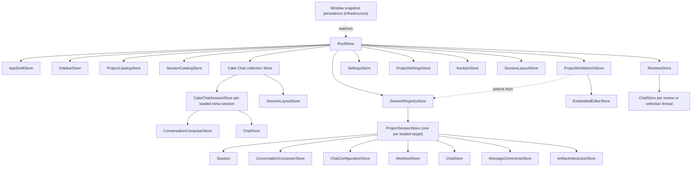

# Cake architecture and product model

This document describes the durable product and architecture of Cake. It is not
a roadmap. Current source and focused contract documents provide implementation
detail; this document explains how the pieces are meant to fit together. The
canonical language is defined in [`cake-vocabulary.md`](./cake-vocabulary.md),
and the normative runtime design is defined in
[`effect-architecture.md`](./effect-architecture.md).

## Product identity

Cake is Pi in a desktop GUI.

Pi already provides the coding-agent runtime: models and providers, the agent
loop, tools, extensions, skills, session branching, compaction, and durable
session history. Cake preserves that engine and gives it a web-native desktop
surface. Cake may wrap Pi's public provider stream at the adapter boundary for
an explicitly Cake-owned transport policy, but must not patch Pi internals or
replace its agent loop. The GUI is valuable not merely because it renders
terminal output more attractively, but because it can provide interactions such
as navigable session
collections, rich tool activity, diffs, tables, diagrams, forms, media,
sandboxed artifacts, and trusted user-authored React interfaces.

Cake operates at two related levels:

1. A Project Session is Cake's view and controller for one project-associated
   Pi Session.
2. The Cake application is a view and controller for the user's collection of
   Projects and Cake Sessions.

The second level is functionality that a single Pi terminal session does not
provide. Cake can navigate across sessions, expose relationships and activity,
and host application-level Cake Chat sessions. Cake Chat is Pi-backed, but its
conversations are meta-sessions: they can reason about and navigate the application
through curated Cake controls without absorbing the histories of Project Sessions.

The conversation remains the center of the product. Files, reviews, and artifacts
support the work rather than turning Cake into a general-purpose IDE. Embedded VS Code owns source browsing, editing, Git changes, and native diffs.

## Sources of truth

Every durable concept has one authority.

| Concern                                                                | Authority                                                                 | Cake's role                                                                               |
| ---------------------------------------------------------------------- | ------------------------------------------------------------------------- | ----------------------------------------------------------------------------------------- |
| Project Session transcripts, tool history, branching, compaction       | Pi Session files and `SessionManager`                                     | Render validated snapshots and events in the GUI                                          |
| Models, providers, authentication, Pi settings and resources           | Pi                                                                        | Offer Cake controls through the Pi adapter                                                |
| Utility-model selection                                                | Cake application preferences, referencing a Pi provider/model             | Run only explicitly configured, bounded background completions through Pi's model runtime |
| Application-level Cake Chat transcripts                                | Their dedicated Pi Sessions                                               | Present them as Cake-wide meta-sessions and route curated controls                        |
| Projects, per-Project worktree settings, and Project workflow statuses | Cake                                                                      | Persist application metadata without copying or redefining Pi Session lifecycle           |
| Window selection and view state                                        | Cake                                                                      | Persist renderer presentation independently from Project workflow facts                   |
| Scheduled Project Session messages                                     | Cake                                                                      | Persist delivery intent until it becomes an ordinary Pi user message                      |
| Session Family membership, fixed Working Directory, and creation order | Cake                                                                      | Group independent Project Sessions without copying their transcripts                      |
| Cross-session coordination threads and delivery correlation            | Cake                                                                      | Bind participants, limits, closure, and acknowledgements without copying transcript text  |
| Resolved-session status                                                | Cake-managed active/archive transcript location                           | Keep resolved transcripts read-only and restore them before Pi opens them                 |
| Reviews and inline discussions                                         | Cake workflow services, with Pi sidecar-session references where relevant | Persist anchors and workflow metadata without copying Pi transcripts                      |
| Rich artifacts                                                         | Cake artifact repository plus Pi transcript pointers/fallbacks            | Persist and render bounded, versioned artifact data                                       |
| Blocking structured requests                                           | `cake.request/v1` plus the active Pi tool call                            | Render trusted forms or sandboxed custom request widgets and return one validated value   |

Do not introduce a second transcript database, reconstruct Pi state into a
competing domain model, or mutate Pi JSONL with ad hoc file operations. A session
cannot be archived while its Pi turn is active. When the calling agent requests
its own resolution during that turn, the runtime records the intent and applies
it at the settled-turn boundary, after the final transcript snapshot is emitted.

Cake's visible transcript projects the complete active branch returned by Pi's
`SessionManager.getBranch()`. The compacted entries returned by
`buildContextEntries()` are model input, not display history, and must never
replace the complete transcript projection. Compaction entries remain visible
as durable timeline events. Steering and follow-up queues are transient Pi
runtime state: Cake overlays `queue_update` projections while messages wait and
removes them when Pi consumes the corresponding user message into the branch.
Scheduled messages are different: Cake owns each durable, cancellable delivery
intent until its deadline. The destination session projects that pending intent
beside its composer. At the deadline Cake restores the Project Session when
necessary and submits an ordinary prompt, or a follow-up when its runtime is
busy; after acceptance, Pi again becomes the sole message authority.

Cross-session coordination is a lightweight Cake-owned workflow over ordinary
Pi messages. A window-scoped `SessionCoordinationStore` binds two participants,
correlates message and thread IDs, tracks an optional message limit, and closes
an exchange. Sender identity and correlation metadata travel with the ordinary
Pi user message and are schema-validated when projected; Cake does not persist
or replay a second copy of its text. `accepted` means Cake/Pi accepted the turn,
`queued` means it is waiting as Pi follow-up input, `processing` means Pi has
consumed it into an active turn, and `answered` means that turn settled with a
projected response. Closing prevents further coordinated replies. It does not
silently abort unrelated destination work; an already consumed or otherwise
uncancellable late arrival remains visibly attributed to the closed exchange
and never causes autonomous continuation.

All inline threads—code reviews and assistant-message discussions—run as
independent lightweight Pi Sessions using the same runtime pipeline. Their
anchors belong to Cake; their replies remain authoritative in the referenced Pi
sidecar session. Before each reply, Cake regenerates a read-only Markdown
projection of the parent session's current active branch. The sidecar receives
only its anchor, nearby context, its own short history, and read-only file tools.
Both assistant-message and code-anchored chats are read-only; the code anchor
changes the source material, not the sidecar's authority. Neither kind forks or
records work in the parent transcript. A single derived Markdown
thread index is also available to the parent agent through its ordinary project
tools.

## Process boundaries

Cake is one logical application split by Electron privilege boundaries. Main
and each renderer window have separate process-local Effect runtimes joined by
Effect RPC over a narrow Electron transport.

### Electron main

Main owns native windows, filesystem and application persistence, Pi Session
Runtime lifecycle, privileged Services, Cake domain operations, and the Effect
RPC server. Pi is embedded behind the focused `PiSessions`, `PiModels`, and
`PiAgentResources` Services. Pi Extensions share main-process authority and
must not be described as sandboxed.

### Preload

Preload exposes only the frozen transport needed by Effect RPC. It validates
transport messages and does not expose `ipcRenderer`, Node, or general Electron
capabilities. It contains no Cake business logic.

### Renderer

The renderer is sandboxed and has no Node integration. It owns React views, one
window-local r-state-tree, reactive Models, and renderer application state and
logic. Renderer infrastructure owns one Effect runtime and generated
`CakeIpcClient`, then exposes a typed Promise-based `Client` for commands
and one common Stream observation primitive. Focused window-owned observers
apply validated updates to their Model or Store owners and retain their own
cancellation handles. Ordinary
Stores and Models do not import Effect, construct transport envelopes, or import
privileged implementations.

Every cross-process request, success, typed failure, and stream element is
parsed by shared Effect Schemas at the receiving boundary. Raw Pi event and
object shapes stop in `src/services/pi`. When a Project Session agent needs a
renderer-owned application mutation, main sends one validated control request
only to the renderer connection associated with the calling Project Session;
the renderer executes the shared application intent, completes persistence,
and acknowledges the result through Effect RPC before the tool call returns.

## Utility model

Cake may run bounded, non-authoritative background transformations through one
user-configured **utility model**. The preference stores the exact Pi provider,
model identifier, and reasoning level selected by the user. Cake never chooses,
recommends, or silently substitutes a utility model, and it never falls back to
the active conversation model. With no configured utility model, optional
utility work does not run.

Utility work uses Pi's `ModelRuntime` as an auxiliary completion rather than
creating a second provider abstraction, agent runtime, or durable transcript.
Each feature supplies explicit bounded input, output, timeout, cancellation,
and validation policy. Utility results remain advisory metadata until the owning
feature validates and commits them.

Cake applies one such adapter policy to empty, pre-output rate-limit responses
and protocol-valid successful responses with no content. It retries the exact
same model request with a bounded exponential-backoff schedule over 24 hours,
projects each wait into the conversation, and propagates the active turn's abort
signal so the normal Stop action cancels both requests and waits. It never
replays a response after text, reasoning, or tool-call output begins, and it
does not persist failed attempts or hidden continuation messages. The policy is
in-memory: quitting Cake ends it. Pi's native retry behavior remains
authoritative for other transient errors.

Pi agents receive one Cake-owned `cake` gateway. Its progressively disclosed
`subagents.*` operations are backed by the same coordinator. Project agents use these tools only when
the user explicitly requests subagents, delegation, or parallel agent work;
tool availability alone is not authorization. Subagent Sessions are hidden,
parent-owned Cake Sessions, never Project Sessions: the tool contract cannot
attach, fork, select visibility, or expose the backing Pi Session identity. Handles are
parent-scoped and use isolated context. Every task chooses a capability profile:
`scout`, `planner`, and `reviewer` receive only read/search tools, while `worker`
receives the parent's non-delegation tools. Recursive delegation defaults to
depth zero and is capped at one explicitly requested descendant level. Parallel
delegation accepts at most eight tasks and runs at most four at once per
Working Directory. A task acquires an active slot before Cake constructs its private Pi
runtime. Cake resolves and validates every requested model against the parent
session before constructing any child; parallel batches preflight atomically.
A task may request Fast mode only for a model advertised by Cake as supporting
it. That setting is scoped to the private runtime and is not persisted as a
project-session preference. Foreground delegation keeps one streaming tool call
open until the child returns, matching Pi's reference subagent behavior.
Background execution is explicit: completion is persisted as a hidden custom Pi
message and triggers or steers the parent unless an active wait already claimed
the handle. Private runtimes omit project-session catalogs, model menus, command
menus, session trees, artifact indexes, and automatic naming. Live activity is
coalesced from child part events rather than rebuilding full session snapshots.
Cancellation reaches active child work. While a child turn is active, Cake may
open its projected parts through the shared `Chat` component and route explicit
user steer or abort intents through the parent-scoped handle; the renderer never
receives or attaches to the private Pi Session identity. One-shot handles release
their private runtime automatically after capturing the result, at which point
the same popup becomes a read-only projection reconstructed from the parent
transcript. Multi-turn continuation requires `retain: true`. Closing a private
parent also releases its private descendants. Cake projects live child tool
activity, usage, cost, and the final answer through the parent tool call rather
than exposing a second transcript.

Full Project Session families use a different coordination contract. Messages
between parent and child sessions, including deterministic completion or abort
notices, are ordinary Pi user messages. By default they start a normal turn when
the recipient is idle or enter Pi's follow-up queue behind active work. An
explicit steer interrupts and redirects an active family member. Pending family
input is projected beside the composer with source-session attribution rather
than as transcript history.
Creating a child accepts its initial turn in the background and does not keep
the parent's turn waiting for that child. Each family member remains
independently selectable, messageable, and stoppable by its own session
identity. A parent may abort a child's active turn without resolving or deleting
the child.

Embedded VS Code's Source Control view is the Working Directory change authority and
renders native Git diffs. Cake projects review annotations into VS Code without
maintaining a second working-tree snapshot or diff browser. Historical per-turn
diffs remain in Pi's authoritative conversation work logs.

Automatic project-session naming is the first utility workflow. After the
initial user message is accepted, an unnamed session may send that original
user message, with bounded length, to the configured utility model without
waiting for the assistant turn to finish. A successful short title is appended
through Pi's normal session-name API. A Cake-owned draft session attempts the
same bounded naming work when its staged initial message is saved; the title
remains pending metadata until activation. If that attempt fails, normal
first-message naming retries after activation. With no configured utility
model, draft naming is skipped without a fallback. The completion is discarded
if the session is manually named while it is running. Failures are silent and
leave Pi's first-message session-list title as the display fallback for active
sessions. Configuring a utility model later makes an unnamed active session
eligible after its next interaction; already named sessions are never
regenerated automatically. A handoff inherits the source session's current title in both Pi's
session-name metadata and Cake's session-title repository, so continuation never triggers a new
title generation pass.

When the first prompt will create a managed worktree, Cake also attempts a
bounded utility completion before creating the checkout or Pi Session. The
validated result is an exact three-part, lowercase, hyphenated branch slug and
the first prompt remains optimistically visible while this preparation runs.
Cake projects the pending session into navigation before checkout preparation,
so a long-running Project-specific setup script does not leave the work invisible.
Each Project may replace Cake's default worktree creation command and provide a
post-creation shell script. Cake substitutes documented, shell-quoted Project,
worktree, branch, and base-revision variables; runs creation from the repository
root; then runs setup from the new Working Directory before starting Pi. A
failure aborts session startup and removes the incomplete checkout. Missing
utility-model configuration, timeout, provider failure, or invalid naming output
silently falls back to the worktree service's existing random naming scheme.

## Renderer state

`RootStore` is the renderer composition and application-intent boundary. It is
not the owner of every workflow merely because its lifetime matches the window.
Named product surfaces receive named Stores with cohesive behavior, lifecycle,
async policy, and persistence responsibility.

Models are validated reactive projections of entities. One window-owned Model
synchronizer owns authoritative Model observation demand and each observation's
cancellation handle. The renderer runtime's narrow Stream helper provides
Effect-scheduled retries. The observer trusts the sources' current-first, ordered
update contract, applies authoritative snapshots with `applySnapshot`, and reduces
ordered events transactionally, using direct, batched Model mutations for
incremental entity changes so identity is preserved.
Window bootstrap attaches it to the mounted Root Store so it can discover the
current loaded Models reactively; feature Stores and Models never access
synchronization machinery. Stores own window-local application/UI
state and logic: workflow timers, cancellation,
concurrency, snapshot coordination, and application intents. They invoke
semantic Promise operations on `Client`; Cake business logic lives in
main-process domain Effect modules. React keeps only truly local DOM, focus,
measurement, hover, or isolated input state.

Parent Stores coordinate cross-Store behavior without copying child state or
publishing one-for-one forwarding facades. Store providers are lookup scopes,
not ownership scopes. Stores and their external resources must be disposed with
their actual owner.

The window Store hierarchy mirrors the product surfaces:

- `RootStore` composes the window and translates application intents. Window-owned
  renderer infrastructure routes non-authoritative native lifecycle events to
  their focused owners outside the Store tree. `NotificationStore` owns transient
  agent-notification delivery: it applies one three-second trailing debounce per
  calling Cake Session, keeps only the latest item in each burst, and assigns a
  stable native group and notification identity per Session. Agent-selected levels
  do not bypass this policy. Electron then delivers the result through the operating
  system notification center rather than Cake's in-window toast stack.
- `AppShellStore` owns the window's one mutually exclusive application
  selection: a Project Session, a Cake Chat Session, settings, or an empty
  workbench. A Project Session selection stores only its globally unique Session
  ID; its Working Directory is routing context derived from the session catalog
  or registry, never part of selection identity. The visible surface and every
  active navigation treatment derive from that selection. `SidebarStore` owns
  navigation presentation and filtering, visibility, and width; neither Store
  opens sessions directly.
- `ProjectCatalogStore` owns registered Project records and their window-local
  ordering. Each Project may carry Cake-owned custom workflow columns and per-session
  assignments. `Draft`, `Active`, and `Resolved` remain derived system columns;
  custom statuses subdivide only Active and never redefine transcript lifecycle.
  `KanbanStore` owns the Project Kanban surface, mutation orchestration, drop semantics,
  and bounded background card-description generation. Sidebar session rows project a
  custom status swatch in their indentation gutter and offer the same valid lifecycle and
  custom-status transitions through their native context menu; Draft is never a return
  destination after activation. React owns only an in-progress drag gesture. `SessionCatalogStore` owns the currently demanded, activity-sorted
  session metadata projection plus cached ID and project-group indexes. Active
  project streams remain demanded while their groups are visually collapsed, so
  expanding a group never restarts discovery or clears its projection. Its
  active discovery reads only the Project root and active or landed Managed
  Worktrees; finished, discarded, and missing worktrees never participate in
  startup. Project-root and active or landed Managed Worktree metadata scans run
  concurrently and join the same bounded initial projection, so worktree sessions
  do not appear as a delayed second catalog. The complete active catalog arrives as
  one coherent initial snapshot. The resolved lane and every resolved Project group
  start visually collapsed, but their metadata-only archive catalogs remain demanded
  for the window lifetime. Each registered Project therefore has its complete
  resolved projection before its Kanban board or resolved navigation group opens.
  This reads Cake's archive index only: it does not open transcripts, inspect Git,
  discover Managed Worktrees, or acquire Pi runtimes. After the initial scan, session
  mutations publish scoped catalog events that refresh only the affected metadata and
  never restart catalogs from application-state revisions. Resolved groups display ten
  loaded sessions at first and reveal ten more when the user chooses Show more.
  Titles come from Cake's namespace-independent,
  per-session metadata repository, so neither active nor resolved listing opens
  transcript bodies. Session IDs are the canonical identity; duplicate IDs are
  rejected. Resolved status derives solely from the active or archived
  filesystem namespace, never from a persisted ID list. A Project Session's
  resolved navigation record stores only bounded Cake-owned display and routing
  metadata, including its title, Project, original Working Directory, and
  historical worktree name. Resolved browsing reads those records without Pi,
  Git, or Managed Worktree discovery. Existing archives are indexed once when
  their registered Project catalog first initializes; that migration reads filename
  metadata and Cake titles without opening transcript bodies. Resolving moves the Pi
  transcript between namespaces. After the final active Project Session in a landed
  Managed Worktree is resolved, Cake closes that Working Directory's terminals and
  removes the checkout and merged branch while retaining its Managed Worktree record.
  Restoring the first archived session recreates that checkout before restoring its
  transcript. Resolving one of several active sessions never retires their shared
  Working Directory, and the Cake-owned title remains stable across both namespaces.
- Window-owned persistence infrastructure loads one versioned Store snapshot before
  mounting the Root Store, then watches the mounted Store tree and saves later
  snapshots through `Client`. Persistence is not a Store and never
  synchronizes storage back into an already-mounted Store tree.
- `ProjectWorkbenchStore` coordinates project activation and its focused
  workflow children: `CommandPaneStore`, `SessionManagementStore`,
  `SessionContinuationStore`, `WorktreeCreationStore`, and `EmbeddedEditorStore`.
  `SessionLayoutStore` owns a persisted binary split tree, divider ratios, focused pane,
  and per-pane session navigation. Root owns the Project Session layout, while the Cake Chat
  collection owns an independent instance for its meta-sessions. Splitting is relative to the
  focused pane and prepares an unsent conversation: a Project Session in the same Working
  Directory or a Cake Chat Session with Cake-wide controls. The single sidebar targets the
  focused pane; selecting a session already visible in another pane focuses that pane rather than
  duplicating it. Every visible pane pins its conversation for observation. Command-pane,
  extension UI, and embedded-editor operations target the focused pane where those capabilities
  apply. The window-level terminal dock spans the workbench and follows the focused Project
  Session pane's Working Directory. Its tab collections are keyed by canonical Working Directory,
  so sessions in one checkout share terminals while different Managed Worktrees remain isolated.
  Resolving one session preserves those terminals; retiring or discarding the Working Directory
  closes the complete collection. Embedded VS Code temporarily replaces the Project Session split
  presentation without destroying its layout.
  `WorktreeCreationStore` owns both staged-session disposition and worktree
  selection and Cake Chat's coordinated create-worktree-then-create-named-session workflow.
  Fork and handoff are continuation workflows rather than permanent Working Directory bindings:
  both default to the parent's current Working Directory and can instead target a child Managed
  Worktree based on the current worktree, the Project root with no Managed Worktree, or a new
  Managed Worktree based on the Project's default branch. Resolving the parent is an independent,
  explicit choice for every destination; an already resolved parent remains resolved.
  `EmbeddedEditorStore` realizes the selected Project Session's IDE presentation preference and
  owns native-editor lifecycle, bounds, and Source Control navigation. The native VS Code view
  occupies the source pane, the ordinary Cake sidebar may occupy the left pane, and Cake's shared
  chat occupies the right drawer.
  Each child owns its own operation
  state and lifetime; the workbench does not re-export one-for-one child APIs.
- The root-scoped `SessionRegistryStore` preserves one keyed
  `ProjectSessionStore` for every loaded project-session ID so background
  project events and navigation share session identity. Persisted loaded-session
  identity does not create transcript observation demand after restart. The selected
  session and every session running in the current process are pinned for observation;
  up to 20 additional idle sessions remain observed in a process-local LRU. Selecting,
  opening, or starting a session refreshes that retention, and eviction stops its live
  observation while preserving its loaded Store and Model for later reuse. Each
  visible split pane may contain an unsent, unsaved project chat. It is staged
  renderer state, not a session: it does not enter Pi's session catalog, and choosing
  New Chat while that pane is focused reopens its composer with its text, attachments,
  configuration, and Working Directory intact. Cake persists staged pane input
  continuously in window state.
  The first submitted prompt promotes the existing renderer Store identity to an ordinary
  Pi Session only after main accepts the start command. Promotion keeps the optimistic
  message visible, immediately clears the staged slot so New Chat can create another
  composer, and retains a renderer-local pending catalog summary until the authoritative
  Pi-backed catalog projection catches up. It must not wait for catalog discovery or replace
  the visible Store with a newly synchronized instance. An explicitly
  saved draft is different: choosing Draft beside the staged chat's checkout choices
  and submitting creates a cataloged pseudo-session, stages its initial message and
  attachments in Cake window state, projects them through the shared `Chat`, and
  carries draft and resolved presentation metadata until activation. Saving the
  staged chat as a draft also frees New Chat to create one new staged composer. A
  saved draft has no message input; its composer surface contains only checkout and
  model selection plus the activation action. Activation clears the draft state and
  uses the ordinary first-prompt path; Pi remains the transcript authority once the
  session starts. The Working
  Directory remains routing/storage context for the Pi runtime, not part of
  session identity. Cake Chat never enters this registry.
- Each `ProjectSessionStore` owns that session's activity,
  message composer, projected scheduled-message controls, chat configuration, session-local Agent/IDE presentation preference and IDE
  chat-drawer geometry, managed-worktree status and actions, artifacts, and message comments. Its
  `ChatStore` is the common conversation-facing state boundary: it presents the
  draft, transcript parts, streaming state, configuration, and composer actions
  consumed by the authoritative `Chat` component.
- Project sessions, Cake Chat sessions, selection chats, and review threads all
  render the same `Chat` component and supply a `ChatStore`. `Chat` owns the
  authoritative virtualized transcript, message rendering, loading behavior,
  scrolling, and composer. A surface may add contextual framing or capabilities
  through the shared component's explicit extension points, but it must not
  substitute a parallel transcript, message, input, or composer implementation.
  React mounts the Project Session as the nearest provider around the active
  session surface.
- **Scrolling favors a good everyday experience using an off-the-shelf
  implementation.** `use-stick-to-bottom` owns bottom-following in `Chat` and
  independently in each expanded work log. Sending a message explicitly scrolls
  the chat to the bottom; new and streaming content follows while the reader is
  at or near the bottom. Scrolling up lets the reader browse earlier content,
  and returning near the bottom resumes following using the library's normal
  threshold. Message navigation stops following before moving to its target.
  Virtuoso owns virtualization and initial position restoration, not a competing
  follow loop. Scroll state stays local to the rendered container, never in a
  Store or Model. Window, pane, and composer resizing are best-effort layout
  behavior, not reasons to add custom scrolling machinery. These rules apply
  identically to every surface using `Chat`.
- The Cake Chat collection owns its `SessionLayoutStore` and one keyed
  `CakeChatSessionStore` per loaded
  meta-session. Each session retains its own draft, attachments, configuration,
  transcript projection, and streaming state while another Cake Chat session is
  selected. Like a new project chat, a new Cake Chat begins as one renderer-owned
  pending session and creates its Pi runtime on the first prompt; its identity and
  draft may be restored from window state without implying that a transcript file
  exists. Each visible Cake Chat pane may hold its own pending conversation and retains an
  independent composer. Persisted Cake Chat sessions keep live runtimes as they are opened. The
  window's renderer Model owner retains each projected `Session` independently of
  Store or React lifetimes and disposes Models only after Model synchronization has
  stopped. Project and Cake Chat session Stores receive those Models rather than
  creating or disposing them. Cake Chat snapshots and deltas route through the collection, independently of project-session
  registry and workbench lifetimes. Cross-process operations use explicit project
  or Cake Chat intents and never infer session ownership from transcript-file
  existence.

UI and application controls invoke semantic `RootStore` intents such as
`openSession`, `createSession`, or `showCakeChat`. The root performs any
required shell transition and delegates the workflow to its cohesive owner, so
callers do not assemble cross-Store navigation recipes.

## Rich UI has two trust paths

Model-presented content does not become executable application code with Cake
privileges.

- Artifacts cross a versioned, bounded protocol. Markdown and structured kinds
  are validated; raw HTML runs in an isolated frame with restrictive policy.
- Delegated inline widgets begin as compact `cake widgets.present` presentation briefs.
  Generation and repair run in separate tool-less Pi Sessions; generated source
  stays in Cake's artifact repository rather than the project-session context.
  Electron main compiles that source and runs it in a script-enabled,
  opaque-origin frame whose CSP blocks network and application access.

## Development philosophy

- Prefer Pi APIs and contribute useful missing seams upstream. Fork Pi only as
  a last resort.
- Keep Cake's Pi adapter narrow and keep renderer contracts Cake-owned.
- Build vertical behavior through the real Electron boundary, not only isolated
  abstractions.
- Give every state value an authority, owner, lifetime, persistence boundary,
  and concurrency policy before adding it.
- Validate boundary data, propagate cancellation, clean up subscriptions, and
  reject late async results after replacement.
- Keep Cake greenfield. Replace obsolete APIs outright and update all callers,
  tests, and documents in the same change.
- Add general workflow machinery only when concrete product behavior demonstrates
  the need. Do not prebuild a second generic agent runtime.
- Preserve unrelated worktree changes and verify focused tests plus the relevant
  typecheck or build.

## Focused references

- `docs/architecture/cake-vocabulary.md`: canonical domain and architecture
  language.
- `docs/architecture/effect-architecture.md`: Effect Services, domain, RPC,
  Streams, Scopes, storage, renderer state, and source boundaries.
- `docs/architecture/cake-storage.md`: persistent storage ownership.
- `docs/architecture/pi-0.84-contract.md`: pinned Pi adapter assumptions.
- `docs/architecture/s1-session-contract.md`: project-session lifecycle and
  renderer projection contract.
- `docs/architecture/s3-pi-compatibility.md`: Pi resource and extension UI
  compatibility.
- `docs/architecture/s4-artifact-protocol.md`: durable artifact and sandbox
  contract.
- `docs/architecture/session-family-contract.md`: Project Session family,
  communication, and aggregate lifecycle invariants.
