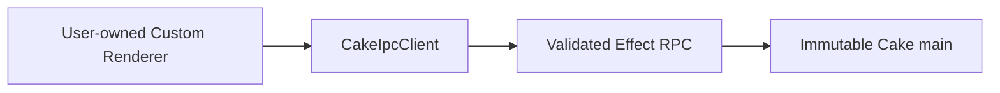

# Future Cake Custom Renderer architecture

> **Status:** Design only. Custom Renderer has not been implemented and is
> explicitly outside the Effect architecture migration. Nothing in the Effect
> migration should build this feature, change scope to prepare it speculatively,
> or treat it as an acceptance criterion. It may be implemented later as a
> separate product project after the Effect migration is complete.

This document records the intended architecture for a possible future feature
in which Cake permits a user and their agent to modify or replace the renderer while
preserving an immutable privileged core. This capability is intentionally more
powerful and less compatibility-stable than Cake Plugins or replacement scenes.
It is practical because an agent can replay source changes onto a new Cake
revision, resolve semantic conflicts from recorded intent, and validate the
result before activation.

This document defines that future feature's safety contract. It does not claim
that the feature exists in the current application or in the post-Effect
migration baseline.

## Three customization levels

Cake offers three distinct levels:

1. **Cake Plugin** — contributes UI or backend behavior through the public,
   version-matched `cake` API and canonical slots.
2. **Plugin scene** — replaces application layout through the public API while
   remaining a plugin.
3. **Custom Renderer** — applies user-owned source changes to Cake's renderer
   itself and may rewrite internal UI, Stores, Models, and components.

Prefer the least powerful level that satisfies the request. A Custom Renderer
has no internal renderer compatibility promise and therefore participates in
the update/rebase workflow below.

## Safety boundary

A Custom Renderer may modify only the sandboxed renderer source surface. It
cannot replace:

- Electron main;
- preload;
- the host-provided `CakeIpcClient`, Electron RPC transport, shared protocol
  definitions, or privileged handlers;
- Cake domain operations or outside-world Service implementations;
- customization source storage, build service, or activation journal;
- diagnostics and health reporting;
- the last-known-good build;
- immutable recovery;
- native credential, filesystem, Pi, Git, terminal, or Electron authority.



The Custom Renderer receives exactly the capabilities exposed through
`CakeIpcClient` and approved plugin APIs. Rewriting renderer code does not grant
raw IPC or Node access. Main revalidates every privileged request.

## Source model

Cake keeps an immutable renderer base for each Cake revision and a user-owned
series of source commits or patches:

```text
Cake renderer base revision
+ ordered user renderer changes
= candidate Custom Renderer
```

Each customization revision records:

- the exact Cake base revision;
- ordered source commits or patches;
- the user's request and concise semantic intent;
- agent provenance where available;
- affected paths;
- validation and diagnostic results;
- the renderer snapshot/storage version expected by that source;
- candidate, active, and last-known-good identities.

Git-compatible patches or commits are the deterministic record of what
changed. Conversation history and intent are supporting evidence for semantic
conflict resolution; they are not a substitute for source changes.

The active Cake checkout is never edited in place as activation. Authoring
produces an isolated candidate source tree and immutable revision.

## Update and semantic rebase

When Cake updates:

1. Select the new immutable renderer base.
2. Replay or three-way merge the user's ordered changes.
3. If mechanical replay conflicts or validation fails, give a repair agent:
   - the old base;
   - the user's prior result;
   - the new base;
   - the exact patches;
   - recorded user intent;
   - compiler, schema, and test diagnostics.
4. The agent resolves conflicts semantically against the new architecture and
   public capabilities.
5. Build and validate the complete candidate.
6. Activate transactionally only after health succeeds.
7. Otherwise retain the failed candidate and boot immutable recovery with the
   previous last-known-good option.

An agent never receives permission to resolve a conflict by weakening preload,
RPC validation, main-process checks, or recovery.

## Build and health contract

A candidate is valid only when all applicable checks pass:

- source path and import policy;
- formatting and static analysis;
- TypeScript typecheck;
- production renderer bundle;
- Effect RPC protocol compatibility;
- effect-state-tree snapshot migration checks;
- focused unit and renderer tests;
- renderer import and first render under a health boundary;
- focused Electron smoke tests for changed authoritative surfaces;
- plugin slot and Custom Renderer compatibility diagnostics.

Activation is journaled and atomic. The candidate becomes active and
last-known-good only after its renderer imports and renders successfully. A
crash, incomplete activation, failed health acknowledgment, or broken snapshot
hydration selects immutable recovery.

## Persistence compatibility

Renderer persistence is a versioned Cake-owned document decoded and migrated
before effect-state-tree snapshot application. A Custom Renderer may extend its
own renderer snapshot only through a namespaced, versioned section. It must
provide migrations for its saved state when changing that section.

The Custom Renderer cannot claim ownership of Pi transcripts, Cake application
storage, plugin storage, artifacts, reviews, Managed Worktree metadata, or any
other main-owned document. Removing a customization does not silently delete
its prior source or namespaced state; recovery may need both.

## Recovery

Immutable recovery loads no Custom Renderer or user plugin renderer code. It
must be able to:

- identify the failed base and customization revisions;
- display exact build, migration, runtime, and health diagnostics;
- inspect recorded intent and source changes;
- open Cake Chat with bounded repair context;
- rebuild and validate a repaired candidate;
- activate a healthy candidate;
- roll back to last-known-good;
- disable the Custom Renderer and use the stock renderer;
- preserve failed source and state for later repair.

Recovery is part of Cake's immutable core and is tested independently from the
replaceable renderer.

## Relationship to Cake Plugins

Plugins remain the preferred stable customization mechanism. Their public API,
slots, optional scene, backend isolation, and recovery behavior are defined in
[`cake-plugins.md`](./cake-plugins.md).

A Custom Renderer may alter where and how the UI presents plugins, but it must
preserve canonical slots intentionally or report compatibility diagnostics. It
must not bypass plugin trust, backend process isolation, persistence namespace,
or activation policy.

## Agent authoring contract

An agent modifying the renderer must:

1. read the exact target Cake architecture and Custom Renderer contract;
2. inspect the current base, active customization, and working revision;
3. retain the original user intent and base revision;
4. make isolated source changes with optimistic revision checks;
5. preserve the main/preload/RPC privilege boundary;
6. add snapshot migrations where persisted shape changes;
7. run the health contract proportionate to the change;
8. activate only a complete healthy candidate;
9. leave failed evidence available to recovery.

The existence of an LLM makes semantic rebasing feasible; it does not make
unvalidated activation safe.
