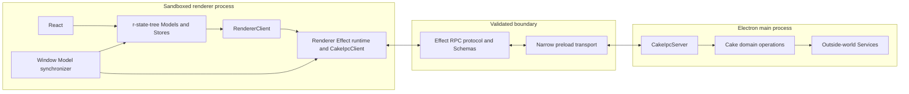

# Cake Effect architecture

This document is the normative technical architecture of Cake. See
[`cake-vocabulary.md`](./cake-vocabulary.md) for canonical terminology.

## Architectural model

Cake is one logical application split across Electron's process boundary. Main
and each renderer window have separate JavaScript heaps and therefore separate
Effect runtimes. They form one logical capability graph through Effect RPC.



There is one r-state-tree per renderer window and one renderer Effect runtime
hidden behind renderer infrastructure. Main contains an Effect service graph,
not another state tree. A Layer, Scope, Fiber, Store, Model, or service object
never crosses the process boundary.

## The core separation

Cake uses three primary implementation categories.

### Services touch the outside world

A Service is an Effect Context capability representing an external system,
native boundary, persistence boundary, or process transport. Services expose
Effects and Streams and own resources through Scope where necessary.

Primary Services are:

- `PiSessions`, `PiModels`, and `PiAgentResources`;
- `Git`;
- Effect Platform `FileSystem`, `Path`, `HttpClient`, and command execution;
- focused typed storage Services;
- `VsCodeServer`;
- `Terminal`;
- `Electron`;
- `PluginRuntime`;
- `CakeIpcClient` in the renderer and `CakeIpcServer` in main.

Cake does not introduce generic abstractions for dependencies it has chosen
concretely. In particular, `VsCodeServer` exposes VS Code-specific behavior;
there is no editor-neutral service.

### Domain modules implement Cake business logic

Cake domain modules contain free, named Effect operations. They yield Services,
combine their capabilities, and enforce product policy.

```ts
export const create = Effect.fn("ManagedWorktrees.create")(function* (
  input: CreateManagedWorktreeInput,
) {
  const git = yield* Git;
  const storage = yield* WorktreeStorage;
  const piModels = yield* PiModels;
  // Cake naming, creation, rollback, and persistence policy
});
```

Domain modules are not Context services. Pure policies may live beside the
Effect operations that use them.

Representative modules are:

```text
application
projects
conversations
projectSessions
cakeChats
discussionSessions
subagents
modelPresets
utilityWork
managedWorktrees
reviews
artifacts
sessionTerminals
plugins
```

Shared conversation functions live in `conversations`; Project Sessions, Cake
Chat Sessions, Discussion Sessions, and Subagent Sessions do not implement
parallel conversation engines.

### Renderer infrastructure adapts RPC; Stores own application state and logic

The window's renderer infrastructure owns `CakeIpcClient` and the Effect
runtime. A permanent typed `RendererClient` executes semantic commands as
Promises and propagates optional `AbortSignal` cancellation to Effect Fiber and
RPC interruption. One window-owned Model synchronizer consumes RPC Streams,
applies authoritative snapshots to stable r-state-tree Models with
`applySnapshot`, and reduces subsequent ordered Events transactionally. It uses
direct, batched Model mutations for incremental entity changes. Renderer
bootstrap attaches both the Model synchronizer and
window snapshot persistence to the mounted Root Store; neither is a Store.

Renderer Stores read those Models, invoke `RendererClient`, and own window-local
application/UI logic and repeated-call policy. They do not import Effect,
`CakeIpcClient`, RPC definitions, Pi, Git, storage, Electron main
implementations, or Cake domain operations.

React renders Store and Model state and invokes Store intents. React does not
construct RPC requests or subscribe directly to main-process event sources.

## Main and renderer runtimes

### Main runtime

Main creates one production `ManagedRuntime` from `MainLive`. Its Layer graph
provides all privileged Services and `CakeIpcServer`.

```text
MainLive
├── PiLive
│   ├── PiSessions
│   ├── PiModels
│   └── PiAgentResources
├── Effect Platform Services
├── GitLive
├── StorageLive
├── VsCodeServerLive
├── TerminalLive
├── PluginRuntimeLive
├── ElectronLive
└── CakeIpcServerLive
```

`MainApplication` is the Effect program for Electron startup, window lifecycle,
RPC registration, and shutdown. `src/main/main.ts` is the visible composition
root: it imports and assembles `MainLive`, creates the one process runtime, and
starts that program. Ordinary Layers are the default composition mechanism. Cake does not introduce
an OpenCode-style custom Layer graph until concrete composition or replacement
problems justify it.

A minimal bootstrap Layer can start the immutable shell and recovery without
loading user plugins, project resources, VS Code Server, terminals, or Project
Session runtimes. Any future Custom Renderer must also remain outside this
bootstrap boundary, but implementing it is not part of this architecture
migration.

### Renderer runtime

Each renderer window has one small runtime providing `CakeIpcClient` over the
validated preload transport. `RendererClient` and the window-owned Model
synchronizer are the only ordinary application modules allowed to execute that
client. The
runtime is created once, lives for the window, and is disposed on window
teardown.

```text
RendererRuntime
└── CakeIpcClientLive
    └── Effect RPC client protocol over preload
```

Renderer state stays in r-state-tree Models and Stores, not in the Layer or
runtime. The runtime is an infrastructure implementation detail, not the Store
dependency-injection system.

## Effect RPC over Electron

Cake uses Effect 4's `effect/unstable/rpc`; it does not maintain a competing
request/stream/cancellation framework.

The shared RPC definitions use Effect Schema and group capabilities such as:

```text
projects
sessions
cakeChats
reviews
artifacts
managedWorktrees
modelPresets
terminals
vscode
plugins
electron
windowState
```

Inside renderer infrastructure, `CakeIpcClient` is one Effect Service exposing
those named groups:

```ts
const client = yield * CakeIpcClient;

yield * client.sessions.create(input);
yield * client.managedWorktrees.land(input);
yield * client.electron.openExternal(url);

const updates = client.sessions.observe(sessionId);
```

The protocol provides:

- Schema-validated payload, success, failure, and stream element types;
- generated Effect client operations;
- streaming RPCs;
- interruption and cancellation;
- server handlers and Layers;
- RPC middleware and correlation metadata.

Cake supplies only the Electron-specific RPC transport:

```text
Effect RPC client protocol
→ frozen preload bridge
→ Electron IPC
→ Effect RPC server protocol
```

Preload is deliberately mechanical. It exposes no raw `ipcRenderer`, performs
no Cake business logic, and accepts only the protocol transport messages.
Both receiving boundaries decode untrusted values. Remaining outside-world
commands are partitioned into the `electron`, `filesystem`, `workspaces`,
`managedWorktrees`, `terminals`, `vscode`, `artifacts`, and `plugins` RPC groups.
Each operation carries its semantic payload directly; there is no generic request
envelope or second dispatcher protocol inside Effect RPC. Focused application, artifact, plugin, terminal, embedded-editor, and surface Streams
carry renderer-connection-scoped native events to their window-owned consumers.

Main RPC handlers are thin adapters to domain operations. They do not own
business logic. Effect Schema decodes requests, results, failures, and Stream
elements once at the process boundary; already-decoded values use ordinary
TypeScript types internally and are not reparsed at each function call. Each
renderer connection owns the Scope of its streaming RPCs and in-flight requests. Closing a window interrupts those subscriptions and
requests.

A long-lived operation with independent domain lifetime returns a stable ID or
handle once accepted and reports later progress through a Stream. Interrupting
the short acceptance request is distinct from issuing the domain's explicit
abort command.

## Pi services

Pi is one external subsystem provided by `PiLive`, but it is not one god
service. Cake exposes only the Pi capabilities it actually uses.

### `PiSessions`

`PiSessions` owns Pi session discovery and scoped live runtime access:

```ts
interface PiSessions {
  readonly list: (
    query: PiSessionQuery,
  ) => Effect.Effect<ReadonlyArray<PiSessionSummary>, PiSessionError>;

  readonly inspect: (target: PiSessionTarget) => Effect.Effect<PiSessionSnapshot, PiSessionError>;

  readonly acquire: (
    options: PiSessionOptions,
  ) => Effect.Effect<PiSessionHandle, PiSessionError, Scope.Scope>;
}
```

A `PiSessionHandle` exposes an observation Stream and operations such as
prompt, steer, follow-up, abort, execute command, set model, compact, fork, and
reload. Runtime acquisition is keyed and scoped: concurrent consumers of one
session share one process-local runtime, and the final release disposes it.
Conflicting runtime-defining options never silently reconfigure an acquired
runtime.

Cake domains choose a semantic capability profile:

```text
ProjectSession
CakeChatSession
DiscussionSession
SubagentSession(profile)
```

The Pi adapter translates that profile into tools, extension policy,
permissions, and supported extension UI. Callers do not manually assemble Pi
internals.

Pi Extension execution is session-bound and belongs to `PiSessions`. There is
no separate public `PiExtensions` service.

### `PiModels`

`PiModels` owns the complete Pi model capability:

- provider/model catalog and authentication projection;
- model availability and supported thinking levels;
- reference resolution;
- bounded, non-session completion through Pi's model runtime.

It accepts concrete Model Selections and knows nothing about Cake Model Preset
names. Conversational execution always goes through `PiSessions`.

### `PiAgentResources`

`PiAgentResources` loads and reloads context-dependent non-model resources:

- skills;
- prompt templates;
- configured Pi Extension sources;
- discovery and load diagnostics.

Runtime commands and executable contributions are authoritative only after a
Pi Session Runtime loads them, so they are exposed through the session handle.

### Pi projection boundary

Raw Pi objects and events stop inside `services/pi`. Pure translation modules
map Pi snapshots, events, resources, and errors to Cake-owned values. No other
Cake module imports Pi packages directly.

## Session observation and Streams

Pi remains the durable transcript authority. Conceptually, a session
observation combines:

```text
Pi session history reconstructed through Pi from JSONL
+ live events from the active Pi Session Runtime
```

Cake never tails or writes Pi JSONL directly. It never persists a second
transcript or a duplicate durable event log.

A session observation begins with one coherent snapshot and continues with
ordered typed events without a subscription gap:

```ts
type CakeSessionUpdate =
  | {
      readonly _tag: "Snapshot";
      readonly revision: CakeSessionRevision;
      readonly snapshot: CakeSessionSnapshot;
    }
  | {
      readonly _tag: "Event";
      readonly revision: CakeSessionRevision;
      readonly event: CakeSessionEvent;
    };
```

Events cover messages and the broader runtime lifecycle: turn state, message
parts, tool execution, model selection, usage, compaction, commands, extension
UI, and failures.

A Stream is not automatically a durable log. If a renderer reconnects or a
live transport cannot continue coherently, main asks Pi for a new authoritative
snapshot and resumes observation. Cake does not invent history to fill the gap.

The Pi adapter has one underlying runtime listener per acquired runtime and
multicasts updates to its scoped consumers. Domain functions project Pi updates
into Cake Session updates before RPC. The renderer Model synchronizer maps the
RPC Stream into Model snapshots and applies them.

```text
Pi → PiSessions Stream → Cake domain projection → RPC Stream
   → Model synchronizer → snapshot hydration / event reduction
   → reactive r-state-tree Models → Stores/React
```

Terminal output, plugin diagnostics, filesystem observation, and other live
sources follow the same Scope and Stream principles but define their own event
vocabularies.

## Resource lifetimes and concurrency

Effect Scope mirrors real ownership:

```text
Main process Scope
├── renderer connection Scopes
├── Project resource Scopes
│   ├── filesystem observation
│   ├── Git-related refresh work
│   └── VS Code Server
├── active Cake Session resource Scopes
│   ├── Pi Session Runtime and listener
│   ├── session-bound extensions and Cake tools
│   └── associated Terminal handles
└── operation Scopes
```

Keyed scoped caches deduplicate concurrent acquisition of Project resources,
Pi Session Runtimes, VS Code Server instances, and other keyed resources. Scope
answers lifetime; it does not answer repeated-call behavior.

Every asynchronous intent separately declares a concurrency policy:

- serialize per key;
- share one in-flight operation;
- interrupt previous;
- latest result wins;
- reject while active;
- queue;
- bounded parallelism;
- independent execution.

Examples include serializing Pi turns per session, bounding Subagent Sessions,
and rejecting concurrent landing of the same Managed Worktree. A loading flag
is presentation state, not a concurrency policy.

## Filesystem, Git, worktrees, VS Code, and terminals

Effect Platform's `FileSystem` owns filesystem operations and observation.
`Git` owns Git commands and Git facts. Cake domain operations decide how
filesystem events trigger debounced Git refreshes.

`WorktreeStorage` is separate from `Git`:

```text
Git
  owns Git Worktree existence and repository state

WorktreeStorage
  owns Cake Managed Worktree metadata

managedWorktrees domain module
  combines Git, WorktreeStorage, and utility model policy
```

`VsCodeServer` is a concrete Cake Service. It owns binary discovery or
installation, per-working-directory process lifecycle, ports, health, VS Code
URLs, Source Control commands, source navigation, and Cake review annotations.
Cake does not hide it behind a generic editor abstraction.

`Terminal` owns PTY creation, input, resize, output Stream, exit, and cleanup.
The `sessionTerminals` domain module associates one or more Terminal handles
with a Cake Session. That association has an explicit Cake Session resource
Scope and is not inferred from renderer visibility or from whether one consumer
currently holds the Pi Session Runtime. Quake-style visibility is renderer
Store state; hiding the surface does not terminate the PTY.

`Electron` owns concrete native capabilities such as windows, dialogs, external
URLs, filesystem reveal, and application lifecycle. A renderer Store may call
a semantic `RendererClient` Electron operation for a simple native action. It
uses a domain operation exposed through RPC when Cake business policy or
multiple Services must be coordinated.

## Typed storage and snapshots

Cake uses focused storage Services rather than a generic untyped key/value
service:

```text
ApplicationStorage
WindowStateStorage
WorktreeStorage
ReviewStorage
ArtifactStorage
PluginStorage
SessionArchiveStorage
```

Each Service owns its document Schema, version envelope, migration sequence,
location, atomic-write behavior, and typed errors. Shared internal file helpers
may implement atomic writes, but domain code uses focused storage Services.

The default persistence format is versioned files:

```ts
interface StoredDocument {
  readonly version: number;
  readonly data: unknown;
}
```

Loading is `read → parse envelope → migrate version-by-version → decode current
Effect Schema`. Saving is `encode current value → add version → temporary write
→ atomic rename`.

r-state-tree snapshots are the serialization boundary for renderer-owned state:

```text
startup: versioned file → WindowStateStorage RPC → mount RootStore with snapshot once
runtime: onSnapshot(RootStore) → RendererClient.windowState → versioned file
```

Window snapshot persistence is renderer infrastructure outside the Store tree.
It never applies storage to an already-mounted Store.

Only fields explicitly marked with r-state-tree snapshot metadata persist. Full
Pi transcript projections, live resources, projection subscriptions, pending
operations, and transport state do not. Hydration loads and migrates storage,
validates it, mounts or applies the complete snapshot before Store effects
activate, chooses an explicit fallback on failure, and only then subscribes to
future snapshot changes for debounced writes. Snapshot APIs do not replace
storage policy.

## Renderer Models, Stores, and React

Renderer Models live in `src/renderer/models`. They contain validated reactive
entity state, identity, owned entity children, references, synchronous
invariants, and pure queries. They contain no Services, Streams, Fibers, or
persistence policy.

Renderer Stores live in `src/renderer/stores`. They own:

- renderer application state and application/UI logic;
- loading, success, and renderer-facing failure state;
- Promise-based intents and repeated-call policy;
- Store-owned workflow resources, timers, and cancellation;
- keyed child Store projections;
- explicit window snapshot fields.

The single Model synchronizer lives in renderer infrastructure. It owns RPC
Stream subscriptions, observation generations, and revision/reconnect policy.
It applies each validated Snapshot with `applySnapshot` and reduces each
subsequent Event transactionally, using direct reactive batches for incremental
entity changes; it is not a second application state system. Renderer bootstrap
attaches it to the mounted Root Store so it can watch the loaded Model set.
Feature Stores and Models never access it.

The normal data and command paths are:

```text
CakeIpcClient Stream → Model synchronizer → hydrate snapshot / reduce event → Store/React
Store intent → RendererClient Promise → CakeIpcClient Effect → RPC
```

r-state-tree Models and Stores use the installed package's actual semantics:

- Models hold validated reactive projection data, identity, children,
  references, and synchronous invariants;
- Stores hold window-local application/UI behavior and explicit async state;
- one logical projection update is committed in one r-state-tree transaction;
- Store `AbortSignal` is passed to cancellable `RendererClient` operations;
- Store disposal prevents late local commits, while the client translates abort
  to Effect/RPC interruption;
- Store effects own workflow-local subscriptions and timers, not authoritative
  entity observation Streams;
- snapshots contain only explicitly selected renderer-owned state.

The Model synchronizer never lets arbitrary Effect Fibers mutate Models. Each
validated Snapshot is applied atomically and each Event is reduced
transactionally; incremental entity changes use direct reactive batches. Stale
generations cannot commit, and reconnect starts from a fresh authoritative
Snapshot. It owns at
most one active observation for each loaded identity. Models remain passive
reactive data and know nothing about Streams or synchronization.

React mounts the root Store outside render, finds it through r-state-tree's
`StoreProvider`, and observes reactive reads with `observer`. Provider ancestry
is lookup, not Store lifetime. React keeps only DOM-local behavior and isolated
component state.

`RootStore` remains the window composition and application-intent boundary. It
does not own event subscriptions or every workflow. Named product surfaces
retain focused Stores. Every chat surface uses the authoritative shared `Chat`
component and `ChatStore`.

## Source organization

Cake remains one application package. Process and dependency boundaries do not
require a monorepo split.

```text
src/
├── services/                 # Outside-world contracts and Live implementations
│   ├── pi/
│   ├── git/
│   ├── storage/
│   ├── vscode/
│   ├── terminal/
│   ├── electron/
│   └── plugins/
├── domain/                   # Cohesive free Effect modules
│   ├── application.ts
│   ├── projects.ts
│   ├── conversations.ts
│   ├── projectSessions.ts
│   ├── cakeChats.ts
│   ├── discussionSessions.ts
│   ├── subagents.ts
│   ├── modelPresets.ts
│   ├── utilityWork.ts
│   ├── managedWorktrees.ts
│   ├── reviews.ts
│   ├── artifacts.ts
│   ├── sessionTerminals.ts
│   └── plugins.ts
├── layers/                   # Production composition adapters joining domains to callback APIs
├── config/                   # Decoded process configuration values
├── ipc/
│   ├── protocol/             # Shared Effect RPC groups and Schemas
│   ├── client/               # CakeIpcClient and renderer transport Layer
│   ├── server/               # CakeIpcServer handlers and main transport Layer
│   └── transport/            # Electron RPC protocol adapters
├── main/
│   ├── main.ts              # MainLive assembly and process runtime
│   ├── MainApplication.ts   # Effect-native Electron application program
│   └── BootstrapLive.ts     # Immutable platform bootstrap capabilities
├── preload/
├── renderer/
│   ├── RendererRuntime.ts    # one window-local Effect runtime
│   ├── client/               # permanent Promise RendererClient adapter
│   ├── RendererModelSynchronizer.ts # Effect Streams → snapshot hydration and event reduction
│   ├── models/               # r-state-tree projection Models
│   ├── stores/               # r-state-tree application/UI Stores
│   └── components/
├── plugin/                   # Public Cake plugin APIs
└── utils/
```

Default to one cohesive file per domain module. Split a module around meaningful
internal concepts only when its implementation demonstrates the need; do not
create one file per operation by convention.

Dependencies flow as follows:

```text
renderer components → renderer Stores and Models
renderer Stores → RendererClient
RendererModelSynchronizer → CakeIpcClient and renderer Models
RendererClient → CakeIpcClient ↔ shared RPC protocol ↔ CakeIpcServer
CakeIpcServer → domain operations → Services
```

Services do not import Cake domain modules. Domain modules do not import
renderer code. RPC payloads never expose raw Pi, Git, Electron, filesystem,
Effect runtime, Store, or Model objects.

## Schema ownership

Schemas live beside the authority or boundary they describe:

```text
services/pi/       Pi adapter values and errors
services/git/      Git values and errors
services/storage/  stored documents and migrations
domain/            Cake business values and policies
ipc/protocol/      values allowed across main and renderer
renderer/models/   reactive projection schemas
```

Cross-process and persistence boundaries use Effect Schema. A generic shared
`types` directory is not an ownership boundary.

## Security and extensibility

The renderer remains sandboxed with no Node globals, raw Electron IPC, raw Pi,
filesystem, credentials, or compiler/recovery authority. Main validates trust,
paths, and permissions even when renderer input has already decoded.

Pi Extensions and Cake Plugins are distinct trust systems. Model-presented
artifacts remain data and use validated or sandboxed protocols.

The Effect/RPC privilege boundary is compatible with a possible future Custom
Renderer, but that feature is not implemented and is not part of the Effect
migration. If pursued later, main, preload, `CakeIpcClient`, RPC schemas and
validation, customization compiler, activation journal, diagnostics,
last-known-good build, and immutable recovery remain Cake-owned and cannot be
replaced by user renderer source. See the separate future design in
[`cake-custom-renderer.md`](./cake-custom-renderer.md).

## Testing and observability

Domain tests execute real domain Effects with test Service Layers. Service
integration tests exercise real external boundaries where practical. Renderer
Store tests inject a controlled Promise `RendererClient`; projection tests use
controlled current-first Streams and assert identity, ordering, reconnect, and
disposal. Focused Electron tests prove the complete
renderer/preload/RPC/main path.

Domain operations and service calls use named Effects and tracing annotations
such as Project ID, Cake Session kind, Pi Session ID, Managed Worktree ID,
Terminal ID, RPC request ID, and subscription ID. Expected failures remain typed
Effect failures; defects are handled and logged at application boundaries.
